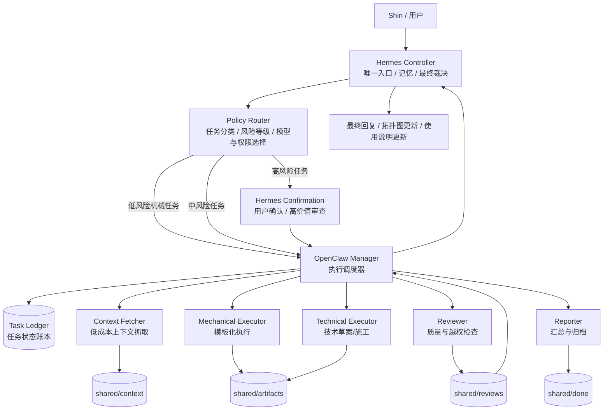

# AI Center Agent Team Runtime 设计说明

> 本文是 AI Center 中 **Hermes + OpenClaw 多 Agent 智能系统** 的权威设计基线。
>
> 目标不是让某个模型临时“聪明地干活”，而是建立一套可长期复用、低出错、可审查、可迭代、可降级的 Agent Team Runtime。
>
> 后续其他模型或 AI 施工时，应严格按照本文设计落地；任何偏离本文的架构性变更，都必须先形成 Proposal，再经 Hermes/高价值模型审查。

---

## 0. 我的建议：这个方案是否好？

你的想法是：

> 高价值模型负责整体设计、规划、最终审查；其他模型负责施工搭建；最后再由高价值模型校验。

我的判断：**这是一个好方案，而且非常适合你当前的 AI Center。**

但它必须满足一个前提：

> 高价值模型输出的不是泛泛建议，而是可被执行模型严格照着施工的“工程规格说明”。

如果只是让高价值模型给方向，低成本模型自由发挥施工，会失控。  
如果让高价值模型写清楚架构边界、目录、状态机、角色权限、验收标准，再让其他模型施工，最后由高价值模型审查，这是正确分工。

### 0.1 这个方案的优点

| 优点 | 说明 |
|---|---|
| 控制成本 | 高价值模型只用于规划、裁决、审查，不做大量机械施工 |
| 降低漂移 | 施工模型不能自由改变架构，必须按照设计文档执行 |
| 可审查 | 所有施工结果可对照设计说明验收 |
| 可复用 | 设计一旦稳定，后续可反复用于新增 Agent、任务类型、流程 |
| 易回滚 | 因为架构和任务状态文件化，出错时能定位并回退 |

### 0.2 这个方案的风险

| 风险 | 解决方式 |
|---|---|
| 施工模型擅自扩展范围 | 在本文中定义“禁止事项”和验收标准 |
| 文档过期 | 建立 Reality Audit 与版本机制 |
| 角色边界漂移 | 每个 Agent 有固定 SOUL.md，不允许口头改角色 |
| 低成本模型越权判断 | Policy Router + 任务类型白名单 + Reviewer 检查 |
| Hermes/OpenClaw 双调度冲突 | 明确 Hermes 是控制面，OpenClaw 是执行面 |

### 0.3 最终建议

采用该方案，但要坚持以下原则：

1. **先设计，再施工。**
2. **高价值模型产出规格，低成本模型按规格施工。**
3. **施工模型不得擅自改变架构。**
4. **所有任务、交接、审查都文件化。**
5. **低成本模型只做机械任务，不参与判断。**
6. **最终拓扑图更新必须经过 Reality Audit。**

---

## 1. 系统目标

本系统的目标是为 AI Center 增加一层长期可用的 Agent Team Runtime：

```text
用户 Shin
  ↓
Hermes Controller：唯一入口 / 总控 / 记忆 / 最终裁决
  ↓
Policy Router：任务分类 / 模型选择 / 权限边界
  ↓
OpenClaw Manager：执行调度 / 状态推进 / worker 分派
  ↓
Specialized Workers：查询、执行、审查、汇报
  ↓
Task Ledger + Shared Artifacts：状态、证据、产物、审查记录
```

该系统要解决的问题：

- 不再每次临时组织 Agent。
- 不再让低成本模型参与复杂判断。
- 不再只靠聊天上下文传递任务。
- 不再让 Hermes 和 OpenClaw 抢控制权。
- 不再让文档、拓扑图、实际服务长期漂移。

---

## 2. 非目标：本系统明确不做什么

为了避免范围膨胀，第一版不做以下事情：

1. **不做全自动自治组织。**  
   Agent 可以提出改进建议，但不能自己修改系统规则并上线。

2. **不做多个 Agent 永久群聊。**  
   第一版采用“角色持久化 + 任务按需派发 + 文件化交接”，而不是常驻聊天群。

3. **不让低成本模型接触密钥和核心配置。**

4. **不让 worker 直接更新 AI Center 拓扑图正式版。**  
   worker 可以生成拓扑更新草案，但最终写入必须经过 Hermes 审查。

5. **不一开始就做自动安装、自动重启、自动升级。**  
   高风险动作必须等 Stage 2/3 之后再开放。

6. **不允许无 Task ID 的施工。**  
   所有施工必须有任务文件、状态、输出路径和验收标准。

---

## 3. 核心设计理念

### 3.1 分层，而不是混合

本系统分为五个平面：

```text
Control Plane       控制面：Hermes
Policy Plane        策略面：路由、权限、模型选择
Execution Plane     执行面：OpenClaw + workers
State Plane         状态面：Task Ledger + Shared Files
Observability Plane 可观测面：日志、指标、审查、复盘
```

每一层只做自己的事，不能互相越权。

---

### 3.2 Hermes 和 OpenClaw 的边界

#### Hermes Controller 负责

- 接收用户请求。
- 判断是否需要启动团队任务。
- 生成任务规格。
- 判定任务风险等级。
- 决定是否允许低成本模型参与。
- 最终审查施工结果。
- 决定是否写入 memory / Obsidian / 拓扑图。
- 对高风险变更要求用户确认。

#### OpenClaw Manager 负责

- 读取 Hermes 批准的任务。
- 按 Policy Router 分配 worker。
- 推进任务状态。
- 要求 worker 按模板 handoff。
- 将产物提交 reviewer。
- 将完成结果交还 Hermes。

#### OpenClaw Manager 不得做

- 改变任务目标。
- 扩大任务范围。
- 修改全局架构。
- 跳过高风险 review。
- 直接修改 Hermes/OpenClaw 核心配置。
- 直接写入最终拓扑图。

一句话：

> Hermes 管“该不该做、做到什么程度、是否最终接受”。  
> OpenClaw 管“已批准任务如何分派、执行、交接”。

---

### 3.3 规则优先，模型辅助

本系统不应完全依赖“Manager Agent 自己聪明地判断”。

正确顺序是：

```text
先走固定 Policy Router
  ↓
规则能判断 → 自动分派
  ↓
规则不能判断 → 升级给 Hermes / 高价值模型裁决
```

原因：长期系统如果完全依赖模型自由判断，会出现漂移。

---

## 4. 总体架构图



---

## 5. 推荐目录结构

建议在 AI Center 下建立独立运行目录：

```text
~/AI-Center/agent-team-runtime/
├── docs/
│   ├── ARCHITECTURE.md
│   ├── AGENT_ROLES.md
│   ├── TASK_PROTOCOL.md
│   ├── POLICY_ROUTER.md
│   ├── RUNBOOK.md
│   ├── CHANGELOG.md
│   └── ADR/
│       ├── ADR-001-file-task-ledger.md
│       └── ADR-002-hermes-openclaw-boundary.md
│
├── agents/
│   ├── manager/
│   │   └── SOUL.md
│   ├── context-fetcher/
│   │   └── SOUL.md
│   ├── mechanical-executor/
│   │   └── SOUL.md
│   ├── technical-executor/
│   │   └── SOUL.md
│   ├── reviewer/
│   │   └── SOUL.md
│   └── reporter/
│       └── SOUL.md
│
├── shared/
│   ├── inbox/
│   ├── tasks/
│   ├── context/
│   ├── artifacts/
│   ├── reviews/
│   ├── decisions/
│   ├── proposals/
│   ├── done/
│   └── failed/
│
├── logs/
│   ├── task-events.jsonl
│   ├── review-events.jsonl
│   ├── policy-events.jsonl
│   └── incidents.jsonl
│
└── tmp/
    └── locks/
```

### 5.1 为什么使用文件化目录

第一版建议使用文件化 Task Ledger，而不是直接上数据库。

原因：

- 人类可读。
- 出错后容易人工修复。
- 便于 Obsidian / Git / diff 审查。
- 便于其他 AI 直接读取。
- 初期任务量不大，不需要复杂数据库。

触发重新评估数据库方案的条件：

- 累计任务超过 500。
- 并发 worker 超过 5。
- 出现重复领取任务超过 2 次。
- 需要 Web 面板实时状态。

---

## 6. Agent 角色定义

### 6.1 Hermes Controller

**定位：** 控制面，不是普通 worker。

负责：

- 用户入口。
- 任务意图理解。
- 风险判定。
- 任务规格生成。
- 高风险确认。
- 最终审查。
- 拓扑图/记忆/使用说明写入决策。

不得：

- 亲自长期执行大量机械任务。
- 与 OpenClaw Manager 重复管理状态。
- 在未验证情况下宣称搭建完成。

---

### 6.2 OpenClaw Manager

**定位：** 执行调度器。

负责：

- 读取 `shared/inbox/` 中的任务。
- 检查任务 schema 是否完整。
- 按 `POLICY_ROUTER.md` 分派 worker。
- 更新任务状态。
- 检查 worker 是否提交到正确路径。
- 将任务送入 review。
- 将结果交回 Hermes。

不得：

- 自行改变任务目标。
- 自行扩大施工范围。
- 跳过 required review。
- 自行写入 `.env`、`config.yaml`、拓扑图正式版。

---

### 6.3 Context Fetcher

**定位：** 低成本上下文抓取员。

适用模型：低成本 Coding Plan / SenseNova 类模型。

允许：

- 查询资料。
- 抽取事实。
- 整理来源。
- 标注访问时间。
- 输出上下文报告。

禁止：

- 给最终建议。
- 做架构判断。
- 选择方案。
- 修改配置。
- 写入正式文档。
- 使用“推荐、应该、最好、必须采用”等决策性表达。

输出必须包含：

```markdown
# Context Report

## Task

## Sources

## Extracted Facts

## Unknowns

## Not Performed
- No recommendation made.
- No config changed.
- No final decision made.
```

---

### 6.4 Mechanical Executor

**定位：** 模板化机械执行者。

允许：

- 按模板生成文件。
- 整理 Markdown。
- 归档产物。
- 根据明确 patch 草案执行低风险修改。

禁止：

- 自行设计架构。
- 自行决定新增服务。
- 自行修改核心配置。
- 自行处理凭证。

---

### 6.5 Technical Executor

**定位：** 技术施工者。

允许：

- 按 approved spec 编写脚本。
- 按 approved diff 修改配置草案。
- 执行中风险技术任务。
- 生成部署脚本草案。

禁止：

- 未经批准直接重启生产服务。
- 未经批准直接修改 `.env`。
- 未经批准更改 Hermes/OpenClaw 核心架构。

---

### 6.6 Reviewer

**定位：** 质量闸门。

负责检查：

- 是否满足 acceptance criteria。
- 是否产物路径正确。
- 是否越权。
- 是否存在凭证泄露。
- 是否与现有拓扑图冲突。
- 是否需要 Hermes/用户确认。

Review 分级：

| 等级 | 适用任务 | 要求 |
|---|---|---|
| L1 | 查询、摘要、格式整理 | 快速检查字段、来源、越权 |
| L2 | 文档、拓扑草案、配置草案 | 检查事实、一致性、安全 |
| L3 | 配置写入、服务重启、插件安装 | 高质量模型审查 + 用户确认 |

---

### 6.7 Reporter

**定位：** 汇总与归档者。

允许：

- 汇总 worker 结果。
- 生成说明文档草案。
- 整理 changelog。
- 将已完成产物移入 done。

禁止：

- 改变事实。
- 擅自补充未经验证的信息。
- 做最终决策。

---

## 7. 任务类型与路由策略

### 7.1 低风险任务

可自动分派给低成本 worker。

```yaml
fetch_context
summarize_sources
format_document
archive_note
status_report
```

要求：

- L1 review。
- 不允许改配置。
- 不允许写正式拓扑图。

---

### 7.2 中风险任务

可以生成草案，但不能直接生效。

```yaml
draft_config
draft_topology_update
draft_runbook
review_artifact
write_docs_draft
```

要求：

- L2 review。
- Hermes 最终接受。
- 如涉及凭证或服务状态，升级 L3。

---

### 7.3 高风险任务

必须 Hermes + 用户确认。

```yaml
apply_config
restart_service
write_env
modify_gateway
install_plugin
create_cron
upgrade_agent
rotate_secret
```

要求：

- L3 review。
- 明确 diff。
- 执行前确认。
- 执行后验证。
- 写 incident/audit log。

---

## 8. Task Ledger 设计

每个任务必须有一个 YAML 文件。

路径：

```text
shared/tasks/TASK-YYYYMMDD-NNN.yaml
```

### 8.1 Task Schema

```yaml
id: TASK-20260505-001
title: "查询 SenseNova Coding Plan 配置方式"
type: fetch_context
status: inbox
priority: low
risk_level: low

created_at: "2026-05-05T10:00:00+08:00"
created_by: hermes
approved_by: hermes

assigned_to: null
allowed_roles:
  - context-fetcher
required_review: L1

model_tier: low_cost
allowed_tools:
  - web_search
  - web_extract
  - read_shared_files
  - write_shared_context

forbidden_actions:
  - architecture_decision
  - code_change
  - config_change
  - credential_read
  - credential_write
  - topology_final_write
  - service_restart

input:
  query: "SenseNova Coding Plan OpenAI-compatible API 配置"

outputs:
  context: "shared/context/TASK-20260505-001.md"
  review: "shared/reviews/TASK-20260505-001-review.md"

acceptance_criteria:
  - "必须包含来源链接"
  - "必须标注访问时间"
  - "只抽取事实，不给最终建议"
  - "不允许写入任何真实配置文件"

timeouts:
  execution_minutes: 10
  review_minutes: 5

retry:
  max_attempts: 1
  backoff_seconds: 30

audit:
  - time: "2026-05-05T10:00:00+08:00"
    actor: hermes
    action: created
    note: "低成本上下文查询任务"
```

---

## 9. 状态机

任务状态统一为：

```text
inbox
  ↓
assigned
  ↓
in_progress
  ↓
review
  ↓
done / failed / blocked / cancelled
```

### 9.1 状态含义

| 状态 | 含义 |
|---|---|
| inbox | 已创建，待分派 |
| assigned | 已选择 worker，尚未开始 |
| in_progress | worker 正在执行 |
| review | 产物已提交，等待审查 |
| done | 已审查通过并由 Hermes 接受 |
| failed | 失败并记录原因 |
| blocked | 缺少信息、权限、凭证或决策 |
| cancelled | 用户或 Hermes 取消 |

### 9.2 状态修改权限

| 状态变化 | 谁能改 |
|---|---|
| inbox → assigned | OpenClaw Manager |
| assigned → in_progress | OpenClaw Manager / worker 启动时 |
| in_progress → review | worker 提交 handoff |
| review → done | Reviewer + Hermes final accept |
| review → in_progress | Reviewer 退回 |
| any → blocked | worker / manager，但必须说明原因 |
| any → failed | Manager / Hermes |
| any → cancelled | Hermes / 用户 |

---

## 10. Handoff 契约

每个 worker 完成任务时，必须写 handoff。

### 10.1 Handoff 模板

```markdown
# Handoff: TASK-YYYYMMDD-NNN

## Actor
[agent name]

## What Was Done
- ...

## Outputs
- Context: path
- Artifact: path
- Review target: path

## How To Verify
- ...

## Known Issues
- ...

## Boundary Confirmation
- No forbidden action was performed.
- No credential was read or written.
- No final architecture decision was made.

## Next Step
- Reviewer should check ...
```

### 10.2 不合格 handoff

以下 handoff 不合格：

```text
Done.
已完成，请查看。
我觉得可以这样配置。
我顺便改了配置。
```

不合格原因：

- 没有产物路径。
- 没有验证方式。
- 没有边界声明。
- 可能越权。

---

## 11. Policy Router 规则

Policy Router 是防止系统漂移的核心。

### 11.1 路由规则示例

```yaml
rules:
  - match:
      type: fetch_context
    assign_to: context-fetcher
    model_tier: low_cost
    required_review: L1
    allow_tools:
      - web_search
      - web_extract
      - write_shared_context
    forbid:
      - config_change
      - final_decision

  - match:
      type: draft_topology_update
    assign_to: reporter
    model_tier: mid
    required_review: L2
    forbid:
      - topology_final_write
      - credential_write

  - match:
      type: apply_config
    assign_to: technical-executor
    model_tier: high
    required_review: L3
    require_user_confirmation: true
```

### 11.2 Policy Router 原则

1. 默认拒绝未知任务类型。
2. 低成本模型默认无配置写权限。
3. 凭证相关任务必须 L3。
4. 服务重启必须用户确认。
5. 拓扑图正式写入必须 Hermes finalization。
6. 任务越模糊，越要升级给 Hermes。

---

## 12. 安全原则

### 12.1 凭证处理

Obsidian 拓扑图和运行文档中，不应写入明文凭证。

正确写法：

```text
API Key: 存放于 ~/.hermes/.env 的 SENSENOVA_API_KEY
Token: 存放于 ~/.hermes/.env 的 WEIXIN_TOKEN
Secret: 已配置，具体值不写入文档
```

错误写法：

```text
App Secret: xxxxx
API Key: sk-xxxxx
Token: xxxxx
```

### 12.2 施工模型不得读取

低成本 worker 不得读取：

- `~/.hermes/.env`
- `~/.openclaw/*secret*`
- `auth.json`
- provider API key
- gateway API key

### 12.3 高风险动作确认

以下动作必须用户确认：

- 写入 `.env`
- 修改 `~/.hermes/config.yaml`
- 修改 OpenClaw 核心配置
- 重启 gateway
- 创建 cron
- 安装插件
- 升级 Hermes / OpenClaw
- 轮换凭证

---

## 13. 可观测性与日志

### 13.1 task-events.jsonl

记录任务状态变化。

```json
{"time":"2026-05-05T10:00:00+08:00","task":"TASK-001","actor":"manager","action":"assigned","to":"context-fetcher"}
```

### 13.2 review-events.jsonl

记录审查结果。

```json
{"time":"2026-05-05T10:10:00+08:00","task":"TASK-001","reviewer":"reviewer","result":"pass","level":"L1"}
```

### 13.3 incidents.jsonl

记录异常。

```json
{"time":"2026-05-05T10:12:00+08:00","task":"TASK-001","severity":"medium","issue":"low_cost_worker_overreach","evidence":"shared/reviews/TASK-001-review.md"}
```

---

## 14. 迭代机制

本系统必须长期迭代，但不能自发乱改。

采用：

```text
Observe → Evaluate → Propose → Approve → Apply → Verify → Document
```

### 14.1 Observe

记录：

- 任务失败。
- review 退回。
- worker 越权。
- 产物丢失。
- 拓扑图漂移。
- 用户手动修正。

### 14.2 Evaluate

区分：

| 问题类型 | 动作 |
|---|---|
| 单次偶发 | 记录即可 |
| 同类问题 2-3 次 | 修改模板/prompt |
| 安全问题 | 立即修 policy |
| 架构问题 | 写 ADR |

### 14.3 Propose

所有规则变更必须写 Proposal：

```markdown
# PROPOSAL-YYYYMMDD-NNN: 标题

## Background

## Evidence

## Proposed Change

## Scope

## Risk

## Verification
```

### 14.4 Approve

| 改动类型 | 批准者 |
|---|---|
| 文档措辞 | Hermes |
| worker prompt | Hermes + Reviewer |
| policy 权限 | Hermes + 用户确认 |
| 服务配置 | 用户确认 |
| 架构变化 | 用户确认 |

### 14.5 Canary

新 prompt、新 policy、新 agent 不直接全量上线。  
先标记：

```yaml
status: experimental
```

通过 3-5 个任务后再升为 active。

### 14.6 Rollback

回滚触发条件：

```yaml
rollback_if:
  - review_return_rate increases by 30%
  - low_cost_overreach_count > 0 on high-risk tasks
  - missing_artifact_count > 0
  - task_success_rate drops below 70%
  - security_warning appears
```

---

## 15. 成熟度路线

### Stage 0：设计期

产出：

- ARCHITECTURE.md
- AGENT_ROLES.md
- TASK_PROTOCOL.md
- POLICY_ROUTER.md
- RUNBOOK.md

不跑自动化。

---

### Stage 1：手动闭环

目标：

- Hermes 手动创建 task yaml。
- OpenClaw/worker 按任务执行。
- Reviewer 检查。
- Hermes 最终总结。

验收：

- 至少 3 个低风险任务成功。
- 无产物丢失。
- 无低成本模型越权。

---

### Stage 2：半自动闭环

目标：

- Manager 自动领取 inbox。
- 自动分派低风险任务。
- 中高风险任务仍需确认。

验收：

- 连续 10 个任务成功率 ≥ 80%。
- low_cost_overreach_count = 0。
- stuck_task_count ≤ 1/week。

---

### Stage 3：稳定运行

目标：

- 周复盘。
- 指标监控。
- Proposal 流程。
- 可灰度、可回滚。
- 拓扑图定期 Reality Audit。

---

### Stage 4：受控自改进

目标：

- Agent 可提出改进 proposal。
- Hermes 自动初审。
- 低风险模板改动可半自动合入。
- 高风险策略仍需用户确认。

---

## 16. 施工步骤

### Step 1：Reality Audit

施工前必须审计现状：

- Hermes gateway 是否运行。
- OpenClaw 是否运行。
- WebUI 是否运行。
- Hindsight 是否运行。
- SearXNG 是否运行。
- 当前端口实际占用。
- 当前配置真实内容。
- skills 是否可用。
- 拓扑图是否与现实一致。

不得在未审计时更新拓扑图。

---

### Step 2：创建目录结构

创建：

```text
~/AI-Center/agent-team-runtime/
```

以及 docs、agents、shared、logs、tmp。

---

### Step 3：写入核心文档

生成：

- docs/ARCHITECTURE.md
- docs/AGENT_ROLES.md
- docs/TASK_PROTOCOL.md
- docs/POLICY_ROUTER.md
- docs/RUNBOOK.md
- docs/CHANGELOG.md

---

### Step 4：写入 Agent SOUL.md

每个 Agent 一个 SOUL.md：

- manager
- context-fetcher
- mechanical-executor
- technical-executor
- reviewer
- reporter

SOUL.md 必须包含：

- Role
- Scope
- Allowed Actions
- Forbidden Actions
- Output Format
- Escalation Rules

---

### Step 5：实现 MVP 任务闭环

先跑一个低风险任务：

```yaml
type: fetch_context
risk_level: low
assigned_to: context-fetcher
required_review: L1
```

流程：

```text
Hermes 创建 task yaml
→ Manager 分派
→ Context Fetcher 输出 context report
→ Reviewer L1 检查
→ Hermes 最终总结
```

---

### Step 6：验证

MVP 验收标准：

- task yaml 完整。
- 状态变化记录完整。
- context report 有来源和时间。
- worker 未给最终建议。
- review 文件存在。
- Hermes 能基于结果形成最终答复。

---

### Step 7：更新拓扑图与使用说明

只有在 Stage 1 验收通过后，才更新：

- `[[AI-Center-拓扑图]]`
- AI Center Agent Team Runtime 使用说明

拓扑图写入内容应包括：

- 新增 Agent Team Runtime 层。
- 目录路径。
- Hermes/OpenClaw 分工。
- 任务账本位置。
- 安全边界。
- 降级策略。

---

## 17. 施工模型必须遵守的禁止事项

任何执行施工的模型不得：

1. 未经确认修改 `~/.hermes/config.yaml`。
2. 未经确认写入 `~/.hermes/.env`。
3. 未经确认重启 gateway。
4. 未经确认安装插件。
5. 未经确认创建 cron。
6. 未经确认修改拓扑图正式版。
7. 把明文 API Key 写入 Obsidian。
8. 让低成本 worker 做架构决策。
9. 跳过 task yaml。
10. 跳过 review。
11. 用“已完成”代替证据。
12. 在没有文件路径、日志、验证结果时宣称成功。

---

## 18. 高价值模型最终审查清单

施工完成后，高价值模型必须检查：

### 架构一致性

- 是否仍然是 Hermes 控制面、OpenClaw 执行面？
- 是否出现双调度器？
- 是否存在 worker 越权？

### 文件结构

- 目录是否符合设计？
- docs 是否齐全？
- SOUL.md 是否齐全？
- shared/tasks 是否存在？

### 任务闭环

- 是否有至少一个完整任务从 inbox 到 done？
- 是否有 review 文件？
- 是否有 event log？
- 是否有 handoff？

### 安全

- 是否有明文凭证写入文档？
- 低成本 worker 是否能访问敏感文件？
- 高风险动作是否需要确认？

### 可恢复性

- 是否有 failed/blocked 状态？
- 是否有 rollback 说明？
- 是否有 changelog？

### 文档

- 拓扑图是否更新？
- 使用说明是否清楚？
- 是否记录了限制和降级方式？

---

## 19. 使用方式草案

### 19.1 提交低风险任务

用户对 Hermes 说：

```text
让 Agent Team 查询 X 的上下文，只整理事实，不做建议。
```

Hermes 创建：

```text
shared/tasks/TASK-xxx.yaml
```

OpenClaw Manager 分派给 Context Fetcher。

---

### 19.2 提交中风险任务

用户说：

```text
让 Agent Team 草拟一份拓扑图更新方案，但不要直接写入。
```

系统：

- Reporter 生成草案。
- Reviewer L2 审查。
- Hermes 最终决定是否写入。

---

### 19.3 提交高风险任务

用户说：

```text
配置新的 provider 并重启 gateway。
```

系统必须：

- 生成任务规格。
- 生成 diff。
- L3 review。
- 明确询问用户确认。
- 执行后验证。

---

## 20. 总结

本设计的核心不是“多 Agent 数量多”，而是建立一个可控的长期运行机制：

```text
Hermes Controller
  ↓
Policy Router
  ↓
OpenClaw Manager
  ↓
Task Ledger
  ↓
Specialized Workers
  ↓
Review Gate
  ↓
Hermes Finalization
```

最终目标：

- 高价值模型负责设计、裁决、审查。
- 执行模型负责按规格施工。
- 低成本模型只做机械上下文工作。
- 所有任务有状态、有证据、有审查、有回滚。
- AI Center 拓扑图和实际系统保持一致。

这套方案不追求一开始全自动，而是先建立 **Stage 0 → Stage 1** 的稳定闭环，再逐步扩展到半自动和受控自改进。

---

## 21. 当前文档状态

```yaml
status: Draft
version: v0.1
next_step: "由 Shin 审阅；如认可，再进入 Stage 0 文档拆分与 Stage 1 MVP 施工。"
```

---

## 9C 当前落地状态（2026-05-13）

- 控制面：Hermes。
- 执行面：OpenClaw。
- 记忆面：Hindsight 处于健康状态，数据库连接正常。
- 记忆配置：`auto_recall=false`，`auto_retain=true`，`retain_async=true`。
- 召回默认：workspace-tag 过滤。
- 抽取模型：DeepSeek official API `deepseek-chat`（lite）。
- 当前基线：`PASS=67 WARN=2 FAIL=0`。
- 9C 已完成最终审计，内部阻塞项已收口。
- `/stats` 仅作 WARN 慢路径，不作为施工阻塞。
