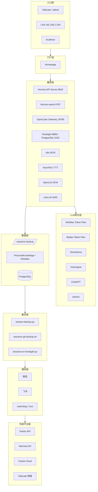

# AI Center 拓扑图

> 本笔记记录 AI Center 所有部署服务、软件、凭证和拓扑关系。
> 新增部署时更新本文档。格式：[[AI-Center-拓扑图]]

---

## 整体架构

### 分层总览



### ASCII 快图

```text
入口层
  ├─ Tailscale / LAN / localhost
  ↓
门户层
  └─ Homepage
     ↓
服务层
  ├─ Hermes API / hermes-webui / OpenClaw
  ├─ Hindsight / PostgreSQL
  ├─ n8n / SearXNG / OpenList
  └─ LiteLLM
        ↓
LLM 网关层
  ├─ MiniMax Token Plan
  ├─ Bailian Token Plan
  ├─ SenseNova / Volcengine / ChatGPT / Gemini
  ↓
数据层
  ├─ sessions backup
  ├─ PersonalKnowledge / Obsidian
  └─ PostgreSQL
  ↓
备份层
  ├─ session-backup.py
  ├─ sessions-git-backup.sh
  └─ sessions-to-hindsight.py
  ↓
通知层
  ├─ 微信
  ├─ 飞书
  └─ watchdog / cron
```

### 关系说明

| 层级 | 代表节点 | 作用 | 备注 |
|---|---|---|---|
| 入口层 | Tailscale / LAN / localhost | 人和脚本如何进入系统 | 只管入口，不管业务 |
| 门户层 | Homepage | 导航 + 状态总览 | 既看入口，也看健康 |
| 服务层 | Hermes / Hindsight / n8n / SearXNG / OpenList / LiteLLM | 具体功能服务 | 长期维护主体 |
| LLM网关层 | MiniMax / Bailian / SenseNova / Volcengine / ChatGPT / Gemini | 模型路由与供应商接入 | 供应商状态独立维护 |
| 数据层 | PostgreSQL / sessions / vault | 持久化存储 | 状态敏感，重点保护 |
| 备份层 | session-backup / Git backup / hindsight import | 恢复能力 | 失败必须告警 |
| 通知层 | 微信 / 飞书 / watchdog | 故障与摘要通道 | 只做最后一跳 |
| 外部平台层 | Oracle / Tailscale 网络 / 外部 API | 外部依赖 | 不能当作本机服务 |

### 当前运行状态说明

- **运行中但需要登录/外部依赖**：
  - SearXNG
  - n8n
  - OpenList
  - LiteLLM
- **本机核心服务**：
  - Hermes API Server
  - hermes-webui
  - OpenClaw Gateway
  - Hindsight
- **实时状态与长期事实分离**：
  - PID、瞬时健康、临时限流不再写进拓扑正文
  - 长期事实留在下半部分服务详情、凭证总册和历史快照中

### 现有目录结构（简版）

```text
AI-Center/
├── services/
├── tools/
├── platforms/
├── infrastructure/
├── docs/
├── credentials/
├── operations/
├── homepage/
├── config/
└── skills-system/
```

### 索引入口

- `docs/WIKI-索引.md`

### 会话存档与知识沉淀

- 会话热备：`/home/shin/sessions/`
- 冷备：`sessions-backup` GitHub 仓库
- 向量检索：Hindsight PostgreSQL
- 知识沉淀：PersonalKnowledge / Obsidian

> 下方服务详情继续保留，用于逐服务维护与历史记录。

---

## 服务详情

### 1. openclaw-gateway（OpenClaw 主网关）

| 属性 | 值 |
|------|-----|
| **类型** | systemd --user 服务 |
| **服务名** | `hermes-gateway.service` |
| **进程** | `openclaw-gateway` (OpenClaw Gateway) |
| **PID** | 486095 |
| **监听端口** | `18789` (gateway) |
| **LAN 访问** | ✅ `http://<本地IP>:18789` 可从局域网访问 |
| **启动方式** | `systemctl --user start hermes-gateway.service` |
| **日志** | `~/.hermes/logs/gateway.log` |
| **配置文件** | `~/.hermes/config.yaml` |

> ⚠️ **注意**: `18789` 归 **OpenClaw Gateway**，不要再把它写成 Hermes。

### Hermes API Server（对外接口）

| 属性 | 值 |
|------|-----|
| **类型** | Hermes 官方 OpenAI 兼容 API |
| **官方默认端口** | `8642` |
| **当前状态** | ✅ 本机监听 `127.0.0.1:8642`（`/health` 返回 ok） |
| **用途** | Open WebUI / 本机客户端调用 Hermes |
| **备注** | 与 OpenClaw Gateway 的 `18789` 是不同入口 |

---

### 2. hermes-webui（Web UI）

| 属性 | 值 |
|------|-----|
| **类型** | Python 服务 (直接运行) |
| **进程** | `/home/shin/.hermes/hermes-agent/.venv/bin/python /home/shin/hermes-webui/server.py` |
| **PID** | 265851 |
| **监听端口** | `8787` |
| **LAN 访问** | ✅ `http://<本地IP>:8787` 可从局域网访问 |
| **Web 框架** | 第三方 Web UI (非 Hermes 原生) |
| **sessions 目录** | `~/.hermes/webui/sessions/` |

> 💡 **备注**: hermes-webui 是第三方增强界面，连接本地 OpenClaw Gateway（18789），不是 Hermes API Server（8642）。

---

### 3. SearXNG（内网搜索）

| 属性 | 值 |
|------|-----|
| **类型** | Docker 元搜索聚合引擎 |
| **Docker 容器** | `searxng`（`searxng/searxng:latest`） |
| **监听端口** | `7777` (TCP，映射 8787→7777) |
| **访问地址** | `http://127.0.0.1:7777` |
| **Base URL** | `http://127.0.0.1:7777/` |
| **用途** | 主力搜索聚合，支持 JSON/API 返回 |
| **配置卷** | `/home/shin/docker/searxng/config:/etc/searxng` |

> ✅ 已修复端口映射，正常运行。

---

### 4. n8n（工作流自动化）

| 属性 | 值 |
|------|-----|
| **类型** | npm 全局安装（node 进程） |
| **安装路径** | `/home/shin/.local/share/npm/bin/n8n` |
| **进程 PID** | 221542 |
| **监听端口** | `5678` |
| **运行机器** | 192.168.2.249 |
| **访问地址** | `http://192.168.2.249:5678` |
| **安装日期** | 2026-05-11 |
| **运行状态** | 运行中 |

> n8n 是独立服务，不依赖 Docker，与 Hermes/OpenClaw 同机部署。

---

### 5. Feishu（飞书）集成

| 属性 | 值 |
|------|-----|
| **类型** | OpenClaw 平台插件 (`channels.feishu`) |
| **插件配置路径** | `~/.openclaw/feishu/` |
| **App ID** | `cli_a951cc68c0789cee` |
| **App Secret** | 见 `~/.openclaw/feishu/` 配置 |
| **启用状态** | ✅ 已启用 |
| **订阅事件** | `im.message.receive_v1` |
| **用户 ID 类型** | `open_id`（格式：`ou_xxx`） |

> 🔑 **凭证信息**（请勿外泄）:
> - App ID: `cli_a951cc68c0789cee`
> - App Secret: 见 `~/.openclaw/feishu/` 配置

---

### 6. WeChat（微信）集成

| 属性 | 值 |
|------|-----|
| **类型** | OpenClaw NPM 插件 (`@tencent-weixin/openclaw-weixin`) |
| **插件路径** | `~/.openclaw/extensions/openclaw-weixin` |
| **版本** | 2.1.8 |
| **安装时间** | 2026-04-17 |
| **OpenClaw 配置** | `~/.openclaw/openclaw.json` → `plugins.entries.openclaw-weixin` |
| **Account ID** | `1152b1001190-im-bot` |
| **Token** | `c3564e...e56a`（完整值见 ~/.hermes/.env） |

> 🔑 **凭证信息**（请勿外泄）:
> - Account ID: `1152b1001190-im-bot`
> - Token: 完整值在 `~/.hermes/.env` 的 `WEIXIN_TOKEN`

---

### 7. MiniMax-CN（主模型提供商）

| 属性 | 值 |
|------|-----|
| **模型** | MiniMax-M2.7 |
| **提供商** | MiniMax-CN Portal |
| **API Endpoint** | `https://api.minimaxi.com/anthropic` |
| **API Mode** | `anthropic-messages` |
| **Context Window** | 204,800 tokens |
| **Max Output** | 131,072 tokens |
| **Reasoning** | ✅ 启用 |
| **输入成本** | $0.3 / 1M tokens |
| **输出成本** | $1.2 / 1M tokens |
| **缓存读取** | $0.06 / 1M tokens |
| **缓存写入** | $0.375 / 1M tokens |

> 🔑 **凭证信息**（请勿外泄）:
> - API Key: 完整值在 `~/.hermes/.env` 的 `MINIMAX_CN_API_KEY`
> - Base URL: `https://api.minimaxi.com/anthropic`

---

### 8. Volcengine ARK（备选模型提供商）

| 属性               | 值                                                            |
| ---------------- | ------------------------------------------------------------ |
| **类型**           | OpenClaw 插件 (`volcengine`)                                   |
| **API Endpoint** | `https://ark.cn-beijing.volces.com/api/coding/v3`            |
| **API Mode**     | `openai-completions`                                         |
| **内置模型**         | ark-code-latest（自动路由）、DeepSeek-V3.2、Doubao-seed-2.0-code/pro |
| **成本**           | 免费（火山引擎编程计划）                                                 |

> 🔑 **凭证信息**（请勿外泄）:
> - API Key: 完整值在 `~/.hermes/.env` 的 `ARK_API_KEY`
> - API Key (部分): `dd94ff...7817`

---

## Skills 系统

### agency-agents（角色库）

| 属性 | 值 |
|------|-----|
| **位置** | `~/.hermes/skills/agency-agents/` |
| **角色数量** | 211 个 |
| **索引文件** | `~/.hermes/skills/agency-agents/SKILL.md` (8.2 KB) |
| **角色目录** | `~/.hermes/skills/agency-agents/agents/` (211 个子目录) |
| **主要分类** | marketing (小红书、抖音、B站等)、engineering (飞书集成等) |
| **单角色激活** | `/skill agency-agents/agents/marketing/xiaohongshu-operator` |
| **父 Skill** | `agency-agents`（汇总索引） |
| **安装日期** | 2026-04-28 |

> 💡 使用 agency-agents 角色前需确认该角色对应当前对话上下文是否合适。

### 内置 Skills

| 属性 | 值 |
|------|-----|
| **总数** | 38 个内置 + 211 agency-agents = 250 个 |
| **包含范围** | GitHub、Terminal、Browser、Obsidian、飞书、微信、Web 等 |
| **用户安装的** | `agency-agents` (211角色) |

---

## 内存/知识系统

### Hermes 内置 Memory（已激活）

| 属性 | 值 |
|------|-----|
| **类型** | 插件: `memory-core` |
| **长期记忆目录** | `~/HermesKnowledge/memory/` |
| **结构** | logs/、projects/、groups/、system/ |
| **记忆文件** | `~/HermesKnowledge/memory/system/MEMORY.md` |
| **Obsidian 同步** | ✅ `hn` 命令输入知识，`ha` 命令应用合并 |

### 可选扩展内存（未部署）

| 服务          | 状态    | 说明                                                     |
| ----------- | ----- | ------------------------------------------------------ |
| Hindsight   | ✅ 已部署 | 三层记忆架构（World Facts/Experiences/Mental Models），`http://127.0.0.1:8888`，bank_id=Hermes                                              |
| mem0        | ❌ 未部署 | 向量+图谱混合记忆                                              |
| SuperMemory | ❌ 未部署 | 浏览器增强记忆                                                |
| Honcho      | ❌ 未部署 | 本地内存服务                                                 |

> 💡 如需升级到外部记忆系统，考虑部署 Hindsight（已就绪）。

### 运维机制

| 机制 | 状态 | 说明 |
| --- | --- | --- |
| config-audit-tracker | ✅ 已配置 | 每周六20:00提醒审计配置，pending未确认则每天催，直到用户回复"确认完成"后清空下次再来 |
| agent-session-archiver | ✅ 运行中 | 每60分钟将会话归档到 Obsidian vault 和 Hindsight 记忆银行 |
| session-backup | ✅ 运行中 | 每小时增量备份到 /home/shin/sessions/ |
| sessions-git-backup | ✅ 运行中 | 每小时检测并推送 GitHub sessions-backup |
| sessions-to-hindsight | ✅ 运行中 | 每日导入 Hindsight 向量库 |
| AI Center变更巡检 | ✅ 运行中 | 每60分钟检测基础设施变更 |

---

## 搜索工具矩阵（已配置）

| 工具 | 版本 | 类型 | 用途 |
|------|------|------|------|
| Jina Reader | API | Skill（`jina-reader`） | 单页精准抓取，干净 Markdown |
| Pandoc | 3.1.3 | 系统自带 | 万能转换，40+格式互转（docx/odt/markdown/html） |
| Marker | PDF | hermes tools + pip | 高精度 PDF→Markdown，复杂排版/表格/公式 |
| DuckDuckGo | CLI (ddgs) | hermes tools + pip | 免费零成本兜底，隐私敏感时用 |
| Tavily | 0.7.24 | hermes tools + pip | AI 语义优化，1000次/月免费额度，已配置 API Key |
| Crawl4AI | 0.8.6 | Skill（`crawl4ai`） | 大规模批量深度抓取，异步并行 |
| Scrapling | 0.2.99 | hermes tools + pip | 复杂反爬，多引擎自适应解析 |
| CamoFox | 0.4.11 | hermes tools + pip | 高匿名隐身浏览器，指纹隐藏 |

### Jina Reader
- API Endpoint: `https://r.jina.ai/<url>`
- 脚本: `~/scripts/jina-read`
- 认证: Bearer Token（`jina_` 开头）
- 定位: 单页快速抓取，内容质量高

### Crawl4AI
- Python 包: `crawl4ai` v0.8.6
- 前置要求: `playwright install chromium`
- 定位: 批量 URL、深层爬取、JS 渲染、LLM 过滤

### Scrapling
- Python 包: `scrapling` v0.2.99
- 引擎: Fetcher(httpx) / StealthyFetcher(Camoufox) / PlayWrightFetcher(Playwright)
- 定位: 复杂反爬场景，自适应解析

### CamoFox
- Python 包: `camoufox` v0.4.11
- CLI: `~/.local/bin/camoufox`
- 定位: 最严格反爬，完整浏览器指纹隐藏

---

## 语音/视觉能力（已配置）

### 语音能力 Audio

| 工具 | 版本 | 类型 | 用途 |
|------|------|------|------|
| Whisper | base (72M) | openai-whisper | 99+语言语音识别，本地模型 |
| Edge TTS | 7.2.8 | edge-tts | 免费高质量语音合成，零成本 |
| faster-whisper | 1.2.1 | faster-whisper | CTranslate2 加速版，更快更省内存 |

#### Whisper
- Python 包: `openai-whisper`（v20250625）
- 模型: `base`（72M 参数，约 139MB）
- 路径: `/home/shin/.hermes/hermes-agent/venv/bin/`
- 定位: 99+语言识别，多语言会议转录

#### Edge TTS
- CLI: `edge-tts`（v7.2.8）
- 中文语音: `zh-CN-XiaoxiaoNeural`（女声，温暖）
- 定位: 免费 TTS，中文效果优秀

### 视觉能力 Vision

| 工具 | 状态 | 说明 |
|------|------|------|
| Fal.ai (fal-client) | ✅ 已配置 Key | FLUX 图像生成，余额不足暂停 |
| FLUX Skill | ⏸ 待充值 | 依赖 fal.ai，需充值后使用 |
| ComfyUI Skill | ❌ 未安装 | 本地图像生成，需 NVIDIA GPU |

#### Fal.ai
- Python 包: `fal_client`（v0.13.2）
- API Key: 已写入 `~/.hermes/.env` 的 `FAL_KEY`
- 模型: `fal-ai/flux-1/schnell`
- 状态: **余额不足**，需充值 https://fal.ai/dashboard/billing

---

## 自我进化能力 Self-Evolution

> 使用遗传-帕累托算法自动优化 Skills 和系统提示词。

| 组件 | 版本 | 说明 |
|---|---|---|
| **DSPy** | 2.6.27 | 提示词编程框架 |
| **GEPA** | 0.1.1 | Genetic-Pareto Evolution，ICLR 2026 Oral |
| **hermes-agent-self-evolution** | 0.1.0 | 独立仓库 `~/self-evolution/` |

### 环境

| 路径                               | 说明                                |
| -------------------------------- | --------------------------------- |
| `~/self-evolution/`              | 克隆的 NousResearch 仓库               |
| `~/.hermes/self-evolution-venv/` | 独立 venv（dspy 2.6.27 + gepa 0.1.1） |
| `~/.hermes/hermes-agent/`        | Hermes Agent 代码库（被优化目标）           |
| `~/self-evolution/run-evolve.sh` | Wrapper 脚本                        |

### 使用方式

```bash
# Dry-run 验证
~/self-evolution/run-evolve.sh github-code-review --dry-run

# 合成数据模式（推荐首次，$2-10/次）
~/self-evolution/run-evolve.sh <skill-name> 10 synthetic
```

### 约束门控

- Skill ≤15KB，工具描述 ≤500 字符
- `pytest tests/ -q` 100% 通过
- 语义一致性验证
- 人工 PR 评审（非直接提交）

---

## 网络与安全

### 端口汇总

| 端口 | 服务 | LAN 可访问 | 建议 |
|------|------|-----------|------|
| 100.113.209.2 | Tailscale VPN | ✅ | Tailnet: shin，域名: shin.tail8a16d3.ts.net |
| 100.114.100.50 | Mac Tailscale 节点 | ✅ | 当前在线节点：`wangxindemacbook-pro` |
| 22 | SSH | ✅ | 使用密钥登录 |
| 18789 | OpenClaw Gateway | ✅ | 无认证，建议内网使用 |
| 18791 | OpenClaw API Server | ✅ | API Key: `67748299` |
| 3334 | Hermes Internal RPC | ❌ 本地 | - |
| 8642 | Hermes API Server | ⚠️ 本机监听，未对 LAN 开放 | 官方默认端口 |
| 8787 | hermes-webui | ✅ | ⚠️ 无认证，建议内网使用 |
| 7777 | SearXNG | ✅ | 运行中 / 200 |
| 631 | CUPS 打印 | ✅ | 可关闭 |
| 5678 | n8n | 🟡 已安装未运行 | 工作流自动化 |
| 5244 | OpenList | 🟢 运行中 | 网盘聚合器 v4.2.2（已挂载 /quark 夸克 + /baidu 百度 + /alipan 阿里云盘 Open） |

### Tailscale CLI 节点（Mac）

| 属性 | 值 |
|------|-----|
| **设备** | MacBook Pro |
| **接入方式** | Tailscale CLI-only（未安装 GUI App） |
| **运行模式** | macOS `LaunchDaemon` + `tailscaled` root 常驻 |
| **LaunchDaemon** | `/Library/LaunchDaemons/com.shin.tailscaled.plist` |
| **Socket** | `/var/run/tailscaled.socket` |
| **State** | `/Library/Tailscale/tailscaled.state` |
| **日志** | `/Library/Tailscale/tailscaled.log` |
| **当前 Tailscale IP** | `100.114.100.50` |
| **当前在线节点名** | `wangxindemacbook-pro` |
| **目标节点名** | `wangxindemacbook-pro` |
| **连通性验证** | ✅ `tailscale ping shin` 成功 |

> 说明：该 Mac 节点已实现开机自动启动 `tailscaled`，无需手动启动守护进程，可直接通过 CLI 使用 `tailscale status / ping / ssh`。

### 节点命名整理

- 旧离线节点已删除
- 当前在线节点：`wangxindemacbook-pro`
- 如需再次手动设置节点名：`tailscale set --hostname=wangxindemacbook-pro`
- 如需同步 macOS 主机名：
  - `sudo scutil --set HostName wangxindemacbook-pro`
  - `sudo scutil --set LocalHostName wangxindemacbook-pro`
  - `sudo scutil --set ComputerName "wangxindemacbook-pro"`

### OpenClaw API Server

| 属性 | 值 |
|------|-----|
| **启用** | ✅ `API_SERVER_ENABLED=true` |
| **Key** | `67748299` |
| **端口** | 18791 |
| **用途** | 提供给 hermes-webui 等外部调用 |

---

## 部署检查清单

新增服务时，更新本文档：

- [ ] 服务类型和名称
- [ ] 进程/PID 信息
- [ ] 监听端口
- [ ] 配置文件路径
- [ ] 凭证信息（如有）
- [ ] 依赖关系（谁依赖谁）
- [ ] LAN 访问范围
- [ ] 更新拓扑图 ASCII

---

## 更新日志

| 日期         | 操作                                                                                                                            |
| ---------- | ----------------------------------------------------------------------------------------------------------------------------- |
| 2026-04-28 | 初始创建本文档，记录 hermes-gateway、hermes-webui、SearXNG、Feishu、WeChat、模型配置                                                             |
| 2026-05-02 | 新增搜索工具矩阵：Jina Reader（Skill）、Crawl4AI（Skill）、Scrapling（pip）、CamoFox（pip）                                                       |
| 2026-05-02 | 修复 SearXNG 端口（8787→7777）；安装 DuckDuckGo CLI（ddgs）、Tavily Python 包                                                              |
| 2026-05-02 | 配置 Tavily API Key（tvly-dev-...），验证搜索正常                                                                                        |
| 2026-05-02 | 新增 Tailscale VPN 配置：节点 shin，IP 100.113.209.2，用于 Mac 远程访问家庭服务器                                                                 |
| 2026-05-02 | 新增 Mac CLI-only Tailscale 节点记录：LaunchDaemon 常驻、socket/state/log 路径、节点命名整理方案                                                   |
| 2026-05-02 | 配置语音能力：Whisper（openai-whisper base 模型）、Edge TTS（edge-tts 7.2.8）、faster-whisper                                                |
| 2026-05-02 | 配置视觉能力：Fal.ai fal-client（API Key 已写入 .env），FLUX 因余额不足暂停                                                                       |
| 2026-05-02 | 新增文档处理工具：Pandoc（万能转换）+ Marker（PDF→Markdown 高精度，独立 venv）                                                                       |
| 2026-05-02 | 配置 hermes-agent-self-evolution：独立 venv (dspy 2.6.27 + gepa 0.1.1)，仓库 ~/self-evolution/，wrapper ~/self-evolution/run-evolve.sh |
| 2026-05-10 | 新增 sessions-backup 三层备份系统：热备(/home/shin/sessions/) + Git冷备(GitHub) + Hindsight向量库，cron已配置 |
| 2026-05-11 | 新增 n8n 服务（192.168.2.249:5678，npm全局安装）；修正拓扑图：OpenClaw 与 Hermes 端口区分（OpenClaw: 18789/18791；Hermes API: 8642）；sessions-backup 架构升级：Hindsight入库从每日批量改为 session-backup.py 内嵌每小时增量处理，停用 sessions-to-hindsight.py cron |
| 2026-05-22 | 新增 LiteLLM 统一模型网关记录；ChatGPT health probe 通过 runtime patch 纠正为真实 responses 探测，模型配置未改 |
| 2026-05-10 | 重构 AI-Center 目录结构：按 services/tools/platforms/infrastructure/docs/credentials/config 分类，新增 WIKI-索引.md |
| 2026-05-10 | 上线个人知识沉淀系统：inbox-watcher + process-inbox.py + daily-briefing.py + SensNova AI增强 + Hermes cron简报 |
| 2026-06-04 | 调研 AList 网盘聚合器，输出调研报告 + 服务 README；建立《服务档案管理方法论》明确归档标准；后续实际部署见下一条 |
| 2026-06-04 | AList 实际部署：镜像 xhofe/alist:latest (amd64 53MB，alist666/alist 只有 arm64)；20 位强密码写入 .env；3 项访客权限全关；端口 5244 LAN 200 OK；数据落盘 /home/shin/workspace/services/alist/data |
| 2026-06-17 | OpenList 调研完成：v4.2.2 为最新稳定版；v4.1+ Docker 部署变更（PUID/PGID 废弃，改用 --user）；驱动代码与 AList 主体共用，夸克一样烂；调研报告 `services/openlist/调研报告-OpenList.md` |
| 2026-06-18 | AList 完全卸载（容器/镜像/data/.env/档案）；OpenList v4.2.2 部署：openlistteam/openlist:latest (amd64 52MB)；--user 0:0；端口 5244 LAN 200 OK；3 项访客权限全关；20 位强密码写入 .env；档案库迁移 services/alist/ → services/openlist/ |
| 2026-06-18 | 夸克网盘挂载成功：用户 Chrome F12 提供 Cookie 1942 字符/21 段，OpenList 创建 storage id=1（mount_path=/quark），验证列出 7 个真实文件夹（含"我的备份 / 夸克精选壁纸 / 来自：分享"）；Cookie 备份到 `~/workspace/services/openlist/data/quark.cookie.bak` (chmod 600) |
| 2026-06-18 | ⚠️ 用户将 OpenList admin 密码改为 `67748299`，与 SSH/OpenClaw API Key/PVE 密码完全相同，**密码重用风险已记录在 credentials/系统凭证备忘录.md**，建议 30 天内轮转 |
| 2026-06-18 | Homepage 真相：实际跑在 192.168.2.254:3000（不在 AI Center）；AI Center 档案库的 yaml 是副本；254 live panel 仍显示 "AList"（旧名）；同步清单 `homepage/254同步操作清单.md` |
| 2026-06-18 | 254 上的 Homepage 同步完成：用 sshpass 远程改 services.yaml + bookmarks.yaml（AList → OpenList + 描述加 v4.2.2），修复一处正则多吃的冒号，YAML 校验通过，docker restart homepage，live API 验证已返回 OpenList（无 AList 残留）；备份 services.yaml.bak.20260618 + bookmarks.yaml.bak.20260618 |
| 2026-06-18 | 百度网盘挂载成功：用 OpenList v4 源码查证路线——`api_url_address=https://api.oplist.org/baiduyun/renewapi` 实现免 client_id 中转；首轮 refresh_token 失败 `invalid refresh token, lifetime changed`（api.oplist.org 工具的"防滥用"机制）；换新 token 后 storage id=5 创建成功，列根目录 64 项真实文件（含 apps/ShuangYe's PICs/发票/《数据化智能营销与Martech》资料包 等）；token 备份到 `~/workspace/services/openlist/data/baidu.token.bak` (chmod 600) |
| 2026-06-18 | Homepage 254 live 面板追加"百度网盘 (via OpenList)"卡片，指向 http://192.168.2.249:5244/baidu；备份 services.yaml.bak.20260618b |
| 2026-06-18 | 阿里云盘 Open 挂载成功：用户从 api.oplist.org 工具拿到 JWT 风格 refresh_token（iat=2026-06-17, exp=2026-09-08，新格式，OpenList v4.2.2 完美支持）；storage id=6 创建成功，**关键修复 root_folder_id 从 "" 改为 "root"**（阿里云盘 API 必填），列根目录 1 项「来自分享」；token 备份到 `~/workspace/services/openlist/data/alipan.token.bak` (chmod 600) |

---

*本文档由 Hermes Agent 自动生成维护*

## 记忆控制面当前状态（2026-05-13 9C）

| 项目 | 当前事实 |
|------|----------|
| Hindsight 健康 | `/health` healthy，database connected |
| Hindsight bank | `Hermes` |
| Hindsight runtime | `auto_recall=false`，`auto_retain=false`，`retain_async=true`，`retain_every_n_turns=10` |
| 召回默认 | workspace-tag 过滤 |
| 抽取模型 | 已移除（待替换） |
| worker | `max_slots=1` |
| 代码修复 | `hindsight_retain` 同步透传 `retain_async` 已修复并通过回归测试 |
| 当前基线 | `PASS=67 WARN=2 FAIL=0` |
| 慢路径 | `/stats` 仅作为 WARN，不作为收口阻塞 |

### 当前使用方式

- 新会话先读 `docs/README.md` 和 `state/current-status.md`。
- 任何写入前先备份，再列计划，再执行。
- 召回默认按 workspace-tag 过滤；无 tag recall 仅保留调试。
- 变更后先跑健康检查，再看 tracker 和 docs 是否同步。
