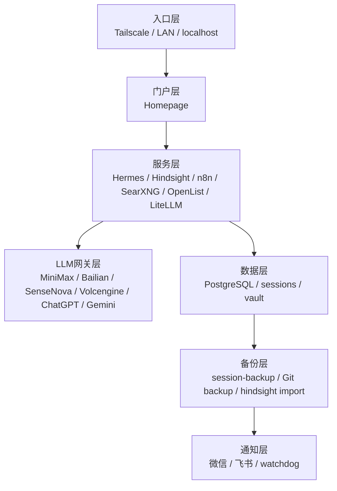

# AI Center

> 部署在家庭服务器上的 AI 智能体系统，包含 Agent、记忆、搜索、语音等全套能力。
> 当前 AI Center 以国内套餐与本机服务为主，LLM 通过 LiteLLM 统一接入 MiniMax、Bailian、SenseNova、Volcengine、ChatGPT、Gemini；实时状态以 Homepage / watchdog 为准。
> 归档范围不只限于本机：**AI Center 还包含 HTPC、家庭网络设备，以及这些设备上运行的全部服务与入口**。
> 后续目标会继续扩展到账号、域名、证书、密钥、配置、迁移痕迹和调研过程，档案库要尽量做到可交接、可复原、可追溯。

---

## 系统架构

> 详细分层图见：`[AI-Center-拓扑图](./AI-Center-拓扑图.md)`



### 当前核心入口

- **本机**：`127.0.0.1`
- **局域网**：`192.168.2.249`
- **Tailscale**：`shin.tail8a16d3.ts.net`
- **门户**：Homepage

### 家庭网络设备

- 总索引：`[infrastructure/home-network/README.md](../infrastructure/home-network/README.md)`
- 254：PVE 宿主，承载 100 / 101 / 102 三台 VM
- 253：爱快主路由 VM，Web 管理可达，SSH 当前凭据失败
- 252：iStoreOS 旁路由 VM，OpenClash / Samba / NFS / Docker 已装
- 251：无线 AP / 路由器，至少有 LuCI Web 管理口
- 250：mesh 路由器，暂按待盘点
- 249：AI 主机，现态为 Hermes / OpenClaw / LiteLLM / OpenList / Hindsight / SearXNG

### 当前核心服务

- Hermes API Server：`8642`
- OpenClaw Gateway：`18789`
- hermes-webui：`8787`
- Hindsight：`8888`
- n8n：`5678`
- SearXNG：`7777`
- OpenList：`5244`
- LiteLLM：`4000`

### 组织关系说明

- **入口层**只负责进入系统
- **门户层**负责导航和状态摘要
- **服务层**负责实际功能
- **LLM 网关层**负责模型路由
- **数据层**负责持久化
- **备份层**负责恢复能力
- **通知层**负责异常汇报

### 状态口径

- **实时状态**写 Homepage / watchdog，不写进总览图正文
- **长期事实**写档案库
- **过时状态**保留历史快照，不伪装成当前事实


---

## 知识沉淀新基线

个人知识库从 2026-06-11 起不再采用“输入 → AI 摘要 → 直接写笔记”的旧思路，而采用：

```text
输入层 → 解析层 → 归一化层（Canonical Envelope） → 知识编译层
```

对应文档：

- `docs/个人知识沉淀系统-设计文档.md`
- `docs/知识摄入解析层与统一内容包规范.md`
- `docs/知识摄入样例验证-2026-06-11.md`

---

## 服务目录

| 服务 | 功能 | 端口 |
|------|------|------|
| [hermes](../services/hermes/README.md) | 主 Agent 框架 / 本机 API Server | 8642（官方默认；本机监听） |
| [openclaw](../platforms/openclaw/README.md) | Agent 执行层 / Gateway | 18789 |
| [hindsight](../services/hindsight/README.md) | 长期记忆与向量检索 | 8888 |
| [hermes-webui](../services/hermes/README.md#hermes-webui) | Web 管理界面 | 8787 |
| [searxng](../services/searxng/README.md) | 隐私搜索聚合引擎 | 7777（运行中） |
| [feishu](../platforms/feishu/README.md) | 飞书消息集成 | — |
| [wechat](../platforms/wechat/README.md) | 微信消息集成 | — |
| [minimax](../platforms/minimax/README.md) | 主模型提供商 | — |
| [volcengine](../platforms/volcengine/README.md) | 备选模型（Doubao） | — |
| [whisper](../tools/whisper/README.md) | 本地语音识别 | — |
| [edge-tts](../tools/edge-tts/README.md) | 本地语音合成 | — |
| [sessions-backup](../services/sessions-backup/README.md) | 会话存档备份（热备/冷备/Hindsight） | — |
| [n8n](../services/n8n/README.md) | 工作流自动化 | 5678 |
| [openlist](../services/openlist/README.md) | 网盘聚合器（AList 社区 fork，v4.2.2） | 5244 |
| [LiteLLM](../credentials/LiteLLM-模型配置方法.md) | 统一模型网关（ChatGPT / Gemini / MiniMax / 百炼 / SenseNova） | 4000 |
| [AI-Center-巡检总控](./AI-Center-巡检总控.md) | 统一巡检总控（资源 / 服务 / 门户 / 数据 / 档案库 / 审计） | — |
| [operations](../operations/README.md) | 巡检总入口 / 告警分级 / 恢复规则 | — |
| [homepage](../homepage/README.md) | Homepage 门户配置 / services.yaml / bookmarks.yaml | — |
| [fal-ai](../tools/fal-ai/README.md) | AI 图像生成 | — |
| [search-tools](../tools/search-tools/README.md) | 搜索工具矩阵 | — |
| [self-evolution](../services/self-evolution/README.md) | 自我进化优化 | — |
|| [home-network](../infrastructure/home-network/README.md) | 家庭网络总索引（HTPC / PVE / 路由 / 旁路由 / AP / mesh / AI 主机） | — |
|| [tailscale](../infrastructure/tailscale/README.md) | VPN 远程访问 | — |
|| [skills-system](../skills-system/README.md) | 技能系统 | — |

> 纠错：**18789 归 OpenClaw Gateway，不要再标成 Hermes。** Hermes 官方 API Server 默认是 **8642**，当前本机已监听 `127.0.0.1:8642`，只能写成“本机可用、未对 LAN 开放”，不能再写成“未启用”。

## 档案库管理规则（16 条）

> 目标：把“新增/升级/下线一个服务”收敛成同一套最小动作。能自动化就自动化，不能核实就保留原样，不靠记忆乱改。
> 最高约束：`[AI-Center-档案库总则](./AI-Center-档案库总则.md)`；本节是执行摘要，不高于总则。
> 当前执行版本：`[AI-Center-档案库V1](./AI-Center-档案库V1.md)`。

### A. 文档链路（1-6）

1. 新增任何服务，先建 `services/<name>/README.md`；没有 README，就不算完成归档。
2. 复杂项目才写调研/选型报告；简单项目只保留 README + 变更记录。
3. `docs/WIKI-索引.md` 必须同步，保证能从索引跳到服务。
4. `docs/AI-Center-拓扑图.md` 必须同步，保证拓扑和现实一致。
5. `docs/README.md` 必须同步，保证总览表可一眼扫到。
6. `credentials/系统凭证备忘录.md` 必须同步；完整值优先留在原始凭证源（如 `~/.hermes/.env`、`workspace/litellm/.env`、`auth.json`），文档里只写变量名/前缀/用途或来源。

### B. 运行核验（7-10）

7. README 基础信息表必须写全：类型、端口、数据目录、运行机器、访问地址、安装日期、状态。
8. 状态必须由实机核验，不用感觉写“运行中”；至少确认端口 / 进程 / 容器中的一个。
9. 数据目录和持久化路径必须核验，不能让“写着落盘，实际没挂载”混过去。
10. 健康检查基线必须存在：能 curl / 能查端口 / 能看容器状态，至少有一个明确判据。

### C. 运营联动（11-13）

11. WIKI、拓扑、总览 README 三处必须一起改，避免单点漂移。
12. 能接 Homepage 就接；至少给一个统一入口面板，别让服务散成一地链接。
13. 备份 / 容灾 / 告警必须接入；优先自动化通知，微信只做最后一跳，不做人肉中继。

### D. 变更纪律（14-16）

14. 每次变更都要写迭代记录，尤其是升级、改端口、换镜像、换凭证。
15. 无法核实的信息保留既有内容，不猜、不补、不硬改。
16. 新增服务的最简动作固定为：`README → 凭证 → WIKI → 拓扑 → 总览 → 健康/备份`；其余步骤尽量自动化。

## USAGE_MANUAL 标准

- 统一入口：`docs/USAGE_MANUAL-标准.md`
- 每个服务 README 必须包含：健康检查 / 备份 / 告警 / 恢复
- 模板总入口：`[docs/模板索引.md](./模板索引.md)`

---

## 运维

### 常用命令

```bash
# 查看 OpenClaw Gateway 状态
systemctl --user status hermes-gateway

# 查看 Hindsight 状态
curl -s http://127.0.0.1:8888/health

# 查看 SearXNG
curl -s http://127.0.0.1:7777 | head -5

# 查看 cron 任务
crontab -l

# 手动运行 session 归档
python3 ~/bin/session_archive.py

# 手动运行知识库 push
~/PersonalKnowledge/.system/scripts/hermes-push-auto
```

### 日志位置

| 服务 | 日志路径 |
|------|---------|
| OpenClaw Gateway | `~/.hermes/logs/gateway.log` |
| Session 归档 | `~/logs/session_archive.log` |
| Evolution | `~/.hermes/evolution/logs/` |
| Hindsight API | systemd journal |

---

## 容灾

```
PersonalKnowledge (GitHub: praxistech2026-eng/personal-knowledge-base)
~/AgentArchives/ (GitHub: praxistech2026-eng/sessions-backup)
Hindsight PostgreSQL (实时向量检索)
```
