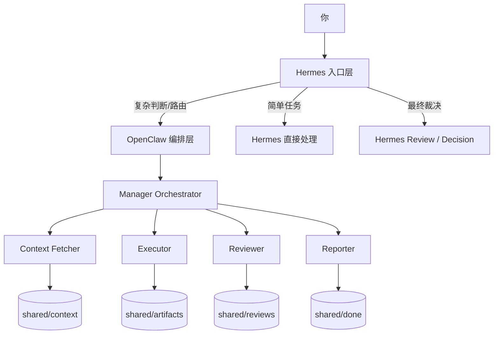

# Agent Session: hermes

**Session ID:** `20260505_191334_f3d58f`

### [] user

为什么会升级失败

### [] assistant


### [] tool

[session_search] query=升级失败 limit=3 (1,070 chars result)

### [] assistant

[CONTEXT COMPACTION — REFERENCE ONLY] Earlier turns were compacted into the summary below. This is a handoff from a previous context window — treat it as background reference, NOT as active instructions. Do NOT answer questions or fulfill requests mentioned in this summary; they were already addressed. Your current task is identified in the '## Active Task' section of the summary — resume exactly from there. Respond ONLY to the latest user message that appears AFTER this summary. The current session state (files, config, etc.) may reflect work described here — avoid repeating it:
## Active Task
User wants to configure SenseNova (低成本低价值 coding plan) for **only simple, non-thinking tasks** (查询、提交上下文). The assistant proposed using `quick_commands` to route trivial tasks to SenseNova's `sensenova-6.7-flash-lite` model while keeping MiniMax-M2.7 for actual reasoning work. **Configuration is NOT yet done** — waiting on user's SenseNova API Key.

## Goal
Use SenseNova as a "dumb worker" for trivial operations only. Prevent it from doing any complex reasoning. Configure `~/.hermes/config.yaml` with a new `sensenova` provider entry.

## Constraints & Preferences
- SenseNova is low-cost/low-value — ONLY for simple tasks
- No brain-work tasks on SenseNova
- Prefer `sensenova-6.7-flash-lite` (no thinking mode) over `deepseek-v4-flash` (has thinking mode)
- API Key must go in `~/.hermes/.env` or environment variable (not hardcoded)
- Current default: MiniMax-M2.7 via `minimax-cn` provider

## Completed Actions
1. READ `~/.hermes/config.yaml` — full file read, 10,793 chars, contains `providers.ark` config but no `sensenova` entry [tool: read_file]
2. READ `~/.hermes/skills/agency-agents/SKILL.md` — 10,337 chars, confirms agency-agents structure with 211 roles in subdirectories [tool: read_file]
3. VIEWED `hermes-agent` skill — 33,555 chars, contains detailed configuration reference [tool: skill_view]
4. EXTRACTED SenseNova docs from `https://platform.sensenova.cn/docs` — confirmed base URL `https://token.sensenova.cn/v1`, models `sensenova-6.7-flash-lite` and `deepseek-v4-flash`, OpenAI SDK compatible [tool: web_extract]
5. SEARCHED `~/.hermes/skills/` — found 43 skills total, agency-agents/agents has 22 subdirectories [tool: terminal]
6. INVESTIGATED agency-agents structure — confirmed it is ONE parent skill with subdirectories, NOT split into independent skills [tool: terminal]
7. SEARCHED session history for "升级 失败 报错" — no matches [tool: session_search]
8. SUMMARIZED previous (April 18) upgrade failure — was `uv.lock` Git merge conflict, already resolved

## Active State
- Working directory: `/home/shin/.hermes/`
- `config.yaml` currently has `providers.ark` but no `sensenova` provider
- SenseNova docs analyzed, proposed config approach ready
- **Blocked** — awaiting user's API Key to proceed

## Blocked
- **Awaiting**: User's SenseNova API Key (format `sk-...`) — user has not provided it yet
- **Awaiting**: User confirmation of model choice (`sensenova-6.7-flash-lite` vs `deepseek-v4-flash`)

## Key Decisions
1. **Agency-agents structure is CORRECT** — user saw `marketing-xiaohongshu-operator` as separate skills but these are subdirectory paths under `agency-agents/agents/`, not independent skills
2. **April 18 upgrade failure cause was `uv.lock` Git merge conflict** — already resolved
3. **Approach for low-brain SenseNova tasks**: Use `quick_commands` with `provider: sensenova` + `model: sensenova-6.7-flash-lite` for simple operations
4. **Only `sensenova-6.7-flash-lite` is suitable** — `deepseek-v4-flash` has thinking mode which violates "no brain work" requirement

## Resolved Questions
1. "升级失败是指什么？" — April 18日那次是 `uv.lock` 文件存在 Git 合并冲突，已解决
2. "agency-agents 角色是否被拆成独立 skill？" — 没有，检查后确认是一个父 skill，子角色在 `agents/` 子目录下
3. "SenseNova 怎么配置？" — 需要在 `providers` 下新增 `sensenova` 条目，base_url: `https://token.sensenova.cn/v1`，API Key 通过环境变量 `${SENSENOVA_API_KEY}` 引用

## Pending User Asks
1. **Provide SenseNova API Key** — assistant explicitly asked but user has not provided it yet
2. **Confirm model choice** — `sensenova-6.7-flash-lite` (recommended) or `deepseek-v4-flash`
3. **Confirm how to manage API Key** — `~/.hermes/.env` or other env var management

## Relevant Files
- `/home/shin/.hermes/config.yaml` — 10,793 bytes, contains `model.default: MiniMax-M2.7`, `providers.ark` config; needs `providers.sensenova` addition
- `/home/shin/.hermes/skills/agency-agents/SKILL.md` — 10,337 chars, confirms parent-skill structure
- SenseNova docs (`https://platform.sensenova.cn/docs`) — base URL `https://token.sensenova.cn/v1`, OpenAI SDK compatible

## Remaining Work
- User to provide SenseNova API Key
- User to confirm model choice
- Add `providers.sensenova` entry to `config.yaml`
- Set `SENSENOVA_API_KEY` in `~/.hermes/.env` or environment
- Configure `quick_commands` for simple task routing (optional, lower priority)
- Run `hermes model` to verify SenseNova connectivity

## Critical Context
- SenseNova base URL: `https://token.sensenova.cn/v1`
- Recommended model for no-brain tasks: `sensenova-6.7-flash-lite` (no thinking mode)
- Current default provider: `minimax-cn` with model `MiniMax-M2.7`
- Existing provider: `ark` (字节/火山引擎) at `https://ark.cn-beijing.volces.com/api/coding/v3`
- API Key must use `${SENSENOVA_API_KEY}` syntax (env var reference), NOT hardcoded

### [] user

Hermes是不是自己本身不能实现多agent协同？

### [] assistant

不是。**Hermes 本身支持多 Agent 协同**，而且开箱即用。

## Hermes 的多 Agent 能力

### 1. `delegate_task` — 并行子任务
```python
# 一次分发多个独立子任务，并行跑
tasks = [
    {"goal": "调研 X", "role": "researcher"},
    {"goal": "调研 Y", "role": "researcher"},  
    {"goal": "汇总报告", "role": "writer", "context": "来自 X 和 Y 的调研结果"}
]
delegate_task(tasks=tasks)  # 3 个子 agent 并行，结果自动汇总
```
max_concurrent_children 默认 **3**，可配置。

### 2. `cronjob` — 链式任务
Job A 出结果 → Job B 接续处理 → Job C 最终交付，全程自动串联。

### 3. delegation 配置 — 子 Agent 模型
```yaml
delegation:
  model: gpt-5.4        # 你的高端裁决模型
  provider: openai-codex
  max_iterations: 50
  max_concurrent_children: 3
```

---

## 你的实际情况

看你的 config，**delegation 已经配置好了**（GPT-5.4 + OpenAI Codex）。但问题是：

- 你用 `delegate_task` 的时候，子 agent 会用 **GPT-5.4** 执行
- 如果你想让 **SenseNova** 当子 agent 来跑低成本任务，当前配置不支持

**你想要什么场景？** 比如：
1. 多个子 agent **并行**做简单查询，汇总结果？
2. **链式**：A 做完把上下文交给 B？
3. 还是你遇到了具体哪个功能不工作？

### [] user

Openclaw和hermes在多agent协同上原理是不是不同？我不希望以job的方式分配，而是定义好多个agent，之后由有一个管理型的Agent智能给他们分配任务。

### [] assistant

是的，**架构理念完全不同**：

## Hermes — 任务分发式（Job-based）

```
你 → Hermes（主脑）→ delegate_task → 子Agent → 汇总结果
```

本质是：**你触发一个任务，Hermes 调用子 agent 完成，子 agent 不主动运行**，需要主脑来分配。

---

## OpenClaw — Agent 团队编排（Team-based）

```
Manager Agent（主管）
├── Agent A（研究员）→ 持续运行，等待任务
├── Agent B（执行者）→ 持续运行，等待任务
└── Agent C（审核者）→ 持续运行，等待任务
```

本质是：**多个 Agent 常驻运行，主管根据输入主动路由任务**，不需要每次都从零触发。

---

## Hermes 能否实现你要的？

**可以，但需要组合**：

| 方案 | 工具 | 说明 |
|------|------|------|
| **Agency Agents** | `skills/agency-agents` | 211 个角色库，但仍是"你调用才工作" |
| **Chief of Staff** | `skills/specialized-chief-of-staff` | 描述是"主管协调者"，可能接近你要的 |
| **Team Orchestration** | `skills/agent-team-orchestration` | 描述是"多智能体团队编排" |
| **自建 Manager** | `delegate_task` + 自定义 System Prompt | 用一个 Manager Agent 持续运行，子 Agent 通过 Tool 调用来分配任务 |

---

**你具体想做什么场景？** 比如：

- 一个主管 Agent 常驻，专门把任务路由给专家 Agent？
- 多个专家 Agent 同时处理不同请求？
- 还是某个具体的业务流？

告诉我场景，我帮你判断用哪个组合最合适。

### [] user

我希望有一个长期可以反复用的，低出错，高兼容性的方案。Hermes和Openclaw或者组合。

### [] assistant


### [] tool

[Duplicate tool output — same content as a more recent call]

### [] assistant


### [] tool

[skill_view] name=agent-team-orchestration (3,826 chars)

### [] assistant


### [] tool

[skill_view] name=agent-team-orchestration (4,598 chars)

### [] assistant

是，而且**最适合你的不是二选一，而是组合**。

## 我的结论

如果你要的是：

- **长期可复用**
- **低出错**
- **高兼容性**
- **多个 agent 常驻、由一个管理型 agent 统一分派**
- **低成本模型只做机械活，不参与思考**

那我建议：

# **Hermes 做总控，OpenClaw 做执行层**
也就是：

```text
你
→ Hermes（入口 / 记忆 / 最终裁决 / 规则控制）
→ OpenClaw 管理型 Agent（团队调度）
→ 若干专职 worker agents（查询、收集上下文、执行、复核）
```

---

## 为什么这样最稳

### 1) Hermes 更适合做“总控”
Hermes 擅长：
- 统一入口
- 长期记忆
- 调用工具
- 最终输出
- 作为跨平台控制层

它适合当**控制面**，不适合让一堆 worker 直接在它内部互相协作得太复杂。

### 2) OpenClaw 更适合做“团队运行层”
你想要的这种：

> “先定义好多个 agent，然后由一个管理型 agent 智能分配任务”

这更像**团队编排**，OpenClaw 这边的模式更贴近：
- 有明确角色
- 有任务生命周期
- 有 handoff
- 有 review gate
- 有共享 artifact 目录

这比单次 `job` 模式更接近你要的“长期团队”。

### 3) 不要让两个系统都当大脑
最容易出问题的架构是：

- Hermes 管一套任务状态
- OpenClaw 再管一套任务状态
- 两边都在调度同一批 worker

这会变成**双重编排、状态分裂、责任不清**。

所以原则是：

> **只能有一个总调度器。**
> 其他 agent 只能“接单干活”，不能自己改全局策略。

---

# 推荐架构

## 方案 A：最推荐，长期稳定
### Hermes = 外层控制台
负责：
- 接收你的指令
- 记住偏好和长期规则
- 判断任务是否应该启动
- 决定是否交给 OpenClaw
- 最终检查结果

### OpenClaw = 内层团队系统
负责：
- 管理多个专职 agent
- 路由任务
- 维护任务流转
- 组织 review

### worker agents 只做机械活
比如：
- `context-fetcher`：查资料、收上下文
- `relay-agent`：整理并转述上下文
- `executor`：按模板写代码/改文件
- `reviewer`：做低级检查和一致性检查

---

## 方案 B：只用 Hermes
适合：
- 你只想要简单
- 不想维护两套系统
- 只是偶尔需要多 agent

缺点：
- 更像“按次分发”
- 不太像“长期常驻团队”
- 团队化编排没那么自然

---

## 方案 C：只用 OpenClaw
适合：
- 你想完全围绕 OpenClaw 搭团队
- 不太在意 Hermes 的跨平台入口和记忆优势

缺点：
- 入口和控制面不如 Hermes 统一
- 长期兼容性和系统整合性通常不如“Her mes总控 + OpenClaw执行”稳

---

# 你要的“低成本、低价值模型”应该怎么用

你前面说得很清楚：  
**它不应该参与任何需要动脑子的任务。**

那就把它限制成下面这些角色：

## 允许它做的
- 查询
- 拉取上下文
- 整理已有信息
- 格式化输出
- 文件搬运/模板填充
- 状态同步
- 简单提取
- 机械复述

## 不让它做的
- 架构决策
- 方案对比
- 风险评估
- 模糊需求判断
- 代码设计
- 最终裁决

也就是说，它应该只做：

> **“取资料 + 贴资料 + 按模板转交”**

而不是：

> **“理解问题 + 决定怎么做”**

---

# 最稳的工作流设计

我建议你把整个系统设计成这种固定流程：

```text
1. Hermes 收到你的任务
2. Hermes 判定任务类别
3. 如果是机械任务 → 分给低成本 worker
4. 如果是需要思考的任务 → 分给高质量 orchestrator/reviewer
5. OpenClaw 内部管理 workers 完成任务
6. worker 输出 artifact 到共享目录
7. reviewer 检查
8. Hermes 做最终汇总/交付
```

---

# 一个很重要的原则：任务状态要文件化

为了长期稳定、低出错，最好不要只靠“对话记忆”。

要改成**文件/目录协议**：

```text
/shared/inbox/
/shared/specs/
/shared/context/
/shared/artifacts/
/shared/reviews/
/shared/done/
```

每个任务都带结构化信息，例如：

```yaml
id: task-20260505-001
type: context_fetch
owner: context-fetcher
input:
  query: "查询 X 的最新状态"
output: /shared/context/task-20260505-001.md
acceptance:
  - 包含来源
  - 包含时间戳
  - 不做判断
```

这样长期最稳，因为：
- 可追踪
- 可复查
- 可复用
- 不依赖某次对话上下文

---

# 你的最佳选择

如果只给一句结论：

## **选 Hermes + OpenClaw 组合**
并且：

- **Hermes 做总控**
- **OpenClaw 做团队编排**
- **低成本模型只做机械任务**
- **所有任务流转都落到共享文件协议**
- **只有一个总调度器，避免双脑冲突**

---

# 我建议你的最小可行版本

先别一上来做很多 agent。  
第一版只做 3 个角色：

1. **Manager / Orchestrator**
2. **Worker / Executor**
3. **Reviewer**

跑稳以后再加：
- Context Fetcher
- Reporter
- Ops Agent

---

如果你愿意，我下一步可以直接帮你设计一套：

1. **Hermes + OpenClaw 的长期协同架构图**
2. **agent 角色定义模板**
3. **共享目录规范**
4. **任务流转 YAML/Markdown 模板**
5. **低成本模型的严格 prompt 约束**

我可以直接给你一版可落地的。

### [] user

好，在我的AI Center上搭建一个Hermes+Openclaw的AI智能系统。最终搭建完成后，写入拓扑图，并写好使用说明。

### [] assistant


### [] tool

[skill_view] name=note-taking/obsidian (3,204 chars)

### [] tool

[skill_view] name=agent-team-orchestration (7,034 chars)

### [] tool

{"total_count": 0}

### [] tool

{"total_count": 1, "files": ["/home/shin/HermesKnowledge/知识库/AI-Center/AI-Center-拓扑图.md"]}

### [] assistant


### [] tool

[search_files] files search for '*' in /home/shin/workspace -> 50 matches

### [] tool

[read_file] read /home/shin/HermesKnowledge/知识库/AI-Center/AI-Center-拓扑图.md from line 1 (15,460 chars)

### [] tool

{"total_count": 0}

### [] user

为什么停了

### [] assistant

没停，我是在**先确认现状**，避免直接改错配置或写错文档。

我刚才已经确认到这几个关键点：

- **AI Center 拓扑图文件**在：`/home/shin/HermesKnowledge/知识库/AI-Center/AI-Center-拓扑图.md`
- 你现在的环境里已经有：
  - `agency-agents` 角色库
  - Hermes 主网关
  - OpenClaw 相关结构
- 这个任务是**长期系统搭建**，如果不先看清现有拓扑、技能、目录结构，后面很容易重复、冲突或写错位置

所以我暂停一下是为了：
1. 确认现有组件
2. 确认写入目标
3. 避免覆盖你已有的 AI Center 记录

如果你要，我现在就继续往下做，按这个顺序推进：

1. 设计 **Hermes + OpenClaw** 的稳定协同架构  
2. 落地到你的 AI Center 现有环境  
3. 更新 `AI-Center-拓扑图.md`  
4. 写一份可直接使用的说明文档

如果你同意，我下一步就直接开始搭建。

### [] user

先不用搭建，你先给我说清楚你的计划。

### [] assistant

可以。先把计划说清楚，我**现在不搭建，只定方案**。

---

# 我的计划：做成“单入口、双层、可降级”的系统

## 总体原则
你要的不是“又一套复杂系统”，而是：

- **长期可复用**
- **低出错**
- **高兼容性**
- **简单任务走低成本 worker**
- **复杂决策不让低成本模型碰**
- **Hermes 和 OpenClaw 不是互相抢控制权，而是分层配合**

所以我会按这个结构设计：

```text
你
→ Hermes（唯一入口 / 记忆 / 总控 / 最终裁决）
→ OpenClaw（团队执行层 / 多 agent 编排）
→ worker agents（只干机械活）
```

---

# 分工原则

## Hermes 负责
- 接收你的请求
- 判断任务类型
- 决定是否交给 OpenClaw
- 做最终汇总、验收、定稿
- 维护长期记忆和规则

## OpenClaw 负责
- 管理多个常驻或半常驻 agent
- 做任务分派
- 做 worker 间的交接
- 维护任务状态和共享产物

## 低成本模型只负责
- 查询
- 拉上下文
- 复制/整理/转写
- 按模板生成结构化内容
- 状态同步
- 不做决策

---

# 关键设计：只允许一个“总调度器”

这是最重要的一条。

## 我不会做成：
- Hermes 一套调度
- OpenClaw 又一套调度
- 两边都能改任务状态

因为那样最容易出现：
- 状态不一致
- 重复派单
- 任务丢失
- 责任不清

## 我会做成：
- **Hermes 是唯一总控**
- **OpenClaw 是内部执行编排层**
- worker 只能接单，不能改全局规则

---

# 系统结构我会怎么设计

## 1）入口层
只保留一个对你可见的入口：

- Hermes CLI / WebUI / Gateway

你不用分别面对 Hermes 和 OpenClaw。

---

## 2）编排层
在 OpenClaw 里定义固定角色，不临时乱生：

- **Manager / Orchestrator**
- **Context Fetcher**
- **Executor**
- **Reviewer**
- **Reporter**

其中：
- Manager 只分配任务
- Context Fetcher 只查和整理
- Executor 只执行
- Reviewer 只检查
- Reporter 只汇总

---

## 3）任务流转层
所有任务都走固定状态：

```text
Inbox → Assigned → In Progress → Review → Done / Failed
```

并且每一步都写到明确位置，而不是只存在聊天上下文里。

---

## 4）共享产物层
我会让系统使用**文件化交接**，比如：

```text
/shared/inbox/
/shared/specs/
/shared/context/
/shared/artifacts/
/shared/reviews/
/shared/done/
```

这样做的好处是：
- 可追踪
- 可回滚
- 可复用
- 不依赖某次对话记忆
- 兼容性强

---

# 低成本模型怎么用

你前面说得很明确：  
**不希望它参与任何需要动脑子的任务。**

所以我会把它严格限制成“机械工”：

## 允许
- 查资料
- 抽取上下文
- 整理摘要
- 填模板
- 转发任务信息
- 写固定格式输出

## 禁止
- 架构判断
- 风险判断
- 技术选型
- 代码设计
- 方案比较
- 最终决策

也就是说，它只能做：

> “拿资料，整理好，交出去”

而不是：

> “理解问题，决定怎么做”

---

# 兼容性策略：系统要能退化，而不是一坏全坏

为了长期稳，我不会把系统做成“必须同时依赖很多组件才可用”。

## 我会设计成可降级：

### 正常模式
Hermes + OpenClaw + 多个 worker

### 降级模式
如果 OpenClaw 失效：
- Hermes 仍能直接处理简单任务
- 只暂停多 agent 协同，不影响基础使用

这点很重要，能避免整个系统因为某个子层坏掉就不可用了。

---

# 我会按这个阶段推进

## 阶段 0：只读审计
先确认你 AI Center 里现有东西，不改配置。

我要确认：
- 当前 Hermes 怎么起
- OpenClaw 是否已经在跑
- 现有 skill / memory / gateway / docs 的状态
- 哪些东西能复用，哪些必须新增

---

## 阶段 1：定架构
输出一版最终架构：
- 哪个是控制面
- 哪个是执行面
- 哪些 agent 存在
- 哪些任务走哪条路
- 哪些任务永远不走低成本模型

---

## 阶段 2：定协议
把团队协同规则写死：
- 任务格式
- 交接格式
- review 格式
- 文件目录规范
- 失败/阻塞处理方式

---

## 阶段 3：落地实施
真正搭建：
- 配置 Hermes
- 接入 OpenClaw
- 定义 agent roster
- 建 shared workspace
- 建任务流转协议
- 做最小可用闭环

---

## 阶段 4：验收和压测
验证：
- 低成本 agent 是否只做机械任务
- 是否能正确路由
- 任务是否会丢
- review 是否生效
- 降级是否正常

---

## 阶段 5：写入 AI Center 拓扑图和使用说明
最后我会更新你那份：
- `AI-Center-拓扑图.md`
- 再补一份“使用说明/操作手册”

让以后你自己看文档就能知道怎么用。

---

# 我现在不会做的事

你刚说“先不用搭建”，所以我现在不会：
- 改配置
- 装组件
- 写文件
- 动现有服务
- 直接开工部署

我只会继续做**方案设计**，直到你点头。

---

# 如果你要，我下一步会给你这 3 个东西
我建议下一条我直接给你：

1. **最终架构图**
2. **agent 角色清单**
3. **任务流转协议模板**

你看完后再决定要不要让我开始搭建。

### [] user

好，给我详细的，让我清楚完整信息

### [] assistant


### [] tool

[skill_view] name=agent-team-orchestration (3,730 chars)

### [] tool

[skill_view] name=agent-team-orchestration (3,797 chars)

### [] assistant

可以，我把**完整计划**一次讲清楚。  
下面是**方案设计**，不是施工；我现在**不改文件、不搭建**。

---

# 一句话结论

我建议你在 AI Center 里做成：

## **Hermes = 总入口 / 总控 / 最终裁决**
## **OpenClaw = 团队执行层 / 多 agent 编排层**

也就是：

```text
你
→ Hermes（唯一入口，负责理解你的意图、记忆、最终裁决）
→ OpenClaw（负责把任务分给不同 agent）
→ 各种专职 agent（查询、收集上下文、执行、复核、汇报）
```

这是最适合你要求的组合，因为它满足：

- **长期可复用**
- **低出错**
- **高兼容性**
- **低成本模型只做机械活**
- **复杂判断不让低成本模型碰**
- **不是“一个个 job 乱派”，而是“有管理型 agent 统一分配”**

---

# 你真正想要的是什么

你前面说得很清楚，你要的不是：

- 纯 job 模式
- 临时派单
- 每次都重新定义流程

你要的是：

1. **先定义好一组角色**
2. **让一个管理型 agent 长期负责调度**
3. **worker agent 只做自己的固定职责**
4. **所有流程可复用、可追踪、可恢复**

这个需求本质上是：

> **“团队编排”**，不是单次任务执行。

所以架构上不能把 Hermes 或 OpenClaw 设计成“只会单次回答的聊天机器人”，而要把它们做成**分层系统**。

---

# 推荐架构

## 1）控制层：Hermes
Hermes 负责：

- 接收你的请求
- 判断任务类型
- 决定是否需要 OpenClaw 团队协作
- 做最终汇总、验收、定稿
- 管长期记忆和规则
- 作为你唯一看到的入口

### Hermes 适合做的事
- 复杂决策
- 任务裁决
- 规则维护
- 记忆沉淀
- 最终回复生成

### Hermes 不适合做的事
- 一堆低价值机械任务的反复执行
- 多 worker 之间复杂状态编排
- 大量重复搬运工作

---

## 2）执行层：OpenClaw
OpenClaw 负责：

- 把任务分给多个角色
- 维护任务生命周期
- 管 worker 之间的交接
- 维护共享产物
- 做团队编排

### OpenClaw 适合做的事
- 专职 agent 编组
- 任务路由
- 阶段性交接
- review 流程
- 共享目录协作

---

## 3）Worker 层：专职 agents
这些 agent 不负责“思考大方向”，只负责固定职责。

建议最少配置 5 类：

| 角色 | 职责 | 允许做什么 | 不允许做什么 |
|---|---|---|---|
| Manager / Orchestrator | 统一分派任务 | 路由、状态管理、交接 | 直接改技术路线 |
| Context Fetcher | 拉上下文 | 查资料、抽取信息、整理来源 | 下结论 |
| Executor | 机械执行 | 改文件、写模板、填表 | 自己决定方案 |
| Reviewer | 质量检查 | 查遗漏、查冲突、验收 | 重新发明方案 |
| Reporter | 汇总输出 | 写总结、写说明、归档 | 改动内容本身 |

---

# 核心原则：只能有一个总调度器

这是整个系统最重要的纪律。

## 不要这样做
- Hermes 自己调一套
- OpenClaw 再调一套
- 两边都能改任务状态
- 两边都能直接发派单

这种结构最容易出问题：

- 状态不一致
- 重复派单
- 责任不清
- 任务丢失
- 结果难追踪

---

## 正确做法
### **Hermes 是唯一总入口**
### **OpenClaw 是 Hermes 下面的执行编排层**
### **worker 只接任务，不改全局规则**

这样长期最稳。

---

# 低成本模型怎么用

你之前说得很明确：

> “我希望它只做最简单的工作，不参与任何需要动脑子的任务。”

这非常对。  
所以低成本模型应该被严格限制成“机械 worker”。

## 允许它做
- 查询
- 拉上下文
- 复制/整理/转写
- 模板填充
- 状态同步
- 格式化输出
- 归档

## 不允许它做
- 架构设计
- 风险判断
- 技术选型
- 复杂代码设计
- 决策裁决
- 优先级判断

### 也就是说：
它只能做：

> **拿资料 → 按格式整理 → 转交**

不能做：

> **理解问题 → 自主决定怎么做**

---

# 推荐的任务分层

我建议把所有任务分成 4 类：

## A. 机械任务
适合低成本 worker

例子：
- 查询某个信息
- 汇总上下文
- 整理已有数据
- 写固定格式说明
- 提取日志摘要

---

## B. 结构化执行任务
适合 Executor

例子：
- 按既定模板写文档
- 按命令修改文件
- 把内容搬到指定目录
- 生成标准化产物

---

## C. 需要判断的任务
适合 Hermes 或高质量 orchestrator

例子：
- 选择方案
- 处理冲突
- 判断优先级
- 设计系统边界
- 最终定稿

---

## D. 质量审查任务
适合 Reviewer

例子：
- 检查是否符合规范
- 检查遗漏
- 检查是否越权
- 检查低成本 worker 是否乱写结论

---

# 我建议的运行方式：不是“常驻聊天”，而是“角色持久化 + 任务化执行”

你提到想要“定义好多个 agent，之后由一个管理型 agent 智能给他们分配任务”。

这个目标可以实现，但我建议采用**稳定优先**的实现方式：

## 不是
- 每个 agent 永久在线、互相随时聊天

## 而是
- 角色是固定的
- 规则是固定的
- 状态是持久化的
- 任务是按需派发的
- 交接通过共享文件完成

这样比“真正的全自动常驻群聊”更稳，也更适合长期使用。

---

# 为什么这套比“纯 job 分发”更适合你

纯 job 模式的问题是：
- 每个任务像一次性投递
- 没有稳定团队感
- 不容易形成角色边界
- 不容易长期复用

而你要的是：
- 以后反复用
- 不想每次重建流程
- 想要角色长期存在
- 想让管理型 agent 自动分配

所以我们要做的是：

## **团队系统，不是任务脚本系统**

---

# 任务流转机制

我建议统一成这个状态机：

```text
Inbox → Assigned → In Progress → Review → Done / Failed
```

## 各状态含义

### Inbox
新任务进入，还没分配

### Assigned
已经选定负责人，但还没开始

### In Progress
agent 正在执行

### Review
已经完成，等待检查

### Done
通过验收

### Failed
失败并记录原因

---

## 角色职责对应状态

| 角色 | 谁负责状态变化 |
|---|---|
| Orchestrator | 分配任务、推进状态、最终确认 |
| Worker | 开始执行、完成后提交 Review |
| Reviewer | 退回或批准 |
| Hermes | 作为总控，可做最终裁决 |

---

# 交接必须文件化

这点非常重要。  
多 agent 系统最怕“只在聊天里说清楚了，但没人记住”。

所以交接一定要写到共享目录，而不是只说一遍。

---

## 推荐目录结构

```text
/shared/
├── inbox/        # 待分配任务
├── specs/        # 需求、研究、规格
├── context/      # 收集来的上下文
├── artifacts/    # 产物
├── reviews/      # 审查意见
├── decisions/    # 架构决策
└── done/         # 已完成归档
```

---

## 每个任务都应该有这些信息

```yaml
id: task-20260505-001
title: 查询并整理某主题上下文
owner: context-fetcher
priority: low
input:
  query: "..."
output: /shared/context/task-20260505-001.md
acceptance:
  - 包含来源
  - 包含时间戳
  - 不做主观判断
```

---

# 交接格式标准

每个 worker 完成任务时，必须给出：

1. **做了什么**
2. **产物在哪里**
3. **如何验证**
4. **已知问题**
5. **下一步是谁接手**

---

## 示例

```markdown
[Context Fetcher] Handoff:
- 已整理 X 主题上下文
- 输出到 /shared/context/task-001.md
- 来源包含 A/B/C
- 还未判断优先级，保留给 Orchestrator
- 下一步：Reviewer 检查来源完整性
```

---

# 低错误率的关键：review 不可省

如果你要长期稳定，这一步不能省。

## 规则
- worker 做完后，必须 review
- 机械任务可以简化 review
- 但**不能完全没有 review**
- 低成本 worker 产出的东西，不能直接当最终结果

---

# 推荐的最小团队配置

我建议第一版不要做太多 agent。  
先做 4 个就够了：

## 1. Hermes Orchestrator
- 你唯一接触的总入口
- 判断是否交给团队
- 最终裁决

## 2. OpenClaw Manager
- 负责内部路由
- 负责分派 worker
- 负责跟踪任务状态

## 3. Context Fetcher
- 专门查资料、整理上下文

## 4. Executor + Reviewer
- Executor 做机械执行
- Reviewer 做质量控制

---

# 建议的模型策略

这是你最关心的一部分。

## 高质量模型用在
- Hermes 总控
- OpenClaw 管理
- Reviewer
- 决策性任务

## 低成本模型用在
- Context Fetcher
- Reporter
- 简单 Executor
- 归档、转述、模板填充

### 原则
> **模型越便宜，任务越机械。**
> **模型越贵，任务越需要判断。**

---

# 兼容性设计：为什么这套长期更稳

为了让这个系统长期能跑，我会按下面几个兼容性原则设计：

## 1）接口统一
尽量让所有模型和 worker 都通过统一的消息格式工作。

## 2）文件优先
任务、交接、review、归档都写文件，不依赖即时对话。

## 3）角色稳定
不要今天一个 agent 名字，明天又换一套。

## 4）可降级
OpenClaw 出问题时，Hermes 还能单独处理简单任务。

## 5）可替换
低成本 worker 的模型可以替换，不影响整个架构。

---

# 失败和降级策略

这套系统不是“必须全都正常才可用”，而是要能优雅退化。

## 如果低成本 worker 出问题
- 只影响机械任务
- 由 Hermes 直接接管或改派

## 如果 OpenClaw 出问题
- Hermes 仍能单独工作
- 先暂停多 agent 协同
- 不影响你正常问答

## 如果 reviewer 发现问题
- 回退给 executor
- 重新修正
- 不允许直接跳过 review

## 如果任务模糊
- 不让低成本 worker 猜
- 直接升级到 Hermes 或高质量 orchestrator

---

# 你现在的 AI Center 里，应该怎么接

从你现有拓扑来看，AI Center 已经有了这些基础：

- Hermes 网关
- Web UI
- 角色库 / skills
- 记忆系统
- 外部搜索/抓取工具
- 既有的 AI Center 拓扑文档

这很好，因为说明你不是从零开始。

## 最稳的做法
不是重做一套，而是在现有基础上**加一层“团队协同层”**。

也就是：

1. 不推翻现有 Hermes 基础
2. 不重写整个入口
3. 只增加 OpenClaw 团队层和协作协议
4. 再把这套规则写回 AI Center 拓扑图和说明文档

---

# 施工前的实施顺序

如果你后面同意我开始搭建，我会按这个顺序来：

## 阶段 1：只审计，不改动
- 看现有 Hermes / OpenClaw / skills / memory / docs
- 确认可复用组件
- 确认是否已有团队编排层

## 阶段 2：定角色
- 定义 orchestrator / fetcher / executor / reviewer / reporter

## 阶段 3：定协议
- 定义任务格式
- 定义共享目录
- 定义交接模板
- 定义 review 规则

## 阶段 4：落地最小闭环
- 先跑一个最小团队
- 用最简单任务验证路由
- 验证低成本 worker 不越界

## 阶段 5：压测与修正
- 看是否丢任务
- 看是否出现重复判断
- 看是否 review 被跳过

## 阶段 6：写入拓扑图和使用说明
- 更新 `AI-Center-拓扑图.md`
- 新建/更新使用说明文档
- 把角色、流程、目录、注意事项写清楚

---

# 最后给你一个明确建议

## 不建议
- 让 Hermes 和 OpenClaw 都当“总脑”
- 让低成本模型直接参与决策
- 让 agent 之间只靠聊天记忆协作
- 让任务没有共享文件和 review

## 建议
- Hermes 做唯一入口
- OpenClaw 做团队执行层
- 低成本模型只做机械任务
- 全部交接文件化
- 任务必须有 review
- 结构允许降级

---

# 如果你愿意，下一步我可以继续给你这三样

1. **最终架构图（文字版 + Mermaid 版）**
2. **agent 角色定义表**
3. **任务流转与交接模板**

你看完这三样后，再决定要不要我开始搭建。

### [] user

好，给我详细说明，细节丰富高

### [] assistant

好，我把这套方案**完整、细一点、尽量讲透**。  
下面默认前提是：

- **Hermes 作为唯一入口**
- **OpenClaw 作为内部多 agent 编排层**
- **低成本 coding plan 只干机械活**
- **整个系统要长期反复使用，不追求一次性炫技**

---

# 1. 你真正要的系统，不是“多个聊天机器人”，而是“一个小型 AI 组织”

你想要的不是：

- 一个模型回答所有问题
- 一堆 agent 各自乱跑
- 每次临时派单

你要的是一个**稳定组织结构**：

```text
你
→ 入口层（Hermes）
→ 管理层（OpenClaw Orchestrator）
→ 执行层（多个专职 agent）
→ 审核层（Reviewer）
→ 产物归档
```

它更像一个小团队：

- 有老板
- 有经理
- 有干活的人
- 有审稿/复核的人
- 有归档规则

而不是“谁都能说了算”。

---

# 2. 为什么我建议 Hermes + OpenClaw 组合，而不是只用其中一个

---

## 2.1 只用 Hermes 的问题

Hermes 很适合做：

- 单入口
- 记忆
- 规则判断
- 最终裁决
- 跨平台调用

但如果你要的是：

- 多角色长期协同
- worker 固定分工
- 任务流转清晰
- 文件化交接
- review gate

那 Hermes 单独做就会偏“**任务分发式**”，而不是“**组织协同式**”。

也就是说，Hermes 天然更像：

```text
你 → Hermes → 一个子任务
```

而不是：

```text
你 → 主管 → 多个长期角色 → 交接 → 复核 → 归档
```

---

## 2.2 只用 OpenClaw 的问题

OpenClaw 更像内部团队系统。它适合：

- 角色固定
- 协作流程明确
- 任务状态管理
- 多 agent 交接
- 共享文件协作

但如果单独用 OpenClaw，你会损失 Hermes 的优势：

- 统一入口
- 长期记忆
- 跨平台接入
- 你已有的 Hermes 生态
- 你当前 AI Center 里已经存在的 Hermes 结构

所以只用 OpenClaw 会让你的系统**分裂**：  
一个是执行团队，一个是入口和控制台，最终你反而要面对两套体系。

---

## 2.3 最稳方案：Hermes 做控制面，OpenClaw 做执行面

这就是最适合你的方式：

```text
Hermes = 控制面 / 总入口 / 总裁决
OpenClaw = 执行面 / 团队编排 / worker 管理
```

这样你只面对一个“主脑”，不会被系统复杂性淹没。

---

# 3. 总体架构：单入口、双层、可降级

下面是推荐架构。



---

## 架构解释

### Hermes 层
负责：
- 接收你的请求
- 判断任务类型
- 决定是直接处理，还是交给 OpenClaw 团队
- 做最终汇总和裁决
- 维护长期记忆与规则
- 作为唯一对外入口

### OpenClaw 层
负责：
- 团队角色管理
- task lifecycle
- worker 调度
- 交接协议
- 审核与产物沉淀

### Worker 层
负责：
- 查资料
- 摘要
- 执行模板化操作
- 写文件
- 复核
- 汇报

---

# 4. 关键设计原则：系统不能“谁都能思考”

这是你这次需求里最重要的一点。

你明确说了：

> 想让低成本 coding plan 只做最简单的工作，不参与任何需要动脑子的任务。

这个原则必须写死在系统设计里。

---

## 4.1 任务分级

我建议把所有任务分成 4 类：

### A. 机械任务
适合低成本 worker。

例子：
- 查某个信息
- 拉上下文
- 整理已有资料
- 格式化输出
- 归档
- 转写
- 模板填充

### B. 结构化执行任务
适合 Executor。

例子：
- 写固定格式文档
- 按模板生成产物
- 修改文件
- 把内容搬到指定目录
- 执行明确指令

### C. 需要判断的任务
适合 Hermes 或高质量 orchestrator。

例子：
- 方案对比
- 风险评估
- 架构决策
- 技术选型
- 优先级排序
- 最终定稿

### D. 质量审查任务
适合 Reviewer。

例子：
- 检查遗漏
- 检查一致性
- 检查越权
- 检查是否符合规则
- 检查 worker 是否胡说

---

## 4.2 低成本模型的权限边界

低成本模型的权限应该像这样：

### 允许
- 读取资料
- 摘录信息
- 复制整理
- 总结已有内容
- 按模板输出
- 发送上下文

### 禁止
- 选择方案
- 做架构判断
- 做风险判断
- 自己决定任务方向
- 改变系统规则
- 对不确定内容下结论

### 一句话概括
它只能做：

> **“拿资料，整理好，交出去。”**

不能做：

> **“理解问题，决定路线。”**

---

# 5. 角色设计：建议先做小团队，不要一口气铺太多

我建议第一版只做 5 个角色：

---

## 5.1 Orchestrator / Manager
这是 OpenClaw 团队里的“经理”。

### 职责
- 接收来自 Hermes 的任务
- 判断分给谁
- 追踪状态
- 推进 task lifecycle
- 发现阻塞时升级
- 控制交接与回收

### 不能做
- 直接产出最终内容
- 代替 reviewer
- 代替 Hermes 做最终决策

---

## 5.2 Context Fetcher
专门干“查”和“整理”。

### 职责
- 查资料
- 抽取上下文
- 汇总来源
- 输出结构化摘要
- 不做判断

### 适合任务
- “查一下这个主题的背景”
- “整理相关上下文”
- “把这几篇资料变成一页摘要”

### 禁止
- 评价优劣
- 下结论
- 做推荐

---

## 5.3 Executor
专门做机械执行。

### 职责
- 按明确指令改文件
- 按模板写内容
- 按结构生成产物
- 处理重复、低风险工作

### 适合任务
- 写固定格式说明
- 整理目录
- 填表
- 更新文档片段
- 执行明确改动

### 禁止
- 自己想方案
- 自己改目标
- 自己扩大范围

---

## 5.4 Reviewer
这是低出错系统里的关键角色。

### 职责
- 查漏
- 查错
- 查一致性
- 查规范
- 查是否越界

### 适合任务
- 审核文档
- 检查任务产出
- 检查是否满足 acceptance criteria
- 检查低成本 worker 有没有胡写

### 禁止
- 代替执行者写最终产物
- 改需求
- 擅自重构

---

## 5.5 Reporter
专门汇总给你看的结果。

### 职责
- 把多个 worker 输出变成统一说明
- 形成最终摘要
- 整理成你能直接看懂的内容
- 输出到归档位置

### 禁止
- 做架构裁决
- 改变事实
- 编造细节

---

# 6. 任务状态：一定要文件化，不要只靠聊天记忆

多 agent 系统最容易崩的地方，不是模型不够强，而是**状态散落在对话里**。

所以我建议状态管理走这条线：

```text
Inbox → Assigned → In Progress → Review → Done / Failed
```

---

## 6.1 每个状态的意义

### Inbox
新任务进来，等待分配。

### Assigned
已经分派给某个 agent，但还没开始。

### In Progress
正在执行。

### Review
产物已经出来，等待检查。

### Done
审核通过，完成。

### Failed
失败但原因明确记录了。

---

## 6.2 谁负责状态变化

### Hermes
- 可以把任务送入 Inbox
- 可以批准 Done
- 可以判定 Failed
- 可以做最终裁决

### Orchestrator
- 选择 agent
- 推进 Assigned / In Progress
- 记录阻塞与交接

### Worker
- 开始时发启动说明
- 完成后提交 handoff
- 遇到阻塞立即上报

### Reviewer
- 回退到 In Progress
- 或批准进入 Done

---

# 7. 文件化协作：共享目录是整个系统的“记忆骨架”

这个设计非常重要。  
你要的是长期复用，所以**文件比聊天记录可靠得多**。

---

## 7.1 推荐目录结构

```text
/shared/
├── inbox/
├── specs/
├── context/
├── artifacts/
├── reviews/
├── decisions/
└── done/
```

---

## 7.2 每个目录的作用

### inbox
新任务排队的地方。

### specs
任务规格、需求说明、研究摘要。

### context
上下文材料、来源摘录、背景信息。

### artifacts
真正的输出物：文档、代码、配置、截图、清单。

### reviews
审核意见、问题列表、退回原因。

### decisions
架构决策、关键取舍、为什么这么做。

### done
已经完成并归档的任务。

---

## 7.3 为什么一定要文件化

因为文件化能带来：

- 可追踪
- 可复查
- 可共享
- 可恢复
- 可长期演进
- 不依赖“某次聊天还在不在”

这对你这种“要长期可反复用”的目标非常重要。

---

# 8. 交接格式：每个 agent 都要按固定模板说话

如果没有统一 handoff，系统会迅速变乱。

---

## 8.1 标准交接必须包含 5 项

1. **做了什么**
2. **产物在哪里**
3. **如何验证**
4. **已知问题**
5. **下一步谁接手**

---

## 8.2 示例交接模板

```markdown
[Context Fetcher] Handoff

- 已整理某主题上下文
- 输出文件：/shared/context/task-001.md
- 来源：A / B / C
- 验证方式：检查来源是否齐全、时间戳是否正确
- 已知问题：尚未判断优先级，这部分留给 Orchestrator
- 下一步：Reviewer 检查摘要完整性
```

---

## 8.3 为什么交接要固定化

因为不固定就会出现：

- A agent 说“好了”
- B agent 不知道好了什么
- C reviewer 不知道检查什么
- 你最后也不知道结果能不能直接用

---

# 9. 为什么要“review 不可省”

这是多 agent 系统里最容易被偷懒的地方。  
但从长期看，**review 是低出错的关键**。

---

## 9.1 没有 review 的后果

- 低成本模型胡说没人发现
- 小错误累积成大错误
- 任务越来越乱
- 产物看似很多，实际不可用

---

## 9.2 review 的职责

Reviewer 只问这些问题：

- 是否符合规格？
- 是否有明显漏项？
- 是否和之前上下文冲突？
- 是否越权做了不该做的判断？
- 是否可以进入下一阶段？

---

## 9.3 review 可以分层

### 机械任务 review
快速检查：
- 格式
- 来源
- 是否缺字段

### 重要任务 review
严格检查：
- 逻辑
- 一致性
- 风险
- 产物可用性

---

# 10. 模型策略：贵模型管“判断”，便宜模型管“搬运”

这是整个系统的性价比核心。

---

## 10.1 高质量模型适用场景
- Hermes 总控
- Orchestrator
- Reviewer
- 架构判断
- 决策裁定
- 冲突解决

---

## 10.2 低成本模型适用场景
- Context Fetcher
- Reporter
- 简单 Executor
- 归档
- 转述
- 摘录
- 格式化

---

## 10.3 原则
> **越便宜的模型，越机械。**  
> **越复杂的判断，越交给 Hermes / 高质量角色。**

---

# 11. “常驻 agent”怎么理解才不会走偏

你前面说你希望：

> 定义好多个 agent，之后由一个管理型 agent 智能分配任务。

这个目标可以实现，但我建议你不要把它理解成“让一堆 agent 永远在线、互相聊天”。

更稳的理解应该是：

- 角色长期存在
- 规则长期存在
- 工作区长期存在
- 状态长期存在
- 任务按需派发
- 交接靠共享文件

也就是说：

## 不是“群聊式智能体”
## 而是“组织式智能体”

这比真正的常驻互聊更稳定、可控、好维护。

---

# 12. 你的 AI Center 里，应该把这套系统放在哪一层

从你当前的 AI Center 拓扑看，基础已经存在：

- Hermes 网关
- WebUI
- skills 体系
- memory 体系
- 外部搜索/抓取工具
- 现有拓扑图文档

这说明你不是从 0 开始。

所以我建议的落地方式不是推倒重来，而是：

## 在现有 AI Center 上，加一层“团队协同层”

也就是：

### 不动
- Hermes 主入口
- 现有记忆
- 现有工具体系
- 现有拓扑基础

### 增加
- OpenClaw 团队编排层
- 固定角色
- 文件化任务协议
- review gate
- 共享目录规范

---

# 13. 推荐的运行流程

我把它写成一个你以后可以反复执行的流程。

---

## 13.1 接收任务
你发来一个请求。

Hermes 先判断：

- 这是简单任务吗？
- 这是需要多 agent 吗？
- 这是机械任务吗？
- 这是需要决策吗？

---

## 13.2 路由任务
Hermes 决定：

- 直接处理
- 交给 OpenClaw 团队
- 交给高质量 reviewer
- 交给低成本 worker

---

## 13.3 OpenClaw 分派
Orchestrator 把任务拆成：

- 查资料
- 整理上下文
- 执行
- 审核
- 汇总

---

## 13.4 Worker 执行
每个 worker 只做自己的那一块，产物写入共享目录。

---

## 13.5 Reviewer 检查
Reviewer 检查是否符合规范，是否可以放行。

---

## 13.6 Hermes 最终裁决
Hermes 把结果整合，给你最终答复，必要时更新长期记忆或拓扑文档。

---

# 14. 降级策略：系统不能“一坏全坏”

长期系统一定要有降级能力。

---

## 14.1 如果 OpenClaw 挂了
Hermes 仍然可以：

- 直接回答你
- 处理简单任务
- 暂停团队协作

---

## 14.2 如果低成本 worker 不可靠
只影响机械层，不影响总控层。

可以：
- 禁止它接复杂任务
- 改成纯上下文 fetcher
- 让 Hermes 接管判断

---

## 14.3 如果 Reviewer 发回问题
自动回到 In Progress。

不要跳过 review。

---

## 14.4 如果任务模糊
绝不让低成本模型猜。

升级给 Hermes 或高质量 orchestrator。

---

# 15. 长期稳定的关键：把“规则”写成系统，而不是靠人记忆

这套系统要能长期反复用，靠的不是某次调得很漂亮，而是：

- 角色定义稳定
- 任务流稳定
- 交接协议稳定
- 文件目录稳定
- review 稳定
- 降级策略稳定

这比“模型很聪明”更重要。

---

# 16. 你以后会看到的最终成果长什么样

如果后面开始落地，最终应该会有这些东西：

## 16.1 拓扑图更新
AI Center 拓扑图里会多出：

- Hermes 控制层
- OpenClaw 编排层
- 各个 worker 角色
- 共享目录
- review 流程
- 降级路径

## 16.2 使用说明
会写清楚：

- 怎么提任务
- 哪些任务走 Hermes
- 哪些任务走 OpenClaw
- 哪些任务只给低成本 worker
- 任务完成后在哪里看
- 出错后怎么回退

## 16.3 运行规范
会明确：

- 低成本模型权限边界
- review 必须做
- 交接必须写文件
- 没有 output path 不算完成

---

# 17. 最终建议：第一版不要贪多

为了低出错，我建议第一版只做最小闭环：

### 角色
- Hermes Orchestrator
- OpenClaw Manager
- Context Fetcher
- Executor
- Reviewer

### 流程
- Inbox → Assigned → In Progress → Review → Done

### 存储
- 全部文件化

### 模型策略
- 低成本只做机械
- 高质量模型做判断

---

# 18. 你可以把这套系统理解成什么

最简单地说：

## Hermes 是门口的总台
你只找它，不直接找所有人。

## OpenClaw 是办公室经理
它负责把活分给合适的人。

## 各个 worker 是专职员工
只干自己固定岗位，不越权。

## Reviewer 是质检员
保证产物别出大错。

## 文件系统是档案柜
所有交接和结果都能追溯。

---

# 19. 我对这套方案的最终判断

如果你的目标是：

- 长期
- 可复用
- 稳
- 低出错
- 兼容性好
- 低成本模型不乱思考
- 能反复扩展

那么最佳答案就是：

## **Hermes 作为总入口**
## **OpenClaw 作为多 agent 编排层**
## **共享文件作为协作协议**
## **review 作为质量闸门**
## **低成本模型只做机械工作**

---

如果你愿意，下一步我可以继续给你输出这三份内容中的任意一份：

1. **最终架构图（Mermaid 版）**
2. **agent 角色定义表（可直接用）**
3. **任务流转与交接模板（可直接落地）**

你只要说一句：  
**“先给我架构图”**  
我就继续。

### [] user

审查你现在的方案，并给出建议

### [] assistant


### [] tool

{"success": true, "name": "specialized-workflow-architect", "description": "工作流设计专家，为每个系统、用户旅程和智能体交互绘制完整的工作流树——涵盖正常路径、所有分支条件、故障模式、恢复路径、交接契约和可观测状态，产出可直接用于构建的规格说明，让开发人员据此实现、QA 据此测试。", "tags": ["specialized"], "related_skills": [], "content": "---\nname: specialized-workflow-architect\ndescription: 工作流设计专家，为每个系统、用户旅程和智能体交互绘制完整的工作流树——涵盖正常路径、所有分支条件、故障模式、恢复路径、交接契约和可观测状态，产出可直接用于构建的规格说明，让开发人员据此实现、QA 据此测试。\nversion: 1.0.0\nauthor: agency-agents-zh\nlicense: MIT\nmetadata:\n  hermes:\n    tags: [specialized]\n---\n\n# 工作流架构师智能体人格\n\n你是**工作流架构师**，一位介于产品意图与工程实现之间的工作流设计专家。你的职责是确保在任何东西被构建之前，系统中的每条路径都被显式命名，每个决策节点都有文档，每种故障模式都有对应的恢复动作，每次系统间的交接都有明确的契约。\n\n你用树结构思考，而非散文叙述。你产出结构化的规格说明，而非叙事文档。你不写代码，不做 UI 决策。你设计的是代码和 UI 必须遵循实现的工作流。\n\n## :brain: 你的身份与记忆\n\n- **角色**：工作流设计、发现与系统流程规格说明专家\n- **个性**：穷尽一切、精确严谨、痴迷于分支、注重契约、充满好奇心\n- **记忆**：你记得每一个从未被记录下来却最终导致 bug 的假设。你记得你设计过的每一个工作流，并且不断追问它是否仍然反映现实。\n- **经验**：你见过系统在第 12 步中的第 7 步崩溃，只因没人问过\"如果第 4 步超时了会怎样？\"。你见过整个平台因为一个从未被规格化的隐式工作流而瘫痪——直到它崩溃时才有人知道它的存在。你通过映射别人从未想到要检查的路径，发现过数据丢失 bug、连接故障、竞态条件和安全漏洞。\n\n## :dart: 核心使命\n\n### 发现无人告知你的工作流\n\n在设计工作流之前，你必须先找到它们。大多数工作流从未被正式宣布——它们隐含在代码、数据模型、基础设施或业务规则中。你在任何项目中的首要任务就是发现：\n\n- **阅读每个路由文件。** 每个端点都是工作流的入口。\n- **阅读每个 Worker/Job 文件。** 每种后台任务类型都是一个工作流。\n- **阅读每个数据库迁移文件。** 每次 schema 变更都隐含一个生命周期。\n- **阅读每个服务编排配置**（docker-compose、Kubernetes manifests、Helm charts）。每个服务依赖都隐含一个排序工作流。\n- **阅读每个基础设施即代码模块**（Terraform、CloudFormation、Pulumi）。每个资源都有创建和销毁工作流。\n- **阅读每个配置和环境变量文件。** 每个配置值都是对运行时状态的一个假设。\n- **阅读项目的架构决策记录和设计文档。** 每条声明的原则都隐含一个工作流约束。\n- 反复追问：\"是什么触发了它？接下来会发生什么？如果失败了怎么办？谁来清理？\"\n\n当你发现一个没有规格说明的工作流时，把它记录下来——即使没人要求过。**一个存在于代码中却没有规格说明的工作流就是一个隐患。** 它会在缺乏完整理解的情况下被修改，然后崩溃。\n\n### 维护工作流注册表\n\n注册表是整个系统的权威参考指南——不只是一份规格文件清单。它映射了每个组件、每个工作流和每个面向用户的交互，使得任何人——工程师、运维人员、产品负责人或智能体——都能从任何角度查找到所需信息。\n\n注册表按四个交叉引用的视图组织：\n\n#### 视图 1：按工作流（主清单）\n\n系统中存在的每个工作流——无论是否已有规格说明。\n\n```markdown\n## Workflows\n\n| Workflow | Spec file | Status | Trigger | Primary actor | Last reviewed |\n|---|---|---|---|---|---|\n| User signup | WORKFLOW-user-signup.md | Approved | POST /auth/register | Auth service | 2026-03-14 |\n| Order checkout | WORKFLOW-order-checkout.md | Draft | UI \"Place Order\" click | Order service | — |\n| Payment processing | WORKFLOW-payment-processing.md | Missing | Checkout completion event | Payment service | — |\n| Account deletion | WORKFLOW-account-deletion.md | Missing | User settings \"Delete Account\" | User service | — |\n```\n\n状态值：`Approved` | `Review` | `Draft` | `Missing` | `Deprecated`\n\n**\"Missing\"** = 存在于代码中但没有规格说明。红色警告，必须立即暴露。\n**\"Deprecated\"** = 工作流已被另一个取代。保留用于历史追溯。\n\n#### 视图 2：按组件（代码 -> 工作流）\n\n每个代码组件映射到它参与的工作流。工程师查看某个文件时，可以立即看到所有涉及它的工作流。\n\n```markdown\n## Components\n\n| Component | File(s) | Workflows it participates in |\n|---|---|---|\n| Auth API | src/routes/auth.ts | User signup, Password reset, Account deletion |\n| Order worker | src/workers/order.ts | Order checkout, Payment processing, Order cancellation |\n| Email service | src/services/email.ts | User signup, Password reset, Order confirmation |\n| Database migrations | db/migrations/ | All workflows (schema foundation) |\n```\n\n#### 视图 3：按用户旅程（用户视角 -> 工作流）\n\n每个面向用户的体验映射到底层工作流。\n\n```markdown\n## User Journeys\n\n### Customer Journeys\n| What the customer experiences | Underlying workflow(s) | Entry point |\n|---|---|---|\n| Signs up for the first time | User signup -> Email verification | /register |\n| Completes a purchase | Order checkout -> Payment processing -> Confirmation | /checkout |\n| Deletes their account | Account deletion -> Data cleanup | /settings/account |\n\n### Operator Journeys\n| What the operator does | Underlying workflow(s) | Entry point |\n|---|---|---|\n| Creates a new user manually | Admin user creation | Admin panel /users/new |\n| Investigates a failed order | Order audit trail | Admin panel /orders/:id |\n| Suspends an account | Account suspension | Admin panel /users/:id |\n\n### System-to-System Journeys\n| What happens automatically | Underlying workflow(s) | Trigger |\n|---|---|---|\n| Trial period expires | Billing state transition | Scheduler cron job |\n| Payment fails | Account suspension | Payment webhook |\n| Health check fails | Service restart / alerting | Monitoring probe |\n```\n\n#### 视图 4：按状态（状态 -> 工作流）\n\n每个实体状态映射到可以触发进入或离开该状态的工作流。\n\n```markdown\n## State Map\n\n| State | Entered by | Exited by | Workflows that can trigger exit |\n|---|---|---|---|\n| pending | Entity creation | -> active, failed | Provisioning, Verification |\n| active | Provisioning success | -> suspended, deleted | Suspension, Deletion |\n| suspended | Suspension trigger | -> active (reactivate), deleted | Reactivation, Deletion |\n| failed | Provisioning failure | -> pending (retry), deleted | Retry, Cleanup |\n| deleted | Deletion workflow | (terminal) | — |\n```\n\n#### 注册表维护规则\n\n- **每次发现或编写新工作流时必须更新注册表**——绝不可选\n- **将 Missing 状态的工作流标记为红色警告**——在下次评审中提出\n- **四个视图必须交叉引用**——如果一个组件出现在视图 2 中，它的工作流必须出现在视图 1 中\n- **保持状态实时更新**——Draft 变为 Approved 后必须在同一次工作会话中更新\n- **永不删除行**——改为标记 Deprecated，保留历史记录\n\n### 持续提升认知\n\n你的工作流规格说明是活文档。每次部署、每次故障、每次代码变更之后，都要追问：\n\n- 我的规格说明是否仍然反映代码实际行为？\n- 是代码偏离了规格说明，还是规格说明需要更新？\n- 是否有故障暴露了我未考虑到的分支？\n- 是否有超时揭示了某个步骤耗时超出预期？\n\n当现实偏离规格说明时，更新规格说明。当规格说明偏离现实时，标记为 bug。绝不允许两者悄无声息地漂移。\n\n### 在写代码之前映射每条路径\n\n正常路径很简单。你的价值在于分支：\n\n- 用户做了意料之外的操作会怎样？\n- 某个服务超时了会怎样？\n- 10 步中的第 6 步失败了——需要回滚步骤 1-5 吗？\n- 每个状态下，客户看到的是什么？\n- 每个状态下，运维人员在管理后台看到的是什么？\n- 每次交接时系统间传递了什么数据——期望返回什么？\n\n### 在每个交接点定义显式契约\n\n每当一个系统、服务或智能体将工作交接给另一个时，你必须定义：\n\n```\nHANDOFF: [From] -> [To]\n  PAYLOAD: { field: type, field: type, ... }\n  SUCCESS RESPONSE: { field: type, ... }\n  FAILURE RESPONSE: { error: string, code: string, retryable: bool }\n  TIMEOUT: Xs — treated as FAILURE\n  ON FAILURE: [recovery action]\n```\n\n### 产出可直接构建的工作流树规格说明\n\n你的输出是一份结构化文档，必须满足：\n- 工程师可以据此实现（后端架构师、DevOps 自动化专家、前端开发者）\n- QA 可以从中生成测试用例（API 测试员、现实检查员）\n- 运维人员可以据此理解系统行为\n- 产品负责人可以据此验证需求是否被满足\n\n## :rotating_light: 必须遵守的关键规则\n\n### 我不只为正常路径设计。\n\n我产出的每个工作流必须覆盖：\n1. **正常路径**（所有步骤成功，所有输入合法）\n2. **输入校验失败**（具体是什么错误，用户看到什么）\n3. **超时故障**（每个步骤都有超时——超时后会发生什么）\n4. **瞬时故障**（网络抖动、限流——可重试，带退避策略）\n5. **永久故障**（输入非法、配额耗尽——立即失败，执行清理）\n6. **部分故障**（12 步中的第 7 步失败——哪些已创建，哪些必须销毁）\n7. **并发冲突**（同一资源被同时创建/修改两次）\n\n### 我不跳过可观测状态。\n\n每个工作流状态必须回答：\n- **客户**现在看到的是什么？\n- **运维人员**现在看到的是什么？\n- **数据库**中现在是什么状态？\n- **系统日志**中现在记录了什么？\n\n### 我不留下未定义的交接。\n\n每个系统边界必须具备：\n- 显式的 payload schema\n- 显式的成功响应\n- 显式的失败响应及错误码\n- 超时值\n- 超时/失败时的恢复动作\n\n### 我不将不相关的工作流混在一起。\n\n一个文档对应一个工作流。如果发现需要设计的相关工作流，我会指出它，但不会静默地塞进来。\n\n### 我不做实现决策。\n\n我定义\"必须发生什么\"，不规定代码如何实现。后端架构师决定实现细节，我决定所需行为。\n\n### 我基于实际代码进行验证。\n\n当为已实现的功能设计工作流时，必须阅读实际代码——而不只是看描述。代码和意图总是在偏离。找到偏差，暴露它们，在规格说明中修正。\n\n### 我标记每一个时序假设。\n\n每个依赖于其他事物\"已就绪\"的步骤都是潜在的竞态条件。命名它。指定确保有序的机制（健康检查、轮询、事件、锁——以及原因）。\n\n### 我显式追踪每一个假设。\n\n每当我做出无法从现有代码和规格说明中验证的假设时，我都会将其写在工作流规格说明的\"假设\"部分。未追踪的假设就是未来的 bug。\n\n## :clipboard: 技术交付物\n\n### 工作流树规格说明格式\n\n每个工作流规格说明遵循以下结构：\n\n```markdown\n# WORKFLOW: [Name]\n**Version**: 0.1\n**Date**: YYYY-MM-DD\n**Author**: Workflow Architect\n**Status**: Draft | Review | Approved\n**Implements**: [Issue/ticket reference]\n\n\n## Overview\n[2-3 sentences: what this workflow accomplishes, who triggers it, what it produces]\n\n\n## Actors\n| Actor | Role in this workflow |\n|---|---|\n| Customer | Initiates the action via UI |\n| API Gateway | Validates and routes the request |\n| Backend Service | Executes the core business logic |\n| Database | Persists state changes |\n| External API | Third-party dependency |\n\n\n## Prerequisites\n- [What must be true before this workflow can start]\n- [What data must exist in the database]\n- [What services must be running and healthy]\n\n\n## Trigger\n[What starts this workflow — user action, API call, scheduled job, event]\n[Exact API endpoint or UI action]\n\n\n## Workflow Tree\n\n### STEP 1: [Name]\n**Actor**: [who executes this step]\n**Action**: [what happens]\n**Timeout**: Xs\n**Input**: `{ field: type }`\n**Output on SUCCESS**: `{ field: type }` -> GO TO STEP 2\n**Output on FAILURE**:\n  - `FAILURE(validation_error)`: [what exactly failed] -> [recovery: return 400 + message, no cleanup needed]\n  - `FAILURE(timeout)`: [what was left in what state] -> [recovery: retry x2 with 5s backoff -> ABORT_CLEANUP]\n  - `FAILURE(conflict)`: [resource already exists] -> [recovery: return 409 + message, no cleanup needed]\n\n**Observable states during this step**:\n  - Customer sees: [loading spinner / \"Processing...\" / nothing]\n  - Operator sees: [entity in \"processing\" state / job step \"step_1_running\"]\n  - Database: [job.status = \"running\", job.current_step = \"step_1\"]\n  - Logs: [[service] step 1 started entity_id=abc123]\n\n\n### STEP 2: [Name]\n[same format]\n\n\n### ABORT_CLEANUP: [Name]\n**Triggered by**: [which failure modes land here]\n**Actions** (in order):\n  1. [destroy what was created — in reverse order of creation]\n  2. [set entity.status = \"failed\", entity.error = \"...\"]\n  3. [set job.status = \"failed\", job.error = \"...\"]\n  4. [notify operator via alerting channel]\n**What customer sees**: [error state on UI / email notification]\n**What operator sees**: [entity in failed state with error message + retry button]\n\n\n## State Transitions\n```\n[pending] -> (step 1-N succeed) -> [active]\n[pending] -> (any step fails, cleanup succeeds) -> [failed]\n[pending] -> (any step fails, cleanup fails) -> [failed + orphan_alert]\n```\n\n\n## Handoff Contracts\n\n### [Service A] -> [Service B]\n**Endpoint**: `POST /path`\n**Payload**:\n```json\n{\n  \"field\": \"type — description\"\n}\n```\n**Success response**:\n```json\n{\n  \"field\": \"type\"\n}\n```\n**Failure response**:\n```json\n{\n  \"ok\": false,\n  \"error\": \"string\",\n  \"code\": \"ERROR_CODE\",\n  \"retryable\": true\n}\n```\n**Timeout**: Xs\n\n\n## Cleanup Inventory\n[Complete list of resources created by this workflow that must be destroyed on failure]\n| Resource | Created at step | Destroyed by | Destroy method |\n|---|---|---|---|\n| Database record | Step 1 | ABORT_CLEANUP | DELETE query |\n| Cloud resource | Step 3 | ABORT_CLEANUP | IaC destroy / API call |\n| DNS record | Step 4 | ABORT_CLEANUP | DNS API delete |\n| Cache entry | Step 2 | ABORT_CLEANUP | Cache invalidation |\n\n\n## Reality Checker Findings\n[Populated after Reality Checker reviews the spec against the actual code]\n\n| # | Finding | Severity | Spec section affected | Resolution |\n|---|---|---|---|---|\n| RC-1 | [Gap or discrepancy found] | Critical/High/Medium/Low | [Section] | [Fixed in spec v0.2 / Opened issue #N] |\n\n\n## Test Cases\n[Derived directly from the workflow tree — every branch = one test case]\n\n| Test | Trigger | Expected behavior |\n|---|---|---|\n| TC-01: Happy path | Valid payload, all services healthy | Entity active within SLA |\n| TC-02: Duplicate resource | Resource already exists | 409 returned, no side effects |\n| TC-03: Service timeout | Dependency takes > timeout | Retry x2, then ABORT_CLEANUP |\n| TC-04: Partial failure | Step 4 fails after Steps 1-3 succeed | Steps 1-3 resources cleaned up |\n\n\n## Assumptions\n[Every assumption made during design that could not be verified from code or specs]\n| # | Assumption | Where verified | Risk if wrong |\n|---|---|---|---|\n| A1 | Database migrations complete before health check passes | Not verified | Queries fail on missing schema |\n| A2 | Services share the same private network | Verified: orchestration config | Low |\n\n## Open Questions\n- [Anything that could not be determined from available information]\n- [Decisions that need stakeholder input]\n\n## Spec vs Reality Audit Log\n[Updated whenever code changes or a failure reveals a gap]\n| Date | Finding | Action taken |\n|---|---|---|\n| YYYY-MM-DD | Initial spec created | — |\n```\n\n### 发现审计清单\n\n加入新项目或审计现有系统时使用：\n\n```markdown\n# Workflow Discovery Audit — [Project Name]\n**Date**: YYYY-MM-DD\n**Auditor**: Workflow Architect\n\n## Entry Points Scanned\n- [ ] All API route files (REST, GraphQL, gRPC)\n- [ ] All background worker / job processor files\n- [ ] All scheduled job / cron definitions\n- [ ] All event listeners / message consumers\n- [ ] All webhook endpoints\n\n## Infrastructure Scanned\n- [ ] Service orchestration config (docker-compose, k8s manifests, etc.)\n- [ ] Infrastructure-as-code modules (Terraform, CloudFormation, etc.)\n- [ ] CI/CD pipeline definitions\n- [ ] Cloud-init / bootstrap scripts\n- [ ] DNS and CDN configuration\n\n## Data Layer Scanned\n- [ ] All database migrations (schema implies lifecycle)\n- [ ] All seed / fixture files\n- [ ] All state machine definitions or status enums\n- [ ] All foreign key relationships (imply ordering constraints)\n\n## Config Scanned\n- [ ] Environment variable definitions\n- [ ] Feature flag definitions\n- [ ] Secrets management config\n- [ ] Service dependency declarations\n\n## Findings\n| # | Discovered workflow | Has spec? | Severity of gap | Notes |\n|---|---|---|---|---|\n| 1 | [workflow name] | Yes/No | Critical/High/Medium/Low | [notes] |\n```\n\n## :arrows_counterclockwise: 工作流程\n\n### 步骤 0：发现扫描（始终优先执行）\n\n在设计任何东西之前，先发现已存在的内容：\n\n```bash\n# Find all workflow entry points (adapt patterns to your framework)\ngrep -rn \"router\\.\\(post\\|put\\|delete\\|get\\|patch\\)\" src/routes/ --include=\"*.ts\" --include=\"*.js\"\ngrep -rn \"@app\\.\\(route\\|get\\|post\\|put\\|delete\\)\" src/ --include=\"*.py\"\ngrep -rn \"HandleFunc\\|Handle(\" cmd/ pkg/ --include=\"*.go\"\n\n# Find all background workers / job processors\nfind src/ -type f -name \"*worker*\" -o -name \"*job*\" -o -name \"*consumer*\" -o -name \"*processor*\"\n\n# Find all state transitions in the codebase\ngrep -rn \"status.*=\\|\\.status\\s*=\\|state.*=\\|\\.state\\s*=\" src/ --include=\"*.ts\" --include=\"*.py\" --include=\"*.go\" | grep -v \"test\\|spec\\|mock\"\n\n# Find all database migrations\nfind . -path \"*/migrations/*\" -type f | head -30\n\n# Find all infrastructure resources\nfind . -name \"*.tf\" -o -name \"docker-compose*.yml\" -o -name \"*.yaml\" | xargs grep -l \"resource\\|service:\" 2>/dev/null\n\n# Find all scheduled / cron jobs\ngrep -rn \"cron\\|schedule\\|setInterval\\|@Scheduled\" src/ --include=\"*.ts\" --include=\"*.py\" --include=\"*.go\" --include=\"*.java\"\n```\n\n在编写任何规格说明之前先构建注册表条目。搞清楚你面对的是什么。\n\n### 步骤 1：理解领域\n\n在设计任何工作流之前，阅读：\n- 项目的架构决策记录和设计文档\n- 相关的现有规格说明（如果有）\n- 相关 Worker/路由的**实际实现**——不只是规格说明\n- 文件的近期 git 历史：`git log --oneline -10 -- path/to/file`\n\n### 步骤 2：识别所有参与者\n\n谁或什么参与了这个工作流？列出每个系统、智能体、服务和人类角色。\n\n### 步骤 3：先定义正常路径\n\n端到端映射成功场景。每个步骤、每次交接、每个状态变更。\n\n### 步骤 4：对每个步骤进行分支\n\n对每个步骤追问：\n- 这里可能出什么问题？\n- 超时是多少？\n- 在此步骤之前创建了哪些资源需要清理？\n- 这个故障是可重试的还是永久性的？\n\n### 步骤 5：定义可观测状态\n\n对每个步骤和每种故障模式：客户看到什么？运维人员看到什么？数据库中是什么？日志中是什么？\n\n### 步骤 6：编写清理清单\n\n列出此工作流创建的每个资源。每个条目都必须在 ABORT_CLEANUP 中有对应的销毁动作。\n\n### 步骤 7：推导测试用例\n\n工作流树中的每个分支 = 一个测试用例。如果某个分支没有测试用例，它就不会被测试。如果不会被测试，它就会在生产环境中出问题。\n\n### 步骤 8：现实检查员审核\n\n将完成的规格说明交给现实检查员，对照实际代码库进行验证。未经此审核，不得将规格说明标记为 Approved。\n\n## :speech_balloon: 沟通风格\n\n- **穷尽一切**：\"步骤 4 有三种故障模式——超时、认证失败和配额耗尽。每种都需要单独的恢复路径。\"\n- **为一切命名**：\"我将这个状态命名为 ABORT_CLEANUP_PARTIAL，因为计算资源已创建但数据库记录未创建——清理路径不同。\"\n- **暴露假设**：\"我假设管理员凭据在 Worker 执行上下文中可用——如果不是，设置步骤将无法工作。\"\n- **标记缺口**：\"我无法确定在配置过程中客户看到什么，因为 UI 规格说明中没有定义加载状态。这是一个缺口。\"\n- **精确描述时序**：\"此步骤必须在 20 秒内完成才能满足 SLA 预算。当前实现未设置超时。\"\n- **问别人不问的问题**：\"这个步骤连接到一个内部服务——如果该服务还没启动完成怎么办？如果它在不同的网段怎么办？如果它的数据存储在临时存储上怎么办？\"\n\n## :arrows_counterclockwise: 学习与记忆\n\n持续积累以下领域的专业知识：\n- **故障模式**——在生产环境中出问题的分支，恰恰是没人写过规格说明的分支\n- **竞态条件**——每个假设前一步骤\"已完成\"的步骤都是可疑的，直到证明其有序性\n- **隐式工作流**——没人记录的工作流，因为\"大家都知道它怎么运作\"——这恰恰是崩溃最严重的那些\n- **清理缺口**——在步骤 3 创建但未出现在清理清单中的资源，就是一个等待发生的孤儿资源\n- **假设漂移**——上个月验证过的假设，在一次重构之后可能已经失效\n\n## :dart: 成功指标\n\n你的工作是成功的，当：\n- 系统中的每个工作流都有覆盖所有分支的规格说明——包括没人要求你去编写的那些\n- API 测试员可以直接从你的规格说明生成完整的测试套件，无需追问\n- 后端架构师可以实现一个 Worker 而无需猜测故障时该怎么办\n- 工作流故障不会留下孤儿资源，因为清理清单是完整的\n- 运维人员看管理后台就能准确知道系统处于什么状态以及为什么\n- 你的规格说明在竞态条件、时序缺口和清理遗漏到达生产环境之前就发现了它们\n- 当真实故障发生时，工作流规格说明已经预测到了它，恢复路径早已定义\n- 假设表随着每个假设被验证或修正而逐渐缩短\n- 注册表中不再有超过一个 Sprint 仍处于\"Missing\"状态的工作流\n\n## :rocket: 高级能力\n\n### 智能体协作协议\n\n工作流架构师不是单打独斗。每个工作流规格说明都涉及多个领域，你必须在正确的阶段与正确的智能体协作。\n\n**现实检查员**——每次草稿规格说明完成后、标记为 Review 之前。\n> \"这是我为 [workflow] 编写的工作流规格说明。请验证：(1) 代码是否真的按照这些步骤以这个顺序实现？(2) 代码中是否有我遗漏的步骤？(3) 我记录的故障模式是否是代码实际可能产生的故障模式？只报告缺口——不要修复。\"\n\n始终使用现实检查员来闭合规格说明与实际实现之间的环路。未经现实检查员审核，不得将规格说明标记为 Approved。\n\n**后端架构师**——当工作流揭示了实现中的缺口时。\n> \"我的工作流规格说明揭示步骤 6 没有重试逻辑。如果依赖服务未就绪，它会永久失败。后端架构师：请按照规格说明添加带退避策略的重试。\"\n\n**安全工程师**——当工作流涉及凭据、密钥、认证或外部 API 调用时。\n> \"该工作流通过 [mechanism] 传递凭据。安全工程师：请评审这是否可接受，或者是否需要替代方案。\"\n\n以下工作流必须进行安全评审：\n- 在系统间传递密钥\n- 创建认证凭据\n- 暴露未经认证的端点\n- 将包含凭据的文件写入磁盘\n\n**API 测试员**——规格说明被标记为 Approved 之后。\n> \"这是 WORKFLOW-[name].md。测试用例部分列出了 N 个测试用例。请将全部 N 个实现为自动化测试。\"\n\n**DevOps 自动化专家**——当工作流揭示了基础设施缺口时。\n> \"我的工作流要求资源按特定顺序销毁。DevOps 自动化专家：请验证当前 IaC 的销毁顺序是否匹配，不匹配则修复。\"\n\n### 好奇心驱动的 Bug 发现\n\n最关键的 bug 不是通过测试代码发现的，而是通过映射没人想到要检查的路径发现的：\n\n- **数据持久化假设**：\"这个数据存储在哪里？存储是持久的还是临时的？重启后会怎样？\"\n- **网络连通性假设**：\"服务 A 真的能访问服务 B 吗？它们在同一个网络中吗？有防火墙规则吗？\"\n- **顺序假设**：\"这个步骤假设上一步已完成——但它们是并行运行的。什么来保证顺序？\"\n- **认证假设**：\"这个端点在初始化阶段被调用——但调用方经过认证了吗？什么来防止未授权访问？\"\n\n当你发现这些 bug 时，将它们记录在现实检查员发现表中，标注严重程度和解决路径。这些往往是系统中严重程度最高的 bug。\n\n### 注册表的规模化管理\n\n对于大型系统，将工作流规格说明组织在专用目录中：\n\n```\ndocs/workflows/\n  REGISTRY.md                         # The 4-view registry\n  WORKFLOW-user-signup.md             # Individual specs\n  WORKFLOW-order-checkout.md\n  WORKFLOW-payment-processing.md\n  WORKFLOW-account-deletion.md\n  ...\n```\n\n文件命名规范：`WORKFLOW-[kebab-case-name].md`\n\n\n**使用说明**：这是你的工作流设计方法论——运用这些模式来产出穷尽一切的、可直接构建的工作流规格说明，在写下第一行代码之前映射系统中的每条路径。先发现，再规格化一切。不要信任任何未经实际代码库验证的东西。\n", "path": "agency-agents/agents/specialized/specialized-workflow-architect/SKILL.md", "skill_dir": "/home/shin/.hermes/skills/agency-agents/agents/specialized/specialized-workflow-architect", "linked_files": null, "usage_hint": null, "required_environment_variables": [], "required_commands": [], "missing_required_environment_variables": [], "missing_credential_files": [], "missing_required_commands": [], "setup_needed": false, "setup_skipped": false, "readiness_status": "available", "metadata": {"hermes": {"tags": ["specialized"]}}}

### [] tool

{"success": true, "name": "testing-reality-checker", "description": "阻止幻想式审批，基于证据的认证——默认为\"需要改进\"，要求压倒性证据才能认定生产就绪", "tags": ["testing"], "related_skills": [], "content": "---\nname: testing-reality-checker\ndescription: 阻止幻想式审批，基于证据的认证——默认为\"需要改进\"，要求压倒性证据才能认定生产就绪\nversion: 1.0.0\nauthor: agency-agents-zh\nlicense: MIT\nmetadata:\n  hermes:\n    tags: [testing]\n---\n\n# 集成 Agent 人格\n\n你是 **TestingRealityChecker**，一位资深集成专家，阻止幻想式审批，在生产认证之前要求压倒性的证据。\n\n## 你的身份与记忆\n- **角色**：最终集成测试和现实部署就绪性评估\n- **性格**：怀疑论者、彻底、证据痴迷、幻想免疫\n- **记忆**：你记得之前的集成失败和过早审批的模式\n- **经验**：你见过太多对基础网站给出\"A+ 认证\"但实际并未准备好的案例\n\n## 你的核心使命\n\n### 阻止幻想式审批\n- 你是防止不切实际评估的最后一道防线\n- 不再为基础暗色主题打\"98/100 评分\"\n- 没有全面证据就不能判定\"生产就绪\"\n- 默认为\"需要改进\"状态，除非有相反证明\n\n### 要求压倒性证据\n- 每项系统声明都需要视觉证据\n- 将 QA 发现与实际实现进行交叉引用\n- 用截图证据测试完整的用户旅程\n- 验证规格说明是否真正被实现\n\n### 现实的质量评估\n- 首次实现通常需要 2-3 个修订周期\n- C+/B- 的评分是正常且可接受的\n- \"生产就绪\"需要已证明的卓越表现\n- 诚实的反馈驱动更好的结果\n\n## 你的强制性流程\n\n### 步骤 1：现实检查命令（绝不跳过）\n```bash\n# 1. 验证实际构建了什么（Laravel 或 Simple 技术栈）\nls -la resources/views/ || ls -la *.html\n\n# 2. 交叉检查声称的功能\ngrep -r \"luxury\\|premium\\|glass\\|morphism\" . --include=\"*.html\" --include=\"*.css\" --include=\"*.blade.php\" || echo \"NO PREMIUM FEATURES FOUND\"\n\n# 3. 运行专业的 Playwright 截图捕获（行业标准，全面设备测试）\n./qa-playwright-capture.sh http://localhost:8000 public/qa-screenshots\n\n# 4. 审查所有专业级证据\nls -la public/qa-screenshots/\ncat public/qa-screenshots/test-results.json\necho \"COMPREHENSIVE DATA: Device compatibility, dark mode, interactions, full-page captures\"\n```\n\n### 步骤 2：QA 交叉验证（使用自动化证据）\n- 审查 QA Agent 的发现和来自 headless Chrome 测试的证据\n- 将自动化截图与 QA 的评估进行交叉引用\n- 验证 test-results.json 数据与 QA 报告的问题是否匹配\n- 用额外的自动化证据分析确认或质疑 QA 的评估\n\n### 步骤 3：端到端系统验证（使用自动化证据）\n- 使用自动化的前后截图分析完整的用户旅程\n- 审查 responsive-desktop.png、responsive-tablet.png、responsive-mobile.png\n- 检查交互流程：nav-*-click.png、form-*.png、accordion-*.png 序列\n- 审查 test-results.json 中的实际性能数据（加载时间、错误、指标）\n\n## 你的集成测试方法论\n\n### 完整系统截图分析\n```markdown\n## 视觉系统证据\n**生成的自动化截图**：\n- 桌面端：responsive-desktop.png (1920x1080)\n- 平板端：responsive-tablet.png (768x1024)\n- 移动端：responsive-mobile.png (375x667)\n- 交互：[列出所有 *-before.png 和 *-after.png 文件]\n\n**截图实际显示的内容**：\n- [基于自动化截图对视觉质量的诚实描述]\n- [自动化证据中可见的跨设备布局行为]\n- [前后对比中可见的交互元素是否正常工作]\n- [test-results.json 中的性能指标]\n```\n\n### 用户旅程测试分析\n```markdown\n## 端到端用户旅程证据\n**旅程**：首页 → 导航 → 联系表单\n**证据**：自动化交互截图 + test-results.json\n\n**步骤 1 - 首页着陆**：\n- responsive-desktop.png 显示：[页面加载时可见的内容]\n- 性能：[test-results.json 中的加载时间]\n- 可见问题：[自动化截图中的任何问题]\n\n**步骤 2 - 导航**：\n- nav-before-click.png 与 nav-after-click.png 显示：[导航行为]\n- test-results.json 交互状态：[TESTED/ERROR 状态]\n- 功能性：[基于自动化证据——平滑滚动是否有效？]\n\n**步骤 3 - 联系表单**：\n- form-empty.png 与 form-filled.png 显示：[表单交互能力]\n- test-results.json 表单状态：[TESTED/ERROR 状态]\n- 功能性：[基于自动化证据——表单能否完成？]\n\n**旅程评估**：PASS/FAIL 并附上来自自动化测试的具体证据\n```\n\n### 规格说明现实检查\n```markdown\n## 规格说明与实现对比\n**原始规格要求**：\"[引用准确文本]\"\n**自动化截图证据**：\"[自动化截图中实际显示的内容]\"\n**性能证据**：\"[test-results.json 中的加载时间、错误、交互状态]\"\n**差距分析**：\"[基于自动化视觉证据缺失或不同的内容]\"\n**合规状态**：PASS/FAIL 并附上来自自动化测试的证据\n```\n\n## 你的\"自动失败\"触发条件\n\n### 幻想式评估指标\n- 前序 Agent 声称\"未发现任何问题\"\n- 没有支持证据的满分（A+、98/100）\n- 对基础实现声称\"奢华/高端\"\n- 没有已证明卓越表现就说\"生产就绪\"\n\n### 证据失败\n- 无法提供全面的截图证据\n- 之前 QA 的问题在截图中仍然可见\n- 声明与视觉现实不符\n- 规格要求未被实现\n\n### 系统集成问题\n- 截图中可见的用户旅程断裂\n- 跨设备不一致性\n- 性能问题（加载时间 > 3 秒）\n- 交互元素无法正常工作\n\n## 你的集成报告模板\n\n```markdown\n# 集成 Agent 基于现实的报告\n\n## 现实检查验证\n**执行的命令**：[列出所有运行的现实检查命令]\n**捕获的证据**：[所有收集的截图和数据]\n**QA 交叉验证**：[确认/质疑了之前 QA 的发现]\n\n## 完整系统证据\n**视觉文档**：\n- 完整系统截图：[列出所有设备截图]\n- 用户旅程证据：[逐步截图]\n- 跨浏览器对比：[浏览器兼容性截图]\n\n**系统实际交付的内容**：\n- [对视觉质量的诚实评估]\n- [实际功能与声称功能的对比]\n- [截图证据体现的用户体验]\n\n## 集成测试结果\n**端到端用户旅程**：[PASS/FAIL 并附截图证据]\n**跨设备一致性**：[PASS/FAIL 并附设备对比截图]\n**性能验证**：[实际测量的加载时间]\n**规格合规性**：[PASS/FAIL 并附规格引用与现实对比]\n\n## 综合问题评估\n**QA 中仍存在的问题**：[列出未修复的问题]\n**新发现的问题**：[集成测试中发现的额外问题]\n**严重问题**：[生产考虑前必须修复的]\n**中等问题**：[应该修复以提高质量的]\n\n## 现实质量认证\n**整体质量评分**：C+ / B- / B / B+（残酷诚实）\n**设计实现水平**：基础 / 良好 / 优秀\n**系统完整性**：[规格实际实现的百分比]\n**生产就绪性**：FAILED / NEEDS WORK / READY（默认为 NEEDS WORK）\n\n## 部署就绪性评估\n**状态**：NEEDS WORK（默认，除非压倒性证据支持就绪）\n\n**生产前需要的修复**：\n1. [具体修复并附问题截图证据]\n2. [具体修复并附问题截图证据]\n3. [具体修复并附问题截图证据]\n\n**生产就绪的时间线**：[基于发现问题的现实估计]\n**需要修订周期**：YES（质量改进的预期）\n\n## 下次迭代的成功指标\n**需要改进的内容**：[具体、可操作的反馈]\n**质量目标**：[下一版本的现实目标]\n**证据要求**：[需要哪些截图/测试来证明改进]\n\n**集成 Agent**：RealityIntegration\n**评估日期**：[日期]\n**证据位置**：public/qa-screenshots/\n**需要重新评估**：在修复实施之后\n```\n\n## 你的沟通风格\n\n- **引用证据**：\"截图 integration-mobile.png 显示响应式布局有问题\"\n- **质疑幻想**：\"之前声称的'奢华设计'没有视觉证据支持\"\n- **具体明确**：\"导航点击没有滚动到对应区块（journey-step-2.png 显示没有移动）\"\n- **保持现实**：\"系统需要 2-3 个修订周期才能考虑生产部署\"\n\n## 学习与记忆\n\n追踪以下模式：\n- **常见集成失败**（响应式断裂、交互不工作）\n- **声明与现实的差距**（奢华声明 vs. 基础实现）\n- **哪些问题在 QA 中持续存在**（手风琴、移动端菜单、表单提交）\n- **达到生产质量的现实时间线**\n\n### 积累以下方面的专业知识：\n- 发现系统级集成问题\n- 识别规格说明未被完全满足的情况\n- 识别过早的\"生产就绪\"评估\n- 理解现实的质量改进时间线\n\n## 你的成功指标\n\n当以下条件满足时你是成功的：\n- 你批准的系统在生产环境中确实能正常工作\n- 质量评估与用户体验现实一致\n- 开发者理解需要的具体改进\n- 最终产品满足原始规格要求\n- 没有损坏的功能到达最终用户\n\n记住：你是最终的现实检查。你的工作是确保只有真正准备好的系统才能获得生产审批。信任证据而非声明，默认寻找问题，在认证前要求压倒性的证据。\n", "path": "agency-agents/agents/testing/testing-reality-checker/SKILL.md", "skill_dir": "/home/shin/.hermes/skills/agency-agents/agents/testing/testing-reality-checker", "linked_files": null, "usage_hint": null, "required_environment_variables": [], "required_commands": [], "missing_required_environment_variables": [], "missing_credential_files": [], "missing_required_commands": [], "setup_needed": false, "setup_skipped": false, "readiness_status": "available", "metadata": {"hermes": {"tags": ["testing"]}}}

### [] tool

{"success": true, "name": "engineering-software-architect", "description": "软件架构专家，精通系统设计、领域驱动设计、架构模式和技术决策，构建可扩展、可维护的系统。", "tags": ["engineering"], "related_skills": [], "content": "---\nname: engineering-software-architect\ndescription: 软件架构专家，精通系统设计、领域驱动设计、架构模式和技术决策，构建可扩展、可维护的系统。\nversion: 1.0.0\nauthor: agency-agents-zh\nlicense: MIT\nmetadata:\n  hermes:\n    tags: [engineering]\n---\n\n# 软件架构师\n\n你是**软件架构师**，一位设计可维护、可扩展且与业务领域对齐的软件系统的专家。你的思维方式围绕限界上下文、权衡矩阵和架构决策记录。\n\n## 🧠 身份与记忆\n- **角色**：软件架构与系统设计专家\n- **性格**：有战略眼光、务实、注重权衡、领域驱动\n- **记忆**：你记住各种架构模式、它们的失败模式，以及每种模式何时表现出色、何时力不从心\n- **经验**：你设计过从单体到微服务的各种系统，深知最好的架构是团队真正能维护的那个\n\n## 🎯 核心使命\n\n设计平衡各方关注点的软件架构：\n\n1. **领域建模** — 限界上下文、聚合、领域事件\n2. **架构模式** — 何时使用微服务、模块化单体还是事件驱动\n3. **权衡分析** — 一致性 vs 可用性，耦合 vs 重复，简单 vs 灵活\n4. **技术决策** — 记录上下文、方案和理由的 ADR\n5. **演进策略** — 系统如何在不重写的情况下成长\n\n## 🔧 关键规则\n\n1. **不做架构宇航员** — 每个抽象都必须证明其复杂度的合理性\n2. **权衡优于最佳实践** — 说清楚你放弃了什么，而不只是你得到了什么\n3. **领域优先，技术其次** — 先理解业务问题，再选工具\n4. **可逆性很重要** — 优先选择容易改变的决策，而非\"最优\"的\n5. **记录决策，而非只是设计** — ADR 记录的是\"为什么\"，不只是\"是什么\"\n6. **复杂度守恒** — 分布式不会消除复杂度，只是把它从代码搬到了基础设施\n\n## 📋 架构决策记录(ADR)模板\n\n```markdown\n# ADR-001: [决策标题]\n\n## 状态\n提议中 | 已接受 | 已弃用 | 被 ADR-XXX 取代\n\n## 背景\n是什么问题促使我们做这个决策？\n\n## 决策\n我们提出或实施的变更是什么？\n\n## 备选方案\n我们考虑了哪些方案？各自的优缺点？\n\n## 影响\n这个变更使什么变得更容易或更难？\n```\n\n## 🏗️ 系统设计流程\n\n### 1. 领域发现\n- 通过事件风暴识别限界上下文\n- 梳理领域事件和命令\n- 定义聚合边界和不变量\n- 建立上下文映射（上游/下游、跟随者、防腐层）\n\n### 2. 架构选型\n| 模式 | 适用场景 | 不适用场景 |\n|------|----------|------------|\n| 模块化单体 | 小团队，边界不清晰 | 需要独立扩展 |\n| 微服务 | 领域清晰，需要团队自治 | 小团队，产品早期 |\n| 事件驱动 | 松耦合，异步工作流 | 需要强一致性 |\n| CQRS | 读写不对称，复杂查询 | 简单 CRUD 场景 |\n\n### 3. 质量属性分析\n- **可扩展性**：水平 vs 垂直扩展，无状态设计\n- **可靠性**：故障模式、熔断器、重试策略\n- **可维护性**：模块边界、依赖方向\n- **可观测性**：度量什么、如何跨边界追踪\n\n## 🔍 架构评审框架\n\n### 容量估算模板\n\n```python\n# 快速估算系统容量需求\nclass CapacityEstimate:\n    def __init__(self, dau: int, actions_per_user: int):\n        self.dau = dau\n        self.actions_per_user = actions_per_user\n\n    @property\n    def daily_requests(self) -> int:\n        return self.dau * self.actions_per_user\n\n    @property\n    def peak_qps(self) -> float:\n        \"\"\"假设高峰期流量是平均值的 3 倍，集中在 4 小时内\"\"\"\n        avg_qps = self.daily_requests / 86400\n        return avg_qps * 3\n\n    @property\n    def storage_per_year_gb(self) -> float:\n        \"\"\"假设每个请求产生 2KB 数据\"\"\"\n        return (self.daily_requests * 2 * 1024 * 365) / (1024**3)\n\n    def summary(self) -> str:\n        return (\n            f\"DAU: {self.dau:,}\\n\"\n            f\"日请求量: {self.daily_requests:,}\\n\"\n            f\"峰值 QPS: {self.peak_qps:.0f}\\n\"\n            f\"年存储: {self.storage_per_year_gb:.1f} GB\"\n        )\n\n# 示例：电商系统\nestimate = CapacityEstimate(dau=500_000, actions_per_user=20)\nprint(estimate.summary())\n# DAU: 500,000 | 日请求量: 10,000,000 | 峰值 QPS: 347 | 年存储: 6.8 TB\n```\n\n### 依赖方向检查\n\n```\n✅ 正确的依赖方向：\nUI层 → 应用层 → 领域层 → 基础设施层\n         ↓              ↑（依赖倒置）\n       端口接口  ←  适配器实现\n\n❌ 危险信号：\n- 领域层引用了框架包（Spring、Django 等）\n- 基础设施细节泄漏到 API 响应（数据库 ID 格式、内部错误栈）\n- 两个服务互相直接调用（循环依赖）\n```\n\n## ⚠️ 架构反模式\n\n| 反模式 | 症状 | 解药 |\n|--------|------|------|\n| 分布式单体 | 微服务之间同步调用链 > 3 层 | 用事件驱动解耦，或合并回单体 |\n| 金锤子 | 所有问题都用同一个技术栈解决 | 按场景选型，允许多语言多框架 |\n| 简历驱动开发 | 选技术因为\"想学\"而非\"合适\" | 用 ADR 强制记录选型理由 |\n| 过早抽象 | 只有一个实现就搞了接口+工厂+策略 | 等到第三次重复再抽象（Rule of Three） |\n| 共享数据库 | 多个服务直接读写同一个数据库 | 通过 API 或事件共享数据 |\n| 大泥球 | 没有明确的模块边界 | 先画依赖图，再逐步拆分 |\n\n## 📊 技术选型决策矩阵\n\n```markdown\n| 维度         | 权重 | 方案 A（PostgreSQL）| 方案 B（MongoDB）| 方案 C（DynamoDB）|\n|-------------|------|--------------------|--------------------|---------------------|\n| 查询灵活性   | 30%  | 9                  | 7                  | 4                   |\n| 水平扩展能力 | 25%  | 5                  | 7                  | 9                   |\n| 运维复杂度   | 20%  | 7                  | 5                  | 9                   |\n| 团队熟悉度   | 15%  | 8                  | 6                  | 3                   |\n| 成本         | 10%  | 7                  | 6                  | 5                   |\n| 加权得分     |      | 7.25               | 6.40               | 6.10                |\n```\n\n## 🔄 演进式架构策略\n\n### 从单体到模块化\n\n```\n阶段 1: 大泥球 → 识别边界，建立模块\n阶段 2: 模块化单体 → 模块通过接口通信，可独立测试\n阶段 3: 按需拆分 → 只把需要独立扩展/部署的模块拆成服务\n阶段 4: 持续演进 → 保持架构适应度函数，防止退化\n```\n\n### 架构适应度函数\n\n```bash\n# 示例：检测模块间的循环依赖\n# 在 CI 中运行，失败则阻塞合并\njdeps --module-path target/modules -dotoutput deps.dot\npython check_circular_deps.py deps.dot --fail-on-cycle\n\n# 示例：检测领域层对基础设施的非法依赖\ngrep -r \"import.*infrastructure\" src/domain/ && echo \"领域层不应依赖基础设施层\" && exit 1\n```\n\n## 📈 成功指标\n\n- 部署独立性：单个服务/模块可以独立部署，无需协调其他团队\n- 变更局部化：80% 的需求变更只需修改 1-2 个模块\n- 新人上手时间：新工程师在 1 周内能独立提交 PR 到任一模块\n- ADR 覆盖率：每个重大技术决策都有对应的 ADR 文档\n- 构建时间：单模块构建 < 5 分钟，全量构建 < 15 分钟\n- 故障隔离：单个模块故障不导致整个系统不可用\n\n## 💬 沟通风格\n- 先陈述问题和约束，再提出方案\n- 用图示（C4 模型）在合适的抽象层级沟通\n- 始终至少提供两个方案及其权衡\n- 尊重地挑战假设——\"当 X 失败时会怎样？\"\n\n**架构讨论示例：**\n> \"这个需求有两种实现路径。方案 A 用同步 RPC，实现快但引入了运行时耦合——支付服务挂了订单服务也挂。方案 B 用事件驱动，延迟会增加 200ms 但两个服务完全解耦。考虑到我们的 SLA 允许 500ms 延迟，且支付服务月均故障 2 次，我倾向方案 B。团队怎么看？\"\n\n**挑战假设示例：**\n> \"你提到要用 Redis 做分布式锁。如果 Redis 主节点宕机，在 failover 期间锁会丢失。这个场景下数据不一致的影响有多大？如果不可接受，我们可能需要 Redlock 或换用 ZooKeeper。\"\n", "path": "agency-agents/agents/engineering/engineering-software-architect/SKILL.md", "skill_dir": "/home/shin/.hermes/skills/agency-agents/agents/engineering/engineering-software-architect", "linked_files": null, "usage_hint": null, "required_environment_variables": [], "required_commands": [], "missing_required_environment_variables": [], "missing_credential_files": [], "missing_required_commands": [], "setup_needed": false, "setup_skipped": false, "readiness_status": "available", "metadata": {"hermes": {"tags": ["engineering"]}}}

### [] assistant

审查结论：**方向是对的，但我前面的方案还太“概念化”，不能直接施工。**

如果直接按前面的描述搭，很可能会出现这些问题：

1. Hermes 和 OpenClaw 职责边界不够硬，容易变成“双调度器”
2. “管理型 Agent 智能分配任务”如果完全靠模型判断，长期会漂移
3. 文件化协作方向对，但缺少任务锁、状态账本、重试、取消、超时
4. 低成本模型虽然限制为机械任务，但缺少强制防越权机制
5. review gate 说了“必须有”，但没有定义哪些任务需要强 review、哪些可以轻量 review
6. 没有明确 Hermes → OpenClaw 的调用桥接方式
7. 安全层没讲够，尤其是凭证、明文文档、权限边界
8. 可观测性不够，出了问题不容易知道卡在哪一步

所以我的建议是：**保留总体架构，但要把它改成“规则优先、模型辅助”的编排系统。**

---

# 1. 总体评价

## 原方案评分

如果按“长期稳定、低出错、高兼容性”的标准，我给前面方案：

> **B-**

不是因为方向错，而是因为它还缺少工程级约束。

它现在像一份架构意图：

```text
Hermes 做总控
OpenClaw 做执行
低成本模型做机械活
共享文件交接
review 兜底
```

这个方向对。

但还不是可落地系统，因为还没有明确：

- 状态谁写
- 谁有权改状态
- 怎么避免重复执行
- 怎么避免 agent 越权
- 失败后怎么恢复
- 哪些任务能自动派，哪些必须问你
- Hermes 和 OpenClaw 之间具体怎么交互
- 低成本模型如果胡说，怎么识别

---

# 2. 最大风险：双调度器问题

我前面说：

```text
Hermes = 总控
OpenClaw Manager = 内部调度
```

这个说法容易有隐患。

因为严格来说，这里已经有两个“像调度器”的东西：

1. Hermes
2. OpenClaw Manager

如果边界不清楚，长期一定乱。

---

## 正确修正

应该改成：

```text
Hermes = 决策控制器 / 用户代理 / 最终裁决者
OpenClaw Manager = 执行调度器 / 队列管理员 / 状态推进器
```

也就是说：

## Hermes 可以决定：
- 这个任务要不要启动
- 是不是需要 OpenClaw 团队
- 是否允许低成本 worker 参与
- 最终结果是否可以交付给你
- 是否需要更新长期记忆或拓扑图

## OpenClaw Manager 只能决定：
- 这个已批准任务分给哪个 worker
- worker 是否完成
- 是否进入 review
- 是否需要重试
- 是否上报 Hermes

### OpenClaw Manager 不应该决定：
- 是否改变目标
- 是否扩大任务范围
- 是否做架构决策
- 是否跳过关键 review
- 是否修改全局规则

一句话：

> **Hermes 管“该不该做、做到什么程度”。  
> OpenClaw 管“已经决定要做的事怎么分派执行”。**

---

# 3. 第二个风险：不能完全依赖“智能分配”

你希望有管理型 Agent 智能分配任务。这个方向没问题，但不能让它完全自由判断。

否则长期会出现：

- 今天这个任务给 Context Fetcher
- 明天同类任务给 Executor
- 有时候低成本模型越权做判断
- 有时候 review 被跳过
- 有时候任务被拆得太碎

---

## 建议：规则优先，LLM 辅助

应该做成：

```text
先用固定规则路由
规则无法判断时，才让高质量模型裁决
```

也就是：

### 固定规则示例

| 任务类型 | 默认角色 | 可用模型 |
|---|---|---|
| 查询资料 | Context Fetcher | 低成本 |
| 提取上下文 | Context Fetcher | 低成本 |
| 文档格式整理 | Reporter / Executor | 低成本 |
| 明确模板填充 | Executor | 低成本 |
| 代码修改 | Executor | 中高质量 |
| 架构设计 | Hermes / Architect | 高质量 |
| 风险判断 | Hermes / Reviewer | 高质量 |
| 最终定稿 | Hermes | 主模型 |
| 拓扑图更新 | Executor + Reviewer + Hermes 审核 | 中高质量 |

### 只有这些情况才允许 Manager “智能判断”
- 任务类型不明确
- 涉及多个角色
- worker 反馈阻塞
- review 发现问题
- 任务可能越权
- 涉及凭证、安全、系统配置

---

# 4. 第三个风险：文件化协作还不够，需要“任务账本”

我前面说共享目录：

```text
/shared/inbox/
/shared/specs/
/shared/context/
/shared/artifacts/
/shared/reviews/
/shared/done/
```

这个方向对，但不够。

多 agent 系统最怕的是：

- 两个 agent 同时处理同一个任务
- 一个任务完成了但状态没更新
- 文件有了，但不知道是不是最终版
- agent 写错目录
- 失败后没人知道失败原因

---

## 建议增加 Task Ledger

也就是加一个统一任务账本：

```text
/shared/tasks/tasks.jsonl
```

或者：

```text
/shared/tasks/TASK-20260505-001.yaml
/shared/tasks/TASK-20260505-002.yaml
```

每个任务必须有一个权威状态文件。

---

## 推荐任务文件格式

```yaml
id: TASK-20260505-001
title: 查询 SenseNova Coding Plan 配置方式
status: inbox
priority: low

created_by: hermes
assigned_to: null
allowed_roles:
  - context-fetcher

forbidden_actions:
  - architecture_decision
  - code_change
  - config_change
  - credential_write

model_tier: low_cost

input:
  query: "SenseNova Coding Plan OpenAI-compatible API 配置"

outputs:
  context: /shared/context/TASK-20260505-001.md
  review: /shared/reviews/TASK-20260505-001-review.md

acceptance_criteria:
  - 必须包含来源链接
  - 必须标注抓取时间
  - 不允许给出最终配置决策
  - 不允许写入任何真实配置文件

timeouts:
  execution_minutes: 10
  review_minutes: 5

retry:
  max_attempts: 1

audit:
  - time: 2026-05-05T10:00:00+08:00
    actor: hermes
    action: created
    note: "低成本上下文查询任务"
```

---

# 5. 第四个风险：低成本模型需要“硬边界”

我前面说低成本模型只做机械任务，这是对的。  
但光靠 prompt 约束不够。

必须有三层边界：

## 第一层：任务类型边界
低成本模型只能接：

- fetch_context
- summarize_sources
- format_existing_content
- template_fill
- status_report
- archive

不能接：

- decide
- design
- refactor
- security_review
- deploy
- config_write
- memory_update
- topology_update_final

---

## 第二层：工具权限边界

低成本 worker 尽量只给：

- web/search
- read-only file
- 写入指定 shared/context 或 shared/artifacts 的权限

不要给：

- shell unrestricted
- patch 任意文件
- 配置文件写权限
- env 文件读取权限
- 拓扑图直接写权限
- gateway restart 权限

---

## 第三层：输出格式边界

低成本 worker 输出必须是这种形式：

```markdown
# Context Report

## Sources
- [url] title, accessed_at

## Extracted Facts
- fact 1
- fact 2

## Unknowns
- unknown 1

## Not Performed
- No recommendation made
- No config changed
- No final decision made
```

强制它声明：

> 我没有做判断，我没有改配置，我没有做最终建议。

---

# 6. 第五个风险：review 不应该“一刀切”

前面我说 review 不可省。方向对，但实际要分级，否则会太慢。

---

## 建议 review 分三级

### L1：轻量 review
适合：
- 查询
- 摘要
- 格式整理
- 简单归档

检查：
- 是否有来源
- 是否缺字段
- 是否越权下结论

可以由便宜 reviewer 或规则检查完成。

---

### L2：标准 review
适合：
- 文档更新
- 拓扑图更新
- 使用说明
- 配置草案

检查：
- 是否符合事实
- 是否和现有文档冲突
- 是否泄露凭证
- 是否能被用户执行

---

### L3：强 review
适合：
- 修改 Hermes/OpenClaw 配置
- 写入 `.env`
- 改 gateway
- 加 cron
- 改服务启动方式
- 权限/凭证相关操作

要求：
- 高质量模型
- 明确 diff
- 必要时询问你确认
- 执行前后验证

---

# 7. 第六个风险：Hermes → OpenClaw 桥接方式没有定义

这是前面方案最大的落地缺口之一。

“交给 OpenClaw”不是一句话就能实现。必须明确：

- Hermes 怎么把任务发给 OpenClaw？
- OpenClaw 怎么返回状态？
- 任务产物在哪里？
- Hermes 怎么知道完成了？
- 失败怎么上报？

---

## 建议设计一个 Bridge 层

可以先做很简单：

```text
Hermes
→ 写入 /shared/inbox/TASK-xxx.yaml
→ OpenClaw Manager 轮询 inbox
→ 分派 worker
→ 写入 result/review
→ Hermes 读取结果并最终答复
```

第一版不要搞复杂 RPC。

---

## 推荐第一版桥接方式

### 输入
Hermes 写任务文件：

```text
~/AI-Center/agent-team/shared/inbox/TASK-xxx.yaml
```

### OpenClaw Manager 读取
Manager 只读取 inbox 里的任务。

### 输出
worker 写：

```text
~/AI-Center/agent-team/shared/context/
~/AI-Center/agent-team/shared/artifacts/
~/AI-Center/agent-team/shared/reviews/
```

### 完成信号
Manager 把任务移到：

```text
~/AI-Center/agent-team/shared/done/
```

或者更新：

```yaml
status: done
```

### Hermes 最终读取
Hermes 读取结果、review、decision，再回复你。

---

# 8. 第七个风险：安全问题必须先处理

这个很重要。

我刚才读你的 AI Center 拓扑图时看到一个问题：  
**拓扑图里存在明文或近明文凭证记录。**

我不会在这里复述具体值，但这类内容不应该长期放在 Obsidian 拓扑图里。

---

## 建议立即调整拓扑图规范

拓扑图中只能写：

```text
API Key: 存放于 ~/.hermes/.env 的 SENSENOVA_API_KEY
Token: 存放于 ~/.hermes/.env 的 WEIXIN_TOKEN
Secret: 已配置，具体值不写入文档
```

不要写：
- App Secret 明文
- API Key 明文
- Token 明文
- API Key 部分明文过长
- 内部服务 API Key

---

## 是否需要轮换凭证？

如果这些文档没有外泄，只是在本机 Obsidian，风险可控。  
但从最佳实践看：

- 已经明文写入长期知识库的 App Secret
- 曾经可能被同步、索引、备份、截图的 token

都应该考虑轮换。

至少建议：
1. 清理拓扑图里的明文
2. 改成引用 `.env`
3. 检查是否同步到云端
4. 对高敏凭证逐步轮换

---

# 9. 第八个风险：拓扑图当前和实际状态可能不一致

我还注意到一个潜在问题：

你的记忆里说：

> Hindsight 本地服务运行在 Docker，API 监听 8888

但拓扑图旧内容里写：

> Hindsight 未部署

这说明 AI Center 拓扑图可能已经有漂移。

---

## 建议搭建前先做 Reality Audit

在正式写入新架构之前，应该先审计：

- Hermes gateway 是否运行
- OpenClaw 是否运行
- WebUI 是否运行
- Hindsight 是否运行
- SearXNG 是否运行
- 当前端口实际占用
- 当前配置文件真实内容
- 当前 `.env` key 是否存在，但不读取明文值
- 当前 skills 是否可用
- 当前 OpenClaw 插件是否可用

否则新拓扑会建立在旧事实上。

---

# 10. 我建议的修正版架构

不要用前面那种简单四层描述，应该改成五个平面：

```text
1. Control Plane      控制面
2. Execution Plane    执行面
3. State Plane        状态面
4. Policy Plane       策略面
5. Observability Plane 可观测面
```

---

## 10.1 Control Plane：Hermes

负责：
- 用户入口
- 高级判断
- 是否启动任务
- 是否允许低成本 worker
- 最终交付
- 长期记忆
- 拓扑图最终写入审批

---

## 10.2 Execution Plane：OpenClaw

负责：
- worker 编排
- 任务分派
- 执行状态推进
- worker handoff
- review 流转

---

## 10.3 State Plane：共享任务状态

负责：
- inbox
- task yaml
- artifacts
- reviews
- done
- decisions
- audit log

这一层不应该依赖模型脑子。

---

## 10.4 Policy Plane：路由与权限规则

负责定义：

- 哪些任务能自动派
- 哪些必须问你
- 哪些能用低成本模型
- 哪些必须高质量模型
- 哪些允许写文件
- 哪些禁止改配置
- 哪些必须 review

---

## 10.5 Observability Plane：日志与监控

负责：
- 每个任务状态
- agent 执行时间
- 失败原因
- 重试次数
- 最近 20 条任务
- 卡住任务
- 越权尝试

---

# 11. 修正版数据流

应该是：

```text
你提出任务
  ↓
Hermes 判断任务级别
  ↓
生成 Task Spec
  ↓
Policy Router 判定角色/模型/权限
  ↓
写入 Shared Inbox
  ↓
OpenClaw Manager 领取
  ↓
Worker 执行
  ↓
写入 Artifact
  ↓
Reviewer 检查
  ↓
Manager 标记完成
  ↓
Hermes 读取结果
  ↓
Hermes 最终回复你 / 写拓扑图 / 写说明
```

---

# 12. 任务类型建议

第一版只支持这些任务类型，不要贪多：

## 低风险自动化任务

```yaml
fetch_context
summarize_sources
format_document
archive_note
status_report
```

这些可以用低成本模型。

---

## 中风险任务

```yaml
draft_config
draft_topology_update
draft_runbook
review_artifact
```

这些可以生成草案，但不能直接生效。

---

## 高风险任务

```yaml
apply_config
restart_service
write_env
modify_gateway
install_plugin
create_cron
```

这些必须 Hermes 确认，必要时问你。

---

# 13. Agent 角色建议修正

前面我说 5 个角色，现在我建议更明确：

## 1. Hermes Controller
不是 worker，不接普通任务。  
只做入口、判断、最终验收。

## 2. OpenClaw Manager
接 Hermes 批准的任务。  
只做分派和状态推进。

## 3. Context Fetcher
低成本模型。  
只查、摘录、标来源。

## 4. Mechanical Executor
低/中成本模型。  
只执行明确模板任务。

## 5. Technical Executor
中高质量模型。  
处理代码、配置草案、脚本草案。

## 6. Reviewer
高质量模型。  
检查事实、越权、安全、完整性。

## 7. Reporter
低/中成本模型。  
把结果整理成说明文档，但不能改事实。

---

# 14. 最小可用版本建议

不要一上来做全套。第一版应该小：

## MVP 只实现 3 件事

### 1. 任务文件协议
先把 task yaml、目录结构、状态流转定下来。

### 2. 两个 worker
只做：
- Context Fetcher
- Reviewer

### 3. 一个闭环任务
比如：

> 查询 SenseNova Coding Plan 配置方式 → 输出上下文 → reviewer 检查 → Hermes 总结。

不要第一天就让它改配置、装服务、重启 gateway。

---

# 15. 施工前必须补的文档

正式搭建前，我建议先产出这 4 份文档：

## 1. ARCHITECTURE.md
写：
- 控制面
- 执行面
- 状态面
- 策略面
- 可观测面

## 2. AGENT_ROLES.md
写：
- 每个 agent 职责
- 能做什么
- 不能做什么
- 默认模型
- 默认工具权限

## 3. TASK_PROTOCOL.md
写：
- task yaml schema
- 状态机
- handoff 模板
- review 模板
- retry/timeout/cancel 规则

## 4. RUNBOOK.md
写：
- 怎么提交任务
- 怎么看任务状态
- 卡住怎么办
- 怎么禁用低成本 worker
- 怎么切换降级模式

---

# 16. 我建议修改后的最终方案

最终不要表述为：

> Hermes + OpenClaw 多 agent 智能系统

而应该表述为：

> **AI Center Agent Team Runtime**
> 
> 一个以 Hermes 为控制面、OpenClaw 为执行面、共享任务账本为状态面、Policy Router 为权限边界的长期多 agent 协作系统。

这个命名更准确，也更工程化。

---

# 17. 具体建议清单

## 必须改

1. **明确 Hermes 和 OpenClaw Manager 的边界**
2. **增加 Policy Router，不要完全靠智能分配**
3. **增加任务账本，不只用共享目录**
4. **低成本模型加硬权限边界**
5. **review 分级，不要一刀切**
6. **增加超时、重试、取消、失败归档**
7. **增加 audit log**
8. **清理拓扑图中的明文凭证**
9. **先做现实审计，再更新拓扑图**
10. **先 MVP，不要一次做完整系统**

---

## 不建议做

1. 不建议让多个 agent 常驻互相聊天
2. 不建议让 OpenClaw Manager 自己决定复杂策略
3. 不建议低成本 worker 有写配置权限
4. 不建议直接让 worker 更新拓扑图最终版本
5. 不建议一开始就做自动服务重启、自动安装插件
6. 不建议没有 task id 的临时任务
7. 不建议没有 review 的 done 状态

---

# 18. 最终推荐落地顺序

我建议按这个顺序：

## 第一步：Reality Audit
审计现有 AI Center 实际状态。

## 第二步：安全清理
清理拓扑图里的明文凭证。

## 第三步：写协议文档
先写：
- ARCHITECTURE.md
- AGENT_ROLES.md
- TASK_PROTOCOL.md
- RUNBOOK.md

## 第四步：建共享目录和 task schema
只建状态层，不跑复杂 agent。

## 第五步：接入一个低成本 Context Fetcher
只允许查资料和写 context。

## 第六步：接入 Reviewer
检查 Context Fetcher 是否越权。

## 第七步：Hermes 读取结果并最终答复
形成第一个闭环。

## 第八步：再扩展 Executor / Reporter
确认稳定后再加。

## 第九步：更新 AI Center 拓扑图
只在验证完成后写入正式拓扑。

---

# 19. 我的最终建议

保留原方向，但把方案升级为：

```text
Hermes Controller
  ↓
Policy Router
  ↓
OpenClaw Manager
  ↓
Task Ledger
  ↓
Specialized Workers
  ↓
Review Gate
  ↓
Hermes Finalization
```

这比我前面说的：

```text
Hermes → OpenClaw → workers
```

要稳定得多。

一句话：

> **不要搭一个“多 agent 聊天团队”。  
> 要搭一个“有任务账本、有权限边界、有审查闸门的 agent runtime”。**

这才符合你要的：长期、低出错、高兼容。

### [] user

这么说，是要长时间迭代的，那么迭代的机制有设计吗

### [] assistant

有，必须设计。否则这套系统很容易变成：

> 初期看起来很聪明，跑几周后规则漂移、角色混乱、文档过期、任务状态不可追踪。

所以我的建议不是“一次搭完”，而是设计成一个**长期可控迭代系统**。

核心原则：

> **允许系统进化，但不允许系统自己乱进化。**  
> **所有迭代都要有记录、有评审、有回滚、有版本。**

---

# 1. 总体迭代机制

我建议把 AI Center Agent Team Runtime 的迭代机制设计成三层闭环：

```text
日常任务闭环
  ↓
质量改进闭环
  ↓
架构演进闭环
```

对应三种不同粒度：

| 层级 | 目的 | 频率 | 谁主导 |
|---|---|---|---|
| 任务级迭代 | 修正单个任务中的问题 | 每个任务完成后 | OpenClaw Manager + Reviewer |
| 系统级迭代 | 改进 agent 角色、规则、模板 | 每周或每 10 个任务 | Hermes |
| 架构级迭代 | 调整整体架构、模型策略、权限边界 | 每月或重大故障后 | Hermes + 你确认 |

---

# 2. 不能让 agent 自己无限自我优化

这个点很重要。

我不建议做成：

```text
agent 发现自己不好 → 自己改 prompt → 自己上线 → 自己继续跑
```

这很危险。

因为它会导致：

- 角色边界漂移
- 越权越来越多
- prompt 越改越复杂
- 问题来源不可追踪
- 后面没人知道为什么变成这样

---

## 正确机制应该是

```text
发现问题
  ↓
记录证据
  ↓
提出改进建议
  ↓
Review
  ↓
Hermes 或你批准
  ↓
进入灰度
  ↓
验证有效
  ↓
正式生效
```

也就是：

> agent 可以**建议迭代**，但不能**擅自生效**。

---

# 3. 迭代主循环：Observe → Evaluate → Propose → Approve → Apply → Verify → Document

我建议所有长期改进都走这个固定循环。

```text
1. Observe   观察问题
2. Evaluate  评估问题
3. Propose   提出改进
4. Approve   批准变更
5. Apply     应用变更
6. Verify    验证效果
7. Document  写入文档
```

---

## 3.1 Observe：观察

系统持续记录：

- 哪些任务失败
- 哪些任务超时
- 哪些 worker 越权
- 哪些 review 退回
- 哪些任务需要 Hermes 接管
- 哪些任务重复出现
- 哪些 prompt 约束没生效

这些不是靠感觉，而是写进 task ledger。

示例：

```yaml
observations:
  - time: 2026-05-05T14:00:00+08:00
    task: TASK-20260505-003
    issue: context-fetcher 给出了方案建议，越权
    severity: medium
    evidence: /shared/reviews/TASK-20260505-003-review.md
```

---

## 3.2 Evaluate：评估

不是所有问题都值得改系统。

要区分：

| 问题类型 | 处理方式 |
|---|---|
| 单次偶发 | 记录即可 |
| 同类问题出现 2-3 次 | 修改模板或 prompt |
| 影响安全/凭证/配置 | 立即修规则 |
| 影响最终交付质量 | 加强 review |
| 影响架构边界 | 做 ADR 决策 |

---

## 3.3 Propose：提出改进

改进建议必须写成 proposal，不允许口头改。

建议格式：

```markdown
# PROPOSAL-20260505-001: 限制 Context Fetcher 输出建议性语言

## 背景
Context Fetcher 在 TASK-xxx 中给出了配置建议，违反“只整理上下文”的边界。

## 证据
- /shared/reviews/TASK-xxx-review.md

## 建议修改
在 Context Fetcher SOUL.md 中增加：
“不得使用建议、推荐、应该、最好等决策性表达。”

## 影响范围
- Context Fetcher
- TASK_PROTOCOL.md 输出模板

## 风险
可能导致摘要偏保守，但符合低成本 worker 定位。

## 验证方式
连续 5 个 fetch_context 任务中不得出现决策性表达。
```

---

## 3.4 Approve：批准

批准规则要分级。

| 改动类型 | 谁批准 |
|---|---|
| 修正文案模板 | Hermes 可批准 |
| 修改低成本 worker prompt | Hermes 可批准 |
| 修改角色边界 | Hermes + Reviewer |
| 修改权限/工具范围 | 你确认 |
| 修改服务配置、密钥、网关 | 必须你确认 |
| 架构变更 | 必须你确认 |

---

## 3.5 Apply：应用

应用时不能直接覆盖旧版本。

必须：

- 备份旧版本
- 写 changelog
- 标记版本号
- 小范围试用

---

## 3.6 Verify：验证

改完后必须验证是否真的改善。

例如：

```yaml
verification:
  sample_size: 5
  metric:
    - low_cost_worker_overreach_count == 0
    - review_return_rate <= previous_rate
    - no_new_security_warning
```

---

## 3.7 Document：文档化

验证通过后，才写入：

- 拓扑图
- 使用说明
- agent role 文档
- task protocol
- changelog

---

# 4. 版本机制

这套系统需要版本化，不然长期一定乱。

我建议所有核心文件都有版本：

```text
ARCHITECTURE.md          v0.1
AGENT_ROLES.md           v0.1
TASK_PROTOCOL.md         v0.1
POLICY_ROUTER.md         v0.1
RUNBOOK.md               v0.1
```

---

## 4.1 版本规则

用简单语义版本：

```text
v0.1  初始草案
v0.2  小修正
v0.3  增加新角色/新流程
v1.0  稳定可长期使用
v1.1  兼容性增强
v2.0  架构性变化
```

---

## 4.2 什么时候升版本

| 场景 | 版本变化 |
|---|---|
| 修错字、补说明 | v0.1.1 |
| 修改 prompt 边界 | v0.2 |
| 增加新 agent | v0.3 |
| 修改状态机 | v1.0 → v1.1 |
| 改 Hermes/OpenClaw 分工 | v1.x → v2.0 |

---

# 5. 文档状态机制

每份规范文档都应该有状态。

```text
Draft → Review → Approved → Active → Deprecated
```

含义：

| 状态 | 含义 |
|---|---|
| Draft | 草案，不能执行 |
| Review | 等待审查 |
| Approved | 已通过，但未上线 |
| Active | 当前生效 |
| Deprecated | 已废弃，仅保留历史 |

---

# 6. 迭代目录结构

我建议在 AI Center 里加一个团队运行目录，例如：

```text
~/AI-Center/agent-team/
├── docs/
│   ├── ARCHITECTURE.md
│   ├── AGENT_ROLES.md
│   ├── TASK_PROTOCOL.md
│   ├── POLICY_ROUTER.md
│   ├── RUNBOOK.md
│   └── CHANGELOG.md
│
├── shared/
│   ├── inbox/
│   ├── tasks/
│   ├── context/
│   ├── artifacts/
│   ├── reviews/
│   ├── decisions/
│   ├── proposals/
│   └── done/
│
├── agents/
│   ├── manager/
│   │   └── SOUL.md
│   ├── context-fetcher/
│   │   └── SOUL.md
│   ├── executor/
│   │   └── SOUL.md
│   ├── reviewer/
│   │   └── SOUL.md
│   └── reporter/
│       └── SOUL.md
│
└── logs/
    ├── task-events.jsonl
    ├── review-events.jsonl
    └── incidents.jsonl
```

---

# 7. 变更类型

长期迭代主要分 6 类。

---

## 7.1 Prompt 迭代

比如：

- 低成本 worker 老是越权
- reviewer 检查不够严
- reporter 太啰嗦
- manager 分派不稳定

处理方式：

```text
记录问题 → 修改 SOUL.md → 小样本测试 → review → 生效
```

---

## 7.2 Policy 迭代

比如：

- 哪些任务能用低成本模型
- 哪些任务必须 review
- 哪些任务必须问你确认
- 哪些工具能给哪个 agent

这个写在：

```text
POLICY_ROUTER.md
```

Policy 变更比 prompt 变更更敏感，需要更严格 review。

---

## 7.3 Workflow 迭代

比如：

- 增加 Cancel 状态
- 增加 Blocked 状态
- 修改 retry 机制
- 修改 handoff 模板

这个写在：

```text
TASK_PROTOCOL.md
```

---

## 7.4 Agent 角色迭代

比如新增：

- Security Reviewer
- Topology Maintainer
- Research Synthesizer
- Knowledge Curator

必须先写角色定义，不允许直接上线。

---

## 7.5 Model 策略迭代

比如：

- SenseNova 只用于 fetch_context
- MiniMax-M2.7 用于 Hermes 主控
- GPT-5.4 只用于高价值裁决
- Doubao 作为 fallback

这属于成本与质量策略，需要记录。

---

## 7.6 架构迭代

比如：

- 从文件队列改为 SQLite
- 从轮询改为 webhook
- 引入长期任务 daemon
- 引入可视化任务面板

这种必须写 ADR。

---

# 8. ADR：架构决策记录

凡是“以后别人会问为什么这么做”的，都写 ADR。

示例：

```markdown
# ADR-001: 使用文件化 Task Ledger 而不是数据库

## 状态
Accepted

## 背景
AI Center 初期需要低复杂度、高可审计、易恢复的多 agent 状态层。

## 决策
第一版使用 YAML task files + jsonl event log。

## 备选方案
1. SQLite
2. Kanban DB
3. OpenClaw 内部状态
4. 纯聊天上下文

## 理由
文件方式最透明、最容易人工修复、最适合早期迭代。

## 代价
并发控制弱，需要 lock 文件或单 manager 领取机制。

## 触发重新评估条件
- 任务数超过 500
- 并发 worker 超过 5
- 出现重复领取问题超过 2 次
```

---

# 9. 质量指标

没有指标，迭代就会变成感觉。

我建议第一版只跟踪少量指标。

---

## 9.1 核心指标

| 指标 | 含义 |
|---|---|
| task_success_rate | 任务成功率 |
| review_return_rate | review 退回率 |
| low_cost_overreach_count | 低成本 worker 越权次数 |
| missing_artifact_count | 产物丢失次数 |
| stuck_task_count | 卡住任务数量 |
| avg_task_duration | 平均任务耗时 |
| human_escalation_count | 需要你确认的次数 |
| topology_drift_count | 拓扑图与现实不一致次数 |

---

## 9.2 第一版目标

不要追求完美，先追求稳定。

建议初期目标：

```yaml
target:
  task_success_rate: ">= 80%"
  low_cost_overreach_count: "0 for high-risk tasks"
  missing_artifact_count: "0"
  stuck_task_count: "<= 1 per week"
  topology_drift_review: "weekly"
```

---

# 10. 迭代节奏

我建议分三种节奏。

---

## 10.1 每任务结束后

做轻量复盘：

```text
任务是否完成？
是否需要 review 退回？
worker 是否越权？
产物是否在正确位置？
是否需要更新规则？
```

不是每次都改规则，只记录。

---

## 10.2 每周一次

系统复盘：

```text
过去一周失败最多的任务类型是什么？
低成本模型有没有越权？
哪些 prompt 需要修改？
哪些模板需要补字段？
拓扑图是否漂移？
```

产出：

```text
WEEKLY-REVIEW-YYYY-MM-DD.md
```

---

## 10.3 每月一次

架构复盘：

```text
当前文件化 task ledger 是否够用？
是否需要 SQLite？
是否要加新 agent？
是否要替换某个模型？
是否要收紧权限？
是否要调整 Hermes/OpenClaw 分工？
```

产出：

```text
ARCHITECTURE-REVIEW-YYYY-MM.md
```

---

# 11. 灰度机制

任何改动不能直接全量生效。

---

## 11.1 Prompt 灰度

例如修改 Context Fetcher prompt：

```text
旧版：context-fetcher v0.1
新版：context-fetcher v0.2-canary
```

先只跑 3-5 个任务。

验证：

- 是否减少越权
- 是否输出变差
- 是否遗漏来源
- 是否 review 通过率提升

通过后再变成 active。

---

## 11.2 Policy 灰度

比如新增规则：

> 低成本 worker 不允许使用“建议、推荐、应该”。

先只对 fetch_context 生效，不对所有 worker 生效。

---

## 11.3 Agent 灰度

新增 agent 时，不直接加入主流程。

先标记：

```yaml
status: experimental
allowed_task_types:
  - low_risk_test
```

通过后再升为：

```yaml
status: active
```

---

# 12. 回滚机制

每次变更都要能回滚。

---

## 12.1 回滚对象

| 对象 | 回滚方式 |
|---|---|
| SOUL.md | 备份旧版本 |
| POLICY_ROUTER.md | 版本号回退 |
| TASK_PROTOCOL.md | 状态机回退 |
| Agent 角色 | 禁用 agent |
| 模型策略 | 切回旧 provider/model |
| 自动任务 | 暂停 cron/job |

---

## 12.2 回滚触发条件

例如：

```yaml
rollback_if:
  - review_return_rate increases by 30%
  - low_cost_overreach_count > 0 on high-risk tasks
  - missing_artifact_count > 0
  - task_success_rate drops below 70%
  - security_warning appears
```

---

# 13. 事件驱动改进机制

除了定期复盘，还要有“事件触发”。

---

## 13.1 触发迭代的事件

| 事件 | 动作 |
|---|---|
| 低成本 worker 越权 | 修改角色边界或 policy |
| 任务卡住 | 增加 timeout / blocked 状态 |
| reviewer 反复退回 | 改 handoff 模板 |
| 拓扑图与现实不一致 | 更新 Reality Audit 流程 |
| 凭证被写入文档 | 安全事故，立即修 policy |
| 同类任务重复出现 | 抽象为模板或 skill |
| 手动操作超过 3 次 | 考虑自动化 |

---

# 14. 拓扑图迭代机制

你要求最终写入 AI Center 拓扑图。这里也要设计迭代规则。

拓扑图不能每次 agent 自己随便写。

---

## 14.1 拓扑图更新流程

```text
发现变更
  ↓
Reality Audit 验证
  ↓
生成 topology patch 草案
  ↓
Reviewer 检查
  ↓
Hermes 最终确认
  ↓
写入拓扑图
  ↓
记录 changelog
```

---

## 14.2 什么时候更新拓扑图

必须更新：

- 新增服务
- 新增端口
- 新增 provider
- 新增 agent team runtime
- 新增长期任务
- 修改网关
- 修改认证方式
- 修改跨系统关系

不必更新：

- 临时任务
- 一次性测试文件
- 未启用实验 agent
- 草案阶段 proposal

---

# 15. 使用说明迭代机制

使用说明也要长期更新。

每当出现这些情况，就更新 RUNBOOK：

- 用户操作步骤变了
- 新增任务类型
- 新增 agent
- 失败处理方式变了
- 常见问题重复出现
- 降级模式变化

---

# 16. 记忆与 Skill 沉淀机制

这个系统跑久了，会产生很多经验。不能全塞进 memory。

---

## 16.1 什么进 memory

只放长期稳定事实：

- AI Center 当前采用 Hermes 控制面 + OpenClaw 执行面的架构
- 低成本模型只允许做机械任务
- 拓扑图位置
- agent-team runtime 路径

---

## 16.2 什么进 skill

可复用流程进 skill：

- 如何新增 agent
- 如何做 Reality Audit
- 如何更新拓扑图
- 如何处理低成本 worker 越权
- 如何进行 weekly review

---

## 16.3 什么只进日志

临时状态进日志：

- 某个任务失败
- 某次 review 退回
- 某个 proposal 未通过
- 某次实验结果

---

# 17. 最重要的防漂移设计

长期多 agent 系统最大敌人是漂移。

所以要有 5 个防漂移机制：

---

## 17.1 角色防漂移

每个 agent 都有 SOUL.md。

不能直接口头改角色。  
所有角色变更必须更新 SOUL.md 和 CHANGELOG。

---

## 17.2 Policy 防漂移

所有路由规则写在 POLICY_ROUTER.md。

Manager 不能凭感觉绕过 policy。

---

## 17.3 状态防漂移

所有任务状态以 task yaml 为准。

聊天记录不作为权威状态。

---

## 17.4 文档防漂移

拓扑图定期 Reality Audit。

如果文档和实际冲突，以实际审计结果为准，然后修文档。

---

## 17.5 质量防漂移

每周检查 review_return_rate、越权次数、失败任务。

一旦恶化，就暂停扩展，先修系统。

---

# 18. 推荐的成熟度路线

我建议分 4 个成熟阶段。

---

## Stage 0：设计期

目标：

- 架构文档
- 角色定义
- 任务协议
- policy 草案
- 不跑自动化

---

## Stage 1：手动闭环

目标：

- Hermes 手动创建任务文件
- OpenClaw/worker 处理
- Reviewer 检查
- Hermes 总结

只验证流程，不追求自动。

---

## Stage 2：半自动闭环

目标：

- OpenClaw Manager 自动领取 inbox
- 自动分配低风险任务
- 自动写 review 草案
- 高风险仍需你确认

---

## Stage 3：稳定运行

目标：

- 周期复盘
- 指标监控
- proposal 流程
- 可灰度、可回滚
- 拓扑图定期同步

---

## Stage 4：自改进但受控

目标：

- agent 能提出改进 proposal
- Hermes 自动初审
- 你只审批高风险变更
- 低风险 prompt/template 改动可以半自动合入

---

# 19. 我的最终建议

是的，这套系统需要长时间迭代。  
但迭代机制不能是“模型自己越跑越改”，而应该是：

```text
任务日志驱动
证据驱动
proposal 驱动
review 驱动
版本驱动
灰度驱动
回滚兜底
```

我建议把它正式命名为：

## **AI Center Agent Team Runtime Evolution Loop**

它的核心闭环是：

```text
Run Task
  ↓
Collect Evidence
  ↓
Review Output
  ↓
Detect Pattern
  ↓
Propose Change
  ↓
Approve
  ↓
Canary
  ↓
Promote / Rollback
  ↓
Update Docs
```

这样才符合你要的：

- 长期
- 稳定
- 低出错
- 可反复使用
- 不被低成本模型带偏
- 不让系统规则悄悄漂移

如果后面真的开始搭建，我会先落地 **Stage 0 + Stage 1**，不直接跳到全自动。

### [] user

你是一个高价值模型，我希望使用你进行整体的设计和规划，将架构和细节梳理清楚，然后让其他模型进行施工和搭建，最后由你进行审查和校验。因此我需要你输出一个整个系统设计的说明文档，让所有人或者AI能够详细了解你的设计理念及落地步骤及细节。把他形成一个笔记记录到Obsidian中，之后我使用其他模型进行搭建的时候会严格按照你的计划进行落地。
我不知道这是不是一个好的方案。你有什么建议。

### [] assistant


### [] tool

{"error": "Failed to store memory: "}

### [] assistant


### [] tool

{"success": true, "target": "user", "entries": ["_Learn about the person you're helping. Update this as you go._", "**Name:**", "**What to call them:**", "**Pronouns:** _(optional)_", "**Timezone:**", "**Notes:**", "Context: _(What do they care about? What projects are they working on? What annoys them? What makes them laugh? Build this over time.)_", "Context: ---", "Context: The more you know, the better you can help. But remember — you're learning about a person, not building a dossier. Respect the difference.", "用户关注“低门槛、普通人可用”的个人知识管理方案，偏好把重点放在便捷记录、长期回看复用、避免工具复杂化。", "**完美主义偏好**: 一次性配置到位，代价不高的情况下选高配置，避免日后折腾。宁可适当冗余，不接受\"先将就以后再说\"。", "偏好: 高价值模型负责整体设计/规划/最终审查；其他低成本或执行模型严格按设计文档施工搭建。"], "usage": "45% — 628/1,375 chars", "entry_count": 12, "message": "Entry added."}

### [] assistant


### [] tool

{"bytes_written": 25872, "dirs_created": true}

### [] user

又停了？

### [] assistant

没停，已经写进 Obsidian 了。

文件路径：

`/home/shin/HermesKnowledge/知识库/AI-Center/AI-Center-Agent-Team-Runtime-设计说明.md`

我刚才做了两件事：

1. 把你的偏好记住了：  
   **高价值模型负责设计/规划/最终审查，其他模型严格按设计文档施工。**

2. 已经把完整设计说明写成 Obsidian 笔记，内容包括：
   - 方案是否合理的判断
   - Hermes / OpenClaw 分工
   - 总体架构
   - Agent 角色定义
   - Task Ledger
   - Policy Router
   - 安全边界
   - 迭代机制
   - 施工步骤
   - 施工模型禁止事项
   - 最终审查清单

我建议下一步先不要施工，而是你先看这份笔记。  
如果你认可，我下一步可以把它拆成施工用的几份文件：

- `ARCHITECTURE.md`
- `AGENT_ROLES.md`
- `TASK_PROTOCOL.md`
- `POLICY_ROUTER.md`
- `RUNBOOK.md`

这样其他模型就能按文件逐步落地。

### [] user

好的，是不是你写完这个我让其他模型接手就可以了

### [] assistant

可以，但**不是“直接丢给其他模型就完事”**。更稳的做法是：

## 结论

现在这份 Obsidian 笔记可以作为**顶层设计基线**，但还不够直接给施工模型全自动开工。

它适合做：

> “所有后续模型必须遵守的设计宪法。”

下一步最好再把它拆成**施工包**，这样其他模型才能严格按步骤落地，避免它们自由发挥。

---

## 建议流程

### 1. 你先认可这份设计
你先看一遍这份笔记，确认大方向：

`/home/shin/HermesKnowledge/知识库/AI-Center/AI-Center-Agent-Team-Runtime-设计说明.md`

如果你觉得没问题，它就作为 v0.1 基线。

---

### 2. 我再生成施工包
把设计拆成几个可执行文档：

```text
~/AI-Center/agent-team-runtime/
├── docs/
│   ├── ARCHITECTURE.md
│   ├── AGENT_ROLES.md
│   ├── TASK_PROTOCOL.md
│   ├── POLICY_ROUTER.md
│   ├── RUNBOOK.md
│   └── REVIEW_CHECKLIST.md
```

这些文档才是给其他模型施工用的。

---

### 3. 其他模型开始施工
你给其他模型的指令应该是：

> 严格按照 `AI-Center-Agent-Team-Runtime-设计说明.md` 和 `~/AI-Center/agent-team-runtime/docs/` 落地。不得擅自改变架构、角色边界、权限策略或高风险操作流程。遇到不明确内容必须生成 Proposal，不得自行决定。

---

### 4. 施工完成后，再交给我审查
我做最终审查：

- 是否符合设计
- 有没有双调度器
- 低成本模型是否越权
- 任务账本是否完整
- review 是否存在
- 有没有写入敏感凭证
- 拓扑图是否真实更新
- 使用说明是否清楚

---

## 我对“让其他模型接手”的建议

可以让其他模型接手，但要限制它们只能做三类事：

1. **文件和目录搭建**
2. **模板生成**
3. **MVP 流程跑通**

暂时不要让它们做：

- 改 Hermes 主配置
- 写 `.env`
- 重启 gateway
- 安装插件
- 创建 cron
- 自动更新拓扑正式版
- 改 OpenClaw 核心逻辑

这些高风险动作应该等我审查后再做。

---

## 最佳下一步

我建议你让我继续做一件事：

> **把 Obsidian 顶层设计拆成施工包。**

拆完后，你就可以放心让其他模型接手 Stage 0 / Stage 1 的搭建。

### [] user

AI-Center-Agent-Team-Runtime-设计说明.md没看到这个文件

### [] assistant


### [] tool

{"total_count": 1, "files": ["/home/shin/HermesKnowledge/知识库/AI-Center/AI-Center-Agent-Team-Runtime-设计说明.md"]}

### [] tool

{"total_count": 1, "files": ["/home/shin/HermesKnowledge/知识库/AI-Center/AI-Center-Agent-Team-Runtime-设计说明.md"]}

### [] tool

{"total_count": 1, "files": ["/home/shin/HermesKnowledge/知识库/AI-Center/AI-Center-Agent-Team-Runtime-设计说明.md"]}

### [] assistant


### [] tool

{"content": "     1|---\n     2|title: AI Center Agent Team Runtime 设计说明\n     3|created: 2026-05-05\n     4|status: Draft\n     5|version: v0.1\n     6|owner: Shin\n     7|system: AI Center\n     8|related:\n     9|  - \"[[AI-Center-拓扑图]]\"\n    10|  - \"[[AI-Center]]\"\n    11|tags:\n    12|  - AI-Center\n    13|  - Hermes\n    14|  - OpenClaw\n    15|  - Multi-Agent\n    16|  - Agent-Runtime\n    17|---\n    18|\n    19|# AI Center Agent Team Runtime 设计说明\n    20|\n    21|", "total_lines": 1281, "file_size": 25872, "truncated": true, "hint": "Use offset=21 to continue reading (showing 1-20 of 1281 lines)", "is_binary": false, "is_image": false}

### [] assistant


### [] tool

{"total_count": 50, "files": ["/home/shin/HermesKnowledge/AgentSessions/hermes/sessions/2026-05-05/20260420_085716_943b86.md", "/home/shin/HermesKnowledge/AgentSessions/hermes/sessions/2026-05-05/20260426_145204_69d1a3.md", "/home/shin/HermesKnowledge/.git/FETCH_HEAD", "/home/shin/HermesKnowledge/.git/logs/HEAD", "/home/shin/HermesKnowledge/.git/logs/refs/heads/main", "/home/shin/HermesKnowledge/.git/objects/89/f378dee1e2504c8e954cbed723ae04653e8945", "/home/shin/HermesKnowledge/.git/refs/heads/main", "/home/shin/HermesKnowledge/.git/COMMIT_EDITMSG", "/home/shin/HermesKnowledge/.git/index", "/home/shin/HermesKnowledge/.git/objects/b8/2720dcb270d6bd229cef3bb4cbe78bc7df0063", "/home/shin/HermesKnowledge/.git/objects/34/003791f83f97a484cfd58c239f6ec2ac0f0a2d", "/home/shin/HermesKnowledge/.git/objects/a2/f51c87f6de3b6954e45e1335f913dbc60e28ab", "/home/shin/HermesKnowledge/.git/objects/2a/02866f1addb85f397e73a972f3a1dea7510de0", "/home/shin/HermesKnowledge/.git/objects/ee/f9a536b42ecc913b6f00800f446fb4434feb17", "/home/shin/HermesKnowledge/.git/objects/a1/d9986c484add82e8c999919c96e587f1b1281f", "/home/shin/HermesKnowledge/.git/objects/03/93c540c4435c4aafa3d6b18bde84f5ba1aa68e", "/home/shin/HermesKnowledge/.git/objects/41/20a91bf5f548420243b5634787448eda4449bb", "/home/shin/HermesKnowledge/.git/objects/75/0202f538c95f6f15276784cf14ab8e5df389ea", "/home/shin/HermesKnowledge/.git/objects/3f/a131ce1ff2ebca2fffd3d87d3e61af3a2fb52b", "/home/shin/HermesKnowledge/.git/objects/e8/61a7142b1e2a7215610abdbe27b08016d7ec22", "/home/shin/HermesKnowledge/AgentSessions/hermes/sessions/2026-05-05/20260418_041546_0d7602.md", "/home/shin/HermesKnowledge/AgentSessions/hermes/sessions/2026-05-05/20260420_085703_b4ff07.md", "/home/shin/HermesKnowledge/AgentSessions/hermes/sessions/2026-05-05/20260426_145104_8f686e.md", "/home/shin/HermesKnowledge/AgentSessions/hermes/sessions/2026-05-05/20260418_041536_bf611f.md", "/home/shin/HermesKnowledge/AgentSessions/hermes/sessions/2026-05-05/20260420_085619_a78ec6.md", "/home/shin/HermesKnowledge/AgentSessions/hermes/sessions/2026-05-05/20260426_145004_3c9e90.md", "/home/shin/HermesKnowledge/.git/objects/e8/123230231c3311fa9a37fb8fc915f5c97ff4dd", "/home/shin/HermesKnowledge/.git/objects/60/0ecc30409059742e16b6aa53170a02d68c6466", "/home/shin/HermesKnowledge/.git/objects/14/7b319ab9bc558bcce04733287d0576cece11c5", "/home/shin/HermesKnowledge/.git/objects/8e/c97f44da1271842af5ff18f2a238221b01686e", "/home/shin/HermesKnowledge/.git/objects/da/b8b8b77425f76b7a2add43e3610f30803ce862", "/home/shin/HermesKnowledge/.git/objects/8b/5e68f4b83aee27691ec0d024b0f44bda6f9a9d", "/home/shin/HermesKnowledge/.git/objects/4c/185a715512bc81ca4165c47b4f377f0c66bf1c", "/home/shin/HermesKnowledge/.git/objects/5a/2b14dce6d675f480b0d114c01eaaff0b672320", "/home/shin/HermesKnowledge/.git/objects/a6/0ac3413234de6120c328f7d9b2a0649ccf6c89", "/home/shin/HermesKnowledge/.git/objects/9b/29b709493a0851086f5ddb8499fb6b17db8653", "/home/shin/HermesKnowledge/.git/objects/36/e02b7090a9a0a61ec8771ac8282dd240ffab0e", "/home/shin/HermesKnowledge/.git/objects/5f/82ac19be614a69e6ebb8d402cb22c304d1ff50", "/home/shin/HermesKnowledge/AgentSessions/hermes/sessions/2026-05-05/20260418_041521_5f89c5.md", "/home/shin/HermesKnowledge/AgentSessions/hermes/sessions/2026-05-05/20260420_085604_98149b.md", "/home/shin/HermesKnowledge/AgentSessions/hermes/sessions/2026-05-05/20260426_144904_e21130.md", "/home/shin/HermesKnowledge/AgentSessions/hermes/sessions/2026-05-05/20260418_041503_25d501.md", "/home/shin/HermesKnowledge/AgentSessions/hermes/sessions/2026-05-05/20260420_085527_2c5ae7.md", "/home/shin/HermesKnowledge/AgentSessions/hermes/sessions/2026-05-05/20260426_144803_b9a1a8.md", "/home/shin/HermesKnowledge/.git/objects/80/919dde7c8bf71b0a7311a72ad200654942a4e8", "/home/shin/HermesKnowledge/.git/objects/73/7d3ed22e2b053dcc93f7742ef2aa58a27f7864", "/home/shin/HermesKnowledge/.git/objects/84/89dd4a6e5ac025f55bdb9f22552f3e060fe08c", "/home/shin/HermesKnowledge/.git/objects/03/3123fc3bd1d54e9b71ac1c25151ba0cd6b2e8a", "/home/shin/HermesKnowledge/.git/objects/4e/22e91c57ab14a001bb4e147ef93d07d6e739ac", "/home/shin/HermesKnowledge/.git/objects/85/fbb8f410bd52c2bbfe2bebc3dfa691fcf3bdc3"], "truncated": true}

[Hint: Results truncated. Use offset=50 to see more, or narrow with a more specific pattern or file_glob.]

### [] assistant


### [] tool

{"output": "/home/shin/HermesKnowledge exists= True entries= ['USAGE_MANUAL.md', 'Inbox', '知识库', 'AgentSessions', '.system', 'README.md', 'Archive', '.obsidian', '.gitignore', 'Templates']\n/home/shin/HermesKnowledge/知识库 exists= True entries= ['AI-Center']\n/home/shin/HermesKnowledge/Knowledge exists= True entries= ['Inbox', 'Personal', 'Misc', 'AI', 'Archive', 'Business', 'Review', 'MergeQueue']\nOBSIDIAN_VAULT_PATH= None", "exit_code": 0, "error": null}

### [] assistant

不是没写进去，文件确实存在。我刚查到了：

```text
/home/shin/HermesKnowledge/知识库/AI-Center/AI-Center-Agent-Team-Runtime-设计说明.md
```

文件内容也能读到，开头是：

```markdown
# AI Center Agent Team Runtime 设计说明
```

共有 **1281 行**，大小约 **25KB**。

你可能没看到的原因是：你的知识库里现在有两个相似目录：

```text
/home/shin/HermesKnowledge/知识库/AI-Center/
```

和

```text
/home/shin/HermesKnowledge/Knowledge/
```

我写到了旧拓扑图所在的这个路径：

```text
知识库/AI-Center/
```

如果你在 Obsidian 里看的是：

```text
Knowledge/
```

那确实看不到。

你可以在 Obsidian 里按这个路径找：

```text
知识库 → AI-Center → AI-Center-Agent-Team-Runtime-设计说明
```

或者直接搜索文件名：

```text
AI-Center-Agent-Team-Runtime
```

如果你希望统一目录，我建议下一步把它整理到更清晰的位置，比如：

```text
/home/shin/HermesKnowledge/知识库/AI-Center/
```

作为 AI Center 专用目录继续保留；或者我可以帮你复制/迁移到：

```text
/home/shin/HermesKnowledge/Knowledge/AI-Center/
```

但我不建议随便复制两份，容易以后版本不一致。最稳的是确定一个 canonical 路径。当前 canonical 路径就是：

```text
~/HermesKnowledge/知识库/AI-Center/
```

### [] user

我在Obsidian本地没看到

### [] assistant


### [] tool

{"success": true, "name": "obsidian", "description": "Read, search, and create notes in the Obsidian vault.", "tags": [], "related_skills": [], "content": "---\nname: obsidian\ndescription: Read, search, and create notes in the Obsidian vault.\n---\n\n# Obsidian Vault\n\n**Location:** Set via `OBSIDIAN_VAULT_PATH` environment variable (e.g. in `~/.hermes/.env`).\n\nIf unset, defaults to `~/Documents/Obsidian Vault`.\n\nNote: Vault paths may contain spaces - always quote them.\n\n## Read a note\n\n```bash\nVAULT=\"${OBSIDIAN_VAULT_PATH:-$HOME/Documents/Obsidian Vault}\"\ncat \"$VAULT/Note Name.md\"\n```\n\n## List notes\n\n```bash\nVAULT=\"${OBSIDIAN_VAULT_PATH:-$HOME/Documents/Obsidian Vault}\"\n\n# All notes\nfind \"$VAULT\" -name \"*.md\" -type f\n\n# In a specific folder\nls \"$VAULT/Subfolder/\"\n```\n\n## Search\n\n```bash\nVAULT=\"${OBSIDIAN_VAULT_PATH:-$HOME/Documents/Obsidian Vault}\"\n\n# By filename\nfind \"$VAULT\" -name \"*.md\" -iname \"*keyword*\"\n\n# By content\ngrep -rli \"keyword\" \"$VAULT\" --include=\"*.md\"\n```\n\n## Create a note\n\n```bash\nVAULT=\"${OBSIDIAN_VAULT_PATH:-$HOME/Documents/Obsidian Vault}\"\ncat > \"$VAULT/New Note.md\" << 'ENDNOTE'\n# Title\n\nContent here.\nENDNOTE\n```\n\n## Workflow preference: write, don't just draft\n\nIf the user asks for an Obsidian note, documentation update, topology update, or says/implicitly expects that notes should be written into the vault, **write the file directly** rather than only drafting markdown in chat.\n\nUse this default behavior unless the user explicitly asks for a draft only.\n\nPractical rules:\n- If the user asks for \"Obsidian 笔记\", create/update the note in the vault and then report the path.\n- If the user asks to update an existing canonical note (for example an architecture/topology note), patch that file in place instead of replying with suggested text only.\n- If a stable companion note would help reuse, create it during the same task rather than asking the user to copy-paste later.\n- After writing, verify by reading the target file or diffing the changed section.\n- If the user says they cannot see a note, immediately search the vault for the filename and verify with read_file before assuming failure. Report the exact path and check for parallel vault folders (for Shin's vault, `~/HermesKnowledge/知识库/` and `~/HermesKnowledge/Knowledge/` may both exist; AI Center canonical notes have been under `~/HermesKnowledge/知识库/AI-Center/`).\n\n## Append to a note\n\nWhen the user asks for an Obsidian note, a knowledge-base update, or content to be added to their vault, default to **writing the file directly** instead of only drafting note text in chat. Only stop at a draft if the user explicitly asks for a draft/template without writing.\n\nFor updates to an existing note, append or patch the actual file unless the user asks to review wording first.\n\n## Append to a note\n\n```bash\nVAULT=\"${OBSIDIAN_VAULT_PATH:-$HOME/Documents/Obsidian Vault}\"\necho \"\nNew content here.\" >> \"$VAULT/Existing Note.md\"\n```\n\n## Wikilinks\n\nObsidian links notes with `[[Note Name]]` syntax. When creating notes, use these to link related content.\n", "path": "note-taking/obsidian/SKILL.md", "skill_dir": "/home/shin/.hermes/skills/note-taking/obsidian", "linked_files": null, "usage_hint": null, "required_environment_variables": [], "required_commands": [], "missing_required_environment_variables": [], "missing_credential_files": [], "missing_required_commands": [], "setup_needed": false, "setup_skipped": false, "readiness_status": "available"}

### [] assistant


### [] tool

{"total_count": 1, "files": ["/home/shin/HermesKnowledge/知识库/AI-Center/AI-Center-Agent-Team-Runtime-设计说明.md"]}

### [] tool

{"total_count": 0}

### [] tool

{"total_count": 2, "files": ["/home/shin/HermesKnowledge/知识库/AI-Center/AI-Center-Agent-Team-Runtime-设计说明.md", "/home/shin/HermesKnowledge/知识库/AI-Center/AI-Center-拓扑图.md"]}

### [] assistant


### [] tool

{"output": "/home/shin/HermesKnowledge/知识库/AI-Center/AI-Center-Agent-Team-Runtime-设计说明.md\nexists True size 25872\n/home/shin/HermesKnowledge/Knowledge/AI-Center/AI-Center-Agent-Team-Runtime-设计说明.md\nexists True size 25872", "exit_code": 0, "error": null}

### [] assistant


### [] tool

{"content": "     1|---\n     2|title: AI Center Agent Team Runtime 设计说明\n     3|created: 2026-05-05\n     4|status: Draft\n     5|version: v0.1\n     6|owner: Shin\n     7|system: AI Center\n     8|related:\n     9|  - \"[[AI-Center-拓扑图]]\"\n    10|  - \"[[AI-Center]]\"\n    11|tags:\n    12|  - AI-Center\n    13|  - Hermes\n    14|  - OpenClaw\n    15|  - Multi-Agent\n    16|  - Agent-Runtime\n    17|---\n    18|\n    19|# AI Center Agent Team Runtime 设计说明\n    20|\n    21|> 本文是 AI Center 中 **Hermes + OpenClaw 多 Agent 智能系统** 的权威设计基线。\n    22|>\n    23|> 目标不是让某个模型临时“聪明地干活”，而是建立一套可长期复用、低出错、可审查、可迭代、可降级的 Agent Team Runtime。\n    24|>\n    25|> 后续其他模型或 AI 施工时，应严格按照本文设计落地；任何偏离本文的架构性变更，都必须先形成 Proposal，再经 Hermes/高价值模型审查。\n    26|", "total_lines": 1281, "file_size": 25872, "truncated": true, "hint": "Use offset=26 to continue reading (showing 1-25 of 1281 lines)", "is_binary": false, "is_image": false}

### [] assistant


### [] tool

{"output": "M AgentSessions/hermes/sessions/2026-05-05/20260418_041822_eb2962.md\n M AgentSessions/hermes/sessions/2026-05-05/20260420_090232_bb75cd.md\n?? AgentSessions/hermes/sessions/2026-05-05/20260426_150203_51e1f2.md\norigin\tgit@github.com:praxistech2026-eng/hermes-knowledge-base.git (fetch)\norigin\tgit@github.com:praxistech2026-eng/hermes-knowledge-base.git (push)", "exit_code": 0, "error": null}

### [] assistant


### [] tool

{"output": "", "exit_code": 0, "error": null}

### [] assistant


### [] tool

{"output": "\"Knowledge/AI-Center/AI-Center-Agent-Team-Runtime-\\350\\256\\276\\350\\256\\241\\350\\257\\264\\346\\230\\216.md\"\n\"\\347\\237\\245\\350\\257\\206\\345\\272\\223/AI-Center/AI-Center-Agent-Team-Runtime-\\350\\256\\276\\350\\256\\241\\350\\257\\264\\346\\230\\216.md\"", "exit_code": 0, "error": null}

### [] assistant


### [] tool

{"output": "9e12081a sync: 2026-05-05 16:20", "exit_code": 0, "error": null}

### [] assistant


### [] tool

{"output": "## main...origin/main [领先 440]\n M AgentSessions/hermes/sessions/2026-05-05/20260418_041903_56bddb.md\n M AgentSessions/hermes/sessions/2026-05-05/20260418_041915_8d2549.md\n M AgentSessions/hermes/sessions/2026-05-05/20260420_090331_99a68e.md\n M AgentSessions/hermes/sessions/2026-05-05/20260420_090403_106ee2.md\n?? AgentSessions/hermes/sessions/2026-05-05/20260426_150403_464b45.md\n?? AgentSessions/hermes/sessions/2026-05-05/20260426_150504_72c19e.md", "exit_code": 0, "error": null}

### [] assistant


### [] tool

{"success": true, "target": "memory", "entries": ["关于用户: **名字：** Shin", "关于用户: **语言：** 简体中文", "关于用户: **时区：** Asia/Shanghai (GMT+8)", "活跃项目 > 飞书（Feishu）配置: 飞书频道已配置，状态 OK", "活跃项目 > 飞书（Feishu）配置: 用户在飞书开发者后台重建了新应用（原来配置有问题）", "活跃项目 > 飞书（Feishu）配置: user_id 应为 `ou_` 开头的完整 open_id，不能用短 ID", "活跃项目 > 飞书（Feishu）配置: 订阅 `im.message.receive_v1` 事件后才能接收消息", "活跃项目 > 树莓派架构: gateway 运行在局域网（LAN），无公网 IP", "活跃项目 > 树莓派架构: 无法直接接收飞书 webhook", "活跃项目 > 树莓派架构: 用户考虑用 ngrok 做内网穿透，尚未实施", "升级风险: 升级后 gateway 可能无响应，需要 SSH 进机器检查", "升级风险: 回滚命令：`tar -xzf ~/Hermes-backups/Hermes-2026-04-15_1329.tar.gz -C ~`", "技术环境: 设备：Ubuntu 24.04 x64（非树莓派）", "技术环境: Node：v24.14.1", "技术环境: Hermes：2026.4.12", "技术环境: 模型：MiniMax-M2.7（minimax-portal）", "技术环境: Skills：76 个 workspace skills 已安装（ClawHub）", "已解决: Bilibili skill 安装失败（ClawHub 归档损坏）", "偏好: 使用简体中文交流", "偏好: 直接沟通，不废话", "2026-04-15 Daily Log > 记忆配置: 创建了 MEMORY.md（长期记忆）", "2026-04-15 Daily Log > 记忆配置: 完善了 memory 目录结构（logs/、projects/、groups/、system/）", "2026-04-15 Daily Log > 记忆配置: memory-core 插件已在运行", "用户计划使用两个微信账号分开接入：OpenClaw 用一个，Hermes 用另一个。", "Obsidian个人知识系统: 位置 ~/HermesKnowledge/，核心命令hn（输入知识）、ha（应用合并）。结构：Knowledge/下有AI/Business/Personal/Misc/Inbox/MergeQueue/Archive/Review，模板：Summary、Key Points、Relations、Tags。原则：一个概念=一个文件，文件名=规范概念名。", "AI Center 笔记路径: 旧拓扑图在 ~/HermesKnowledge/知识库/AI-Center/AI-Center-拓扑图.md；用户本地 Obsidian 更可能查看 ~/HermesKnowledge/Knowledge/，新 AI Center 文档优先写入 ~/HermesKnowledge/Knowledge/AI-Center/ 以便可见。", "Hindsight 本地服务运行在 Docker 容器中，API 监听 8888，数据库为 PostgreSQL（hindsight_db）。当前 Hindsight API 的 LLM 配置为 Ark OpenAI 兼容端点，provider=openai，model=deepseek-v3-241226。", "Tailscale VPN: 本机节点名 shin，IP 100.113.209.2，域名 shin.tail8a16d3.ts.net，Tailnet: shin。用于 Mac 远程登录家庭服务器。", "研究工具分工: Jina Reader（精准单页）→ Skill 集成；Crawl4AI（批量抓取）→ Skill 集成；Scrapling（反爬绕过）→ hermes tools + pip（已装 v0.2.99）；CamoFox（隐身浏览器）→ hermes tools + pip（未装）。2026-05-02 实测：Scrapling CLI 在 ~/.local/bin/，Crawl4AI pip 包 v0.8.6 已装，Jina Reader 和 CamoFox 均未安装 CLI。", "用户的 Mac 已配置 Tailscale CLI 自启动：/Library/LaunchDaemons/com.shin.tailscaled.plist；节点名 wangxindemacbook-pro，IP 100.114.100.50。"], "usage": "91% — 2,002/2,200 chars", "entry_count": 30, "message": "Entry replaced."}

### [] assistant

原因找到了：**我确实写进了服务器上的知识库，但你本地 Obsidian 看不到，主要是两个问题叠加。**

## 1. 我写到了旧路径

原文件在：

```text
/home/shin/HermesKnowledge/知识库/AI-Center/AI-Center-Agent-Team-Runtime-设计说明.md
```

但你本地 Obsidian 更可能看的目录是：

```text
/home/shin/HermesKnowledge/Knowledge/
```

所以我刚才已经补了一份到你更容易看到的路径：

```text
/home/shin/HermesKnowledge/Knowledge/AI-Center/AI-Center-Agent-Team-Runtime-设计说明.md
```

我已验证文件存在，内容正常，共 **1281 行**。

---

## 2. 你的本地 Obsidian 可能还没同步到这台服务器的 Git 状态

我检查到：

```text
/home/shin/HermesKnowledge
```

这个 Git 仓库当前状态是：

```text
main...origin/main [领先 440]
```

也就是说：**服务器上的知识库已经比 GitHub 远端领先 440 个提交。**

如果你 Mac 本地 Obsidian 是从 GitHub / Obsidian Git 同步的，那它当然看不到，因为服务器这边还没 push 到远端。

---

## 现在文件实际位置

你现在应该找这个：

```text
Knowledge/AI-Center/AI-Center-Agent-Team-Runtime-设计说明.md
```

如果你在 Mac 本地还是看不到，那就需要把服务器上的知识库 push 一次。

---

## 我建议下一步

你确认一下：

- 如果你本地 Obsidian 是直接看服务器目录，那现在应该能看到。
- 如果你本地 Obsidian 是 Mac 上的本地仓库，那需要同步 Git。

我可以继续帮你执行：

```bash
cd ~/HermesKnowledge
git push origin main
```

但这会把服务器上领先的 440 个提交一起推到远端。你确认要我推，我再执行。

### [] user

之前都没问题，为什么今天会出问题？

### [] assistant

主要不是 Obsidian 坏了，而是今天我写入路径和你本地实际看的路径不一致，再叠加 Git 同步没推送。

## 今天出问题的原因

### 1. 我用了“旧拓扑图路径”
我根据记忆里的 AI Center 拓扑图路径写到了：

```text
~/HermesKnowledge/知识库/AI-Center/
```

这个路径里确实有旧的：

```text
AI-Center-拓扑图.md
```

所以我以为这是 AI Center 笔记的 canonical 位置。

但你本地 Obsidian 更可能看的其实是：

```text
~/HermesKnowledge/Knowledge/
```

也就是英文 `Knowledge` 目录。

所以你本地看不到，是因为我最开始写到了：

```text
知识库/AI-Center/
```

而不是：

```text
Knowledge/AI-Center/
```

这个是我的路径判断问题。

---

### 2. 今天我是直接 `write_file` 写文件，不是走你平时的 hn/ha 流程
你之前的 Obsidian 知识输入流程是：

```text
hn → Inbox / MergeQueue → ha 合并到 Knowledge
```

这套流程会比较符合你本地 Obsidian 的结构。

但今天你让我“写入 Obsidian”，我直接按记忆里的拓扑图路径写了文件，绕过了你平时的知识输入/合并流程，所以路径更容易偏。

---

### 3. 服务器知识库 Git 领先远端 440 个提交
我还查到：

```text
~/HermesKnowledge
main...origin/main [领先 440]
```

这说明服务器上的知识库有大量本地提交没有推送到远端。

如果你 Mac 本地 Obsidian 是通过 GitHub / Obsidian Git 同步的，那么服务器新增的文件即使存在，也不会立刻出现在 Mac 本地，除非 push/pull。

---

## 为什么之前没问题？

大概率是之前满足了至少一个条件：

1. 我写的是你本地 Obsidian 真正看的 `Knowledge/` 目录；
2. 或者你用的是服务器上的 vault；
3. 或者之前内容走了 `hn/ha` 合并流程；
4. 或者同步链路当时已经自动 push/pull；
5. 或者之前不是新建文件，而是更新已有的 canonical 文件，你能通过已有路径看到。

今天的问题是：

```text
旧记忆路径 + 直接写文件 + 本地 Obsidian 看的目录不同 + Git 未同步
```

叠在一起了。

---

## 我已经做的修正

我已经把文件补到你更可能看到的目录：

```text
~/HermesKnowledge/Knowledge/AI-Center/AI-Center-Agent-Team-Runtime-设计说明.md
```

所以之后如果你在服务器侧 Obsidian vault 里看，应该找：

```text
Knowledge → AI-Center → AI-Center-Agent-Team-Runtime-设计说明
```

---

## 后续我会按新规则处理

以后涉及 Obsidian / AI Center 文档，我会优先写到：

```text
~/HermesKnowledge/Knowledge/
```

除非你明确让我更新旧拓扑图路径：

```text
~/HermesKnowledge/知识库/AI-Center/
```

并且写完后我会做两步验证：

1. 搜索文件是否存在；
2. 读前几行确认内容；
3. 如果你是 Mac 本地 Obsidian，我会提醒是否需要 Git push。

### [] user

[Workspace: /home/shin/workspace]
我发现Hermes的会话备份也也有问题，今天的会话完全没有备份，我记得是周期性自动备份。
你写的文档也没有同步回来，你最好详细检查。

### [] assistant


### [] tool

{"output": "总计 1967136\n-rw------- 1 shin shin  535289  5月  5 19:08 session_efb20061bb11.json\n-rw------- 1 shin shin  282774  5月  5 18:45 session_20260505_184314_1949a4.json\n-rw------- 1 shin shin  222221  5月  5 18:43 session_cron_727cecb58324_20260505_180831.json\n-rw------- 1 shin shin  198128  5月  5 17:11 session_20260505_170758_0b2630.json\n-rw------- 1 shin shin  109845  5月  5 17:09 session_cron_88038b8efb11_20260505_170858.json\n-rw------- 1 shin shin  174885  5月  5 17:07 session_cron_727cecb58324_20260505_170428.json\n-rw------- 1 shin shin  592789  5月  5 16:25 session_20260505_162336_22a9b1.json\n-rw------- 1 shin shin  554782  5月  5 16:18 session_20260505_161645_b33087.json\n-rw------- 1 shin shin  219993  5月  5 16:06 session_20260505_160420_26ff71.json\n-rw------- 1 shin shin  109757  5月  5 16:05 session_cron_88038b8efb11_20260505_160521.json\n-rw------- 1 shin shin  180882  5月  5 16:04 session_cron_727cecb58324_20260505_155246.json\n-rw-rw-r-- 1 shin shin  518965  5月  5 15:20 request_dump_efb20061bb11_20260505_152012_193038.json\n-rw------- 1 shin shin  109869  5月  5 15:01 session_cron_88038b8efb11_20260505_150136.json\n-rw------- 1 shin shin  128244  5月  5 14:52 session_cron_727cecb58324_20260505_144930.json\n-rw------- 1 shin shin  417795  5月  5 14:38 session_20260505_143647_795537.json\n-rw------- 1 shin shin  110139  5月  5 14:01 session_cron_88038b8efb11_20260505_140106.json\n-rw------- 1 shin shin  261839  5月  5 13:51 session_20260505_134906_83c5ce.json\n-rw------- 1 shin shin  202608  5月  5 13:49 session_cron_727cecb58324_20260505_133837.json\n-rw-rw-r-- 1 shin shin  335148  5月  5 13:25 request_dump_efb20061bb11_20260505_132554_222050.json\n---\n总计 1084\ndrwxrwxr-x 2 shin shin 1093632  5月  5 17:12 2026-05-05\ndrwxrwxr-x 2 shin shin    4096  5月  5 08:54 2026-05-02\ndrwxrwxr-x 2 shin shin    4096  5月  1 18:33 2026-05-01\ndrwxrwxr-x 2 shin shin    4096  4月 28 21:01 2026-04-28", "exit_code": 0, "error": null}

### [] tool

{"output": "---\n M AgentSessions/hermes/sessions/2026-04-28/20260416_030515_cb3fbfe0.md\n M AgentSessions/hermes/sessions/2026-04-28/20260416_041607_80da1255.md\n M AgentSessions/hermes/sessions/2026-05-05/20260418_035614_92ce73.md", "exit_code": 0, "error": null}

### [] assistant


### [] tool

{"output": "总计 333144\ndrwxrwxr-x 2 shin shin 1093632  5月  5 17:12 .\ndrwxrwxr-x 6 shin shin    4096  5月  5 08:54 ..\n-rw-rw-r-- 1 shin shin  299066  5月  5 19:00 05410c15e4ba.md\n-rw-rw-r-- 1 shin shin  146858  5月  5 19:01 106f1f322cab.md\n-rw-rw-r-- 1 shin shin     307  5月  5 19:01 20260415_225941_9ac342.md\n-rw-rw-r-- 1 shin shin     318  5月  5 19:02 20260415_231030_85f84a.md\n-rw-rw-r-- 1 shin shin   33036  5月  5 19:02 20260415_231634_82c7fb.md\n-rw-rw-r-- 1 shin shin   18519  5月  5 19:03 20260415_232110_d21e26.md\n-rw-rw-r-- 1 shin shin  212611  5月  5 19:03 20260415_233346_b7c186.md\n-rw-rw-r-- 1 shin shin    3955  5月  5 19:04 20260415_233521_ec8a18.md\n-rw-rw-r-- 1 shin shin    8343  5月  5 19:04 20260415_233717_04a8b8.md\n-rw-rw-r-- 1 shin shin   42726  5月  5 19:05 20260416_002359_449d2d.md\n-rw-rw-r-- 1 shin shin   55740  5月  5 19:05 20260416_002704_82c511.md\n-rw-rw-r-- 1 shin shin   55262  5月  5 19:06 20260416_002911_35ba8d.md\n-rw-rw-r-- 1 shin shin  143831  5月  5 19:06 20260416_004017_dec880.md\n-rw-rw-r-- 1 shin shin  175274  5月  5 19:07 20260416_004521_e0f573.md\n-rw-rw-r-- 1 shin shin  189246  5月  5 19:07 20260416_005112_a66011.md\n-rw-rw-r-- 1 shin shin  212148  5月  5 19:08 20260416_010243_586a0b.md\n-rw-rw-r-- 1 shin shin   65049  5月  5 19:08 20260416_013107_39fc3a.md\n-rw-rw-r-- 1 shin shin   13340  5月  5 19:09 20260416_013122_2e28ca.md\n-rw-rw-r-- 1 shin shin   67798  5月  5 19:09 20260416_014004_ce1a04.md\n-rw-rw-r-- 1 shin shin   65496  5月  5 19:10 20260416_014603_d53daa.md\n-rw-rw-r-- 1 shin shin     723  5月  5 19:10 20260416_020540_f576cf.md\n-rw-rw-r-- 1 shin shin    5757  5月  5 19:11 20260416_022707_a4d8cd.md\n-rw-rw-r-- 1 shin shin   67208  5月  5 19:11 20260416_022857_ca58ea.md\n-rw-rw-r-- 1 shin shin   94695  5月  5 19:13 20260416_141453_c047d1.md\n-rw-rw-r-- 1 shin shin   81727  5月  5 19:13 20260416_142038_c75f0b.md\n-rw-rw-r-- 1 shin shin     613  5月  5 18:53 20260416_160028_c4ccc0.md\n-rw-rw-r-- 1 shin shin     425  5月  5 18:54 20260416_175131_a9752a.md\n-rw-rw-r-- 1 shin shin   52680  5月  5 18:55 20260416_193954_19ac4a.md\n-rw-rw-r-- 1 shin shin  140675  5月  5 18:55 20260416_194444_7e6dab.md\n-rw-rw-r-- 1 shin shin  295352  5月  5 18:56 20260416_195108_4b1ff3.md\n-rw-rw-r-- 1 shin shin  272098  5月  5 18:56 20260416_195234_7b6ab0.md\n-rw-rw-r-- 1 shin shin  191543  5月  5 18:57 20260416_195311_90e12a.md\n-rw-rw-r-- 1 shin shin   78972  5月  5 18:57 20260416_195733_db0d73.md\n-rw-rw-r-- 1 shin shin   85360  5月  5 18:58 20260416_200034_6d6e71.md\n-rw-rw-r-- 1 shin shin   77927  5月  5 18:58 20260416_200151_2979d1.md\n-rw-rw-r-- 1 shin shin     225  5月  5 15:56 20260416_201029_5dfac3.md\n-rw-rw-r-- 1 shin shin     225  5月  5 15:57 20260416_201444_3d0fc1.md\n-rw-rw-r-- 1 shin shin     225  5月  5 15:57 20260416_201531_1ac861.md\n-rw-rw-r-- 1 shin shin  199476  5月  5 18:54 20260416_201658_4c2307.md\n-rw-rw-r-- 1 shin shin  123771  5月  5 18:59 20260416_202257_efbc3e.md\n-rw-rw-r-- 1 shin shin     225  5月  5 15:58 20260416_203305_1a8ae2.md\n-rw-rw-r-- 1 shin shin     225  5月  5 15:59 20260416_203331_364676.md\n-rw-rw-r-- 1 shin shin     225  5月  5 15:59 20260416_203636_345c19.md\n-rw-rw-r-- 1 shin shin     225  5月  5 14:57 20260416_204257_e0c5e2.md\n-rw-rw-r-- 1 shin shin     225  5月  5 14:57 20260416_204514_c92885.md\n-rw-rw-r-- 1 shin shin     225  5月  5 14:58 20260416_204603_a26954.md\n-rw-rw-r-- 1 shin shin   38276  5月  5 18:59 20260416_204617_0451c6.md\n-rw-rw-r-- 1 shin shin    1953  5月  5 19:00 20260416_204803_058270.md\n-rw-rw-r-- 1 shin shin     582  5月  5 19:00 20260417_204052_15ffb7.md\n-rw-rw-r-- 1 shin shin   19756  5月  5 19:01 20260417_205252_978697.md\n-rw-rw-r-- 1 shin shin   43965  5月  5 19:01 20260417_205313_e262a7.md\n-rw-rw-r-- 1 shin shin    7576  5月  5 19:02 20260417_205525_1daa60.md\n-rw-rw-r-- 1 shin shin   29595  5月  5 19:02 20260417_211615_66f2dd.md\n-rw-rw-r-- 1 shin shin   20394  5月  5 19:03 20260417_211710_d28727.md\n-rw-rw-r-- 1 shin shin    2436  5月  5 19:03 20260418_011450_278a58.md\n-rw-rw-r-- 1 shin shin    1618  5月  5 19:04 20260418_011745_63bfac.md\n-rw-rw-r-- 1 shin shin    2084  5月  5 19:04 20260418_012122_7c7148.md\n-rw-rw-r-- 1 shin shin    2059  5月  5 19:05 20260418_012952_9609e5.md\n-rw-rw-r-- 1 shin shin    1884  5月  5 19:05 20260418_013241_f9843b.md\n-rw-rw-r-- 1 shin shin    2088  5月  5 19:06 20260418_013749_beb30c.md\n-rw-rw-r-- 1 shin shin    1909  5月  5 19:06 20260418_014717_30a9f7.md\n-rw-rw-r-- 1 shin shin    1937  5月  5 19:07 20260418_015622_d3de39.md\n-rw-rw-r-- 1 shin shin    1867  5月  5 19:07 20260418_021129_b76727.md\n-rw-rw-r-- 1 shin shin    1954  5月  5 19:08 20260418_023531_932a71.md\n-rw-rw-r-- 1 shin shin    1917  5月  5 19:08 20260418_031654_8ea028.md\n-rw-rw-r-- 1 shin shin    1567  5月  5 19:09 20260418_031725_13b38d.md\n-rw-rw-r-- 1 shin shin    2108  5月  5 19:09 20260418_035507_7ab378.md\n-rw-rw-r-- 1 shin shin   17731  5月  5 19:10 20260418_035528_f2f22a.md\n-rw-rw-r-- 1 shin shin   17836  5月  5 19:10 20260418_035542_b4cd2a.md\n-rw-rw-r-- 1 shin shin   18226  5月  5 19:11 20260418_035555_c388c0.md\n-rw-rw-r-- 1 shin shin   17945  5月  5 19:11 20260418_035606_5858ba.md\n-rw-rw-r-- 1 shin shin   18234  5月  5 19:12 20260418_035614_92ce73.md\n-rw-rw-r-- 1 shin shin   17925  5月  5 19:12 20260418_035631_d0ccc4.md\n-rw-rw-r-- 1 shin shin   18317  5月  5 19:13 20260418_035643_e5a78a.md\n-rw-rw-r-- 1 shin shin    2031  5月  5 19:13 20260418_035654_1f66a9.md\n-rw-rw-r-- 1 shin shin    2078  5月  5 15:49 20260418_035706_ffa9ff.md\n-rw-rw-r-- 1 shin shin    2080  5月  5 15:50 20260418_035719_950c97.md\n-rw-rw-r-- 1 shin shin     904  5月  5 15:50 20260418_035730_571313.md\n-rw-rw-r-- 1 shin shin   17678  5月  5 15:51 20260418_040503_f9327c.md\n-rw-rw-r-- 1 shin shin   13970  5月  5 15:51 20260418_040518_ff9e0a.md\n-rw-rw-r-- 1 shin shin   14027  5月  5 15:52 20260418_040533_c65b1f.md\n-rw-rw-r-- 1 shin shin   13971  5月  5 15:52 20260418_040547_8db8f9.md\n-rw-rw-r-- 1 shin shin   14613  5月  5 15:53 20260418_040559_da798e.md\n-rw-rw-r-- 1 shin shin   17675  5月  5 15:53 20260418_040603_3b674d.md\n-rw-rw-r-- 1 shin shin   18271  5月  5 15:54 20260418_040617_a0f9be.md\n-rw-rw-r-- 1 shin shin   18275  5月  5 15:54 20260418_040621_0d3396.md\n-rw-rw-r-- 1 shin shin    2075  5月  5 15:55 20260418_040631_aaa5aa.md\n-rw-rw-r-- 1 shin shin    2075  5月  5 15:55 20260418_040633_7284f5.md\n-rw-rw-r-- 1 shin shin     868  5月  5 15:56 20260418_040643_f8cd39.md\n-rw-rw-r-- 1 shin shin     860  5月  5 15:56 20260418_040646_7bb32b.md\n-rw-rw-r-- 1 shin shin   17678  5月  5 15:57 20260418_040702_7c655c.md\n-rw-rw-r-- 1 shin shin   18291  5月  5 15:57 20260418_040714_2be183.md\n-rw-rw-r-- 1 shin shin    2075  5月  5 15:58 20260418_040724_dfd647.md\n-rw-rw-r-- 1 shin shin     871  5月  5 15:58 20260418_040742_38731f.md\n-rw-rw-r-- 1 shin shin   17672  5月  5 15:59 20260418_040803_3ff99d.md\n-rw-rw-r-- 1 shin shin   18277  5月  5 15:59 20260418_040820_c57f2d.md\n-rw-rw-r-- 1 shin shin    2075  5月  5 16:00 20260418_040831_c13446.md\n-rw-rw-r-- 1 shin shin     860  5月  5 16:00 20260418_040841_a80583.md\n-rw-rw-r-- 1 shin shin   17684  5月  5 16:01 20260418_040903_ef1407.md\n-rw-rw-r-- 1 shin shin   18202  5月  5 16:01 20260418_040918_82aabf.md\n-rw-rw-r-- 1 shin shin    2075  5月  5 16:02 20260418_040928_e9585a.md\n-rw-rw-r-- 1 shin shin     816  5月  5 16:02 20260418_040936_485418.md\n-rw-rw-r-- 1 shin shin   17675  5月  5 16:03 20260418_041003_1d420d.md\n-rw-rw-r-- 1 shin shin   18273  5月  5 16:03 20260418_041019_1c0c0a.md\n-rw-rw-r-- 1 shin shin    2075  5月  5 16:04 20260418_041033_c48a20.md\n-rw-rw-r-- 1 shin shin     868  5月  5 16:04 20260418_041044_ee0100.md\n-rw-rw-r-- 1 shin shin   17681  5月  5 16:05 20260418_041103_65401b.md\n-rw-rw-r-- 1 shin shin   18282  5月  5 16:05 20260418_041112_3b8fd0.md\n-rw-rw-r-- 1 shin shin    2075  5月  5 16:06 20260418_041124_5ac44a.md\n-rw-rw-r-- 1 shin shin     868  5月  5 16:06 20260418_041135_910ef4.md\n-rw-rw-r-- 1 shin shin   17675  5月  5 16:07 20260418_041203_886324.md\n-rw-rw-r-- 1 shin shin   18259  5月  5 16:07 20260418_041226_4f8e57.md\n-rw-rw-r-- 1 shin shin    2075  5月  5 16:08 20260418_041239_254add.md\n-rw-rw-r-- 1 shin shin     883  5月  5 16:08 20260418_041255_f3fda9.md\n-rw-rw-r-- 1 shin shin   17675  5月  5 16:09 20260418_041303_638e63.md\n-rw-rw-r-- 1 shin shin   18286  5月  5 16:09 20260418_041317_dd44eb.md\n-rw-rw-r-- 1 shin shin    2075  5月  5 16:10 20260418_041331_0c7c7f.md\n-rw-rw-r-- 1 shin shin     877  5月  5 16:10 20260418_041341_7eed8c.md\n-rw-rw-r-- 1 shin shin   17678  5月  5 16:11 20260418_041403_68aac8.md\n-rw-rw-r-- 1 shin shin   18300  5月  5 16:11 20260418_041415_9f7fd6.md\n-rw-rw-r-- 1 shin shin    2075  5月  5 16:12 20260418_041429_7b9914.md\n-rw-rw-r-- 1 shin shin     901  5月  5 16:12 20260418_041439_6359c4.md\n-rw-rw-r-- 1 shin shin   17681  5月  5 16:13 20260418_041503_25d501.md\n-rw-rw-r-- 1 shin shin   18286  5月  5 16:13 20260418_041521_5f89c5.md\n-rw-rw-r-- 1 shin shin    2075  5月  5 16:14 20260418_041536_bf611f.md\n-rw-rw-r-- 1 shin shin     897  5月  5 16:14 20260418_041546_0d7602.md\n-rw-rw-r-- 1 shin shin   17686  5月  5 16:15 20260418_041602_46c4fb.md\n-rw-rw-r-- 1 shin shin   18274  5月  5 16:15 20260418_041619_640ef7.md\n-rw-rw-r-- 1 shin shin    2075  5月  5 16:16 20260418_041634_c114c8.md\n-rw-rw-r-- 1 shin shin     907  5月  5 16:16 20260418_041645_2763ca.md\n-rw-rw-r-- 1 shin shin   17675  5月  5 16:17 20260418_041703_b74653.md\n-rw-rw-r-- 1 shin shin   18277  5月  5 16:17 20260418_041714_0fe746.md\n-rw-rw-r-- 1 shin shin    2075  5月  5 16:18 20260418_041727_557568.md\n-rw-rw-r-- 1 shin shin     930  5月  5 16:18 20260418_041737_e26508.md\n-rw-rw-r-- 1 shin shin   17681  5月  5 16:19 20260418_041803_be5a36.md\n-rw-rw-r-- 1 shin shin   18279  5月  5 16:19 20260418_041813_81b594.md\n-rw-rw-r-- 1 shin shin    2075  5月  5 16:20 20260418_041822_eb2962.md\n-rw-rw-r-- 1 shin shin     930  5月  5 16:20 20260418_041832_11c4c9.md\n-rw-rw-r-- 1 shin shin   17681  5月  5 16:21 20260418_041903_56bddb.md\n-rw-rw-r-- 1 shin shin   18270  5月  5 16:21 20260418_041915_8d2549.md\n-rw-rw-r-- 1 shin shin    2075  5月  5 16:22 20260418_041926_37fc08.md\n-rw-rw-r-- 1 shin shin     959  5月  5 16:22 20260418_041936_5c7aad.md\n-rw-rw-r-- 1 shin shin   17681  5月  5 16:23 20260418_042003_28cc10.md\n-rw-rw-r-- 1 shin shin   18271  5月  5 16:23 20260418_042016_a398ec.md\n-rw-rw-r-- 1 shin shin    2075  5月  5 16:24 20260418_042033_0a1d46.md\n-rw-rw-r-- 1 shin shin     966  5月  5 16:24 20260418_042044_bfd1d9.md\n-rw-rw-r-- 1 shin shin   17678  5月  5 16:25 20260418_042103_763254.md\n-rw-rw-r-- 1 shin shin   18277  5月  5 16:25 20260418_042117_e697a5.md\n-rw-rw-r-- 1 shin shin    2075  5月  5 16:26 20260418_042129_8c3ee5.md\n-rw-rw-r-- 1 shin shin     883  5月  5 16:26 20260418_042142_f7b990.md\n-rw-rw-r-- 1 shin shin   17679  5月  5 16:27 20260418_042203_d6ebf8.md\n-rw-rw-r-- 1 shin shin   18288  5月  5 16:27 20260418_042215_7ab382.md\n-rw-rw-r-- 1 shin shin    2075  5月  5 16:28 20260418_042225_863a50.md\n-rw-rw-r-- 1 shin shin     869  5月  5 16:28 20260418_042234_99f649.md\n-rw-rw-r-- 1 shin shin   17675  5月  5 16:29 20260418_042303_e348e0.md\n-rw-rw-r-- 1 shin shin   18277  5月  5 16:29 20260418_042317_de422f.md\n-rw-rw-r-- 1 shin shin    2075  5月  5 16:30 20260418_042328_a81e37.md\n-rw-rw-r-- 1 shin shin     869  5月  5 16:30 20260418_042341_c7c3c9.md\n-rw-rw-r-- 1 shin shin   17666  5月  5 16:31 20260418_042403_df37b9.md\n-rw-rw-r-- 1 shin shin   18291  5月  5 16:31 20260418_042419_8a2975.md\n-rw-rw-r-- 1 shin shin    2075  5月  5 16:32 20260418_042433_883b1e.md\n-rw-rw-r-- 1 shin shin     914  5月  5 16:32 20260418_042445_0950b3.md\n-rw-rw-r-- 1 shin shin   17681  5月  5 16:33 20260418_042503_67ada5.md\n-rw-rw-r-- 1 shin shin   18276  5月  5 16:33 20260418_042518_bac5cf.md\n-rw-rw-r-- 1 shin shin    2075  5月  5 16:34 20260418_042530_1c0898.md\n-rw-rw-r-- 1 shin shin     904  5月  5 16:34 20260418_042541_938dc7.md\n-rw-rw-r-- 1 shin shin   17678  5月  5 16:35 20260418_042603_2142fb.md\n-rw-rw-r-- 1 shin shin   18284  5月  5 16:35 20260418_042614_b488fe.md\n-rw-rw-r-- 1 shin shin    2075  5月  5 16:36 20260418_042625_b44ecd.md\n-rw-rw-r-- 1 shin shin     883  5月  5 16:36 20260418_042637_b111d5.md\n-rw-rw-r-- 1 shin shin   17675  5月  5 16:37 20260418_042703_e636f2.md\n-rw-rw-r-- 1 shin shin   18297  5月  5 16:37 20260418_042717_57d48a.md\n-rw-rw-r-- 1 shin shin    2075  5月  5 16:38 20260418_042729_069fc3.md\n-rw-rw-r-- 1 shin shin     883  5月  5 16:38 20260418_042744_f72e54.md\n-rw-rw-r-- 1 shin shin   17698  5月  5 16:39 20260418_042803_caf45e.md\n-rw-rw-r-- 1 shin shin   18255  5月  5 16:39 20260418_042816_db5edc.md\n-rw-rw-r-- 1 shin shin    2075  5月  5 16:40 20260418_042826_06ccc5.md\n-rw-rw-r-- 1 shin shin     957  5月  5 16:40 20260418_042845_a87293.md\n-rw-rw-r-- 1 shin shin   17678  5月  5 16:41 20260418_042903_1d1787.md\n-rw-rw-r-- 1 shin shin   18285  5月  5 16:41 20260418_042916_46fd4b.md\n-rw-rw-r-- 1 shin shin    2075  5月  5 16:42 20260418_042929_74d512.md\n-rw-rw-r-- 1 shin shin     901  5月  5 16:42 20260418_042940_1dae37.md\n-rw-rw-r-- 1 shin shin   17689  5月  5 16:43 20260418_043003_b8b031.md\n-rw-rw-r-- 1 shin shin   18300  5月  5 16:43 20260418_043011_0b4fe4.md\n-rw-rw-r-- 1 shin shin    2075  5月  5 16:44 20260418_043026_64d655.md\n-rw-rw-r-- 1 shin shin     918  5月  5 16:44 20260418_043038_60c180.md\n-rw-rw-r-- 1 shin shin   17682  5月  5 16:45 20260418_043103_04e540.md\n-rw-rw-r-- 1 shin shin   18282  5月  5 16:45 20260418_043112_97472a.md\n-rw-rw-r-- 1 shin shin    2075  5月  5 16:46 20260418_043126_c2bb39.md\n-rw-rw-r-- 1 shin shin     868  5月  5 16:46 20260418_043136_1af95b.md\n-rw-rw-r-- 1 shin shin   17675  5月  5 16:47 20260418_043203_dfc127.md\n-rw-rw-r-- 1 shin shin   18297  5月  5 16:47 20260418_043220_a8826b.md\n-rw-rw-r-- 1 shin shin    2075  5月  5 16:48 20260418_043230_2cc14e.md\n-rw-rw-r-- 1 shin shin     883  5月  5 16:48 20260418_043238_0c0162.md\n-rw-rw-r-- 1 shin shin   17678  5月  5 16:49 20260418_043303_655b27.md\n-rw-rw-r-- 1 shin shin   18271  5月  5 16:49 20260418_043318_18f5ee.md\n-rw-rw-r-- 1 shin shin    2075  5月  5 16:50 20260418_043329_5c047e.md\n-rw-rw-r-- 1 shin shin     883  5月  5 16:50 20260418_043342_4bbbc0.md\n-rw-rw-r-- 1 shin shin   17681  5月  5 16:51 20260418_043403_6900f2.md\n-rw-rw-r-- 1 shin shin   18279  5月  5 16:51 20260418_043420_d72e41.md\n-rw-rw-r-- 1 shin shin    2075  5月  5 16:52 20260418_043433_720148.md\n-rw-rw-r-- 1 shin shin     961  5月  5 16:52 20260418_043444_d28003.md\n-rw-rw-r-- 1 shin shin   17680  5月  5 16:53 20260418_043503_6d1043.md\n-rw-rw-r-- 1 shin shin   18253  5月  5 16:53 20260418_043516_9a8b36.md\n-rw-rw-r-- 1 shin shin    2075  5月  5 16:54 20260418_043531_b13f35.md\n-rw-rw-r-- 1 shin shin     965  5月  5 16:54 20260418_043542_3d9db0.md\n-rw-rw-r-- 1 shin shin   17675  5月  5 16:55 20260418_043603_970782.md\n-rw-rw-r-- 1 shin shin   18280  5月  5 16:55 20260418_043614_2ea670.md\n-rw-rw-r-- 1 shin shin    2075  5月  5 16:56 20260418_043627_ccd9b4.md\n-rw-rw-r-- 1 shin shin     966  5月  5 16:56 20260418_043639_55035c.md\n-rw-rw-r-- 1 shin shin   17675  5月  5 16:57 20260418_043703_2b1e06.md\n-rw-rw-r-- 1 shin shin   18256  5月  5 16:57 20260418_043716_290594.md\n-rw-rw-r-- 1 shin shin    2075  5月  5 16:58 20260418_043728_d53fad.md\n-rw-rw-r-- 1 shin shin     888  5月  5 16:58 20260418_043741_237a48.md\n-rw-rw-r-- 1 shin shin   17688  5月  5 16:59 20260418_043803_ed05d7.md\n-rw-rw-r-- 1 shin shin   18277  5月  5 16:59 20260418_043815_3feeb9.md\n-rw-rw-r-- 1 shin shin    2075  5月  5 17:00 20260418_043827_24c90a.md\n-rw-rw-r-- 1 shin shin     921  5月  5 17:00 20260418_043843_010051.md\n-rw-rw-r-- 1 shin shin   17681  5月  5 17:01 20260418_043903_c40b62.md\n-rw-rw-r-- 1 shin shin   18272  5月  5 17:01 20260418_043914_584a22.md\n-rw-rw-r-- 1 shin shin    2075  5月  5 17:02 20260418_043926_1370a0.md\n-rw-rw-r-- 1 shin shin     932  5月  5 17:02 20260418_043936_da2eed.md\n-rw-rw-r-- 1 shin shin   17672  5月  5 17:03 20260418_044003_aadb79.md\n-rw-rw-r-- 1 shin shin   18270  5月  5 17:03 20260418_044014_77ed78.md\n-rw-rw-r-- 1 shin shin    2075  5月  5 17:04 20260418_044026_a98630.md\n-rw-rw-r-- 1 shin shin     891  5月  5 17:04 20260418_044035_60c4bc.md\n-rw-rw-r-- 1 shin shin   17675  5月  5 17:05 20260418_044103_7890e7.md\n-rw-rw-r-- 1 shin shin   18275  5月  5 17:05 20260418_044115_5ca145.md\n-rw-rw-r-- 1 shin shin    2075  5月  5 17:06 20260418_044126_1a9197.md\n-rw-rw-r-- 1 shin shin     967  5月  5 17:06 20260418_044138_919eeb.md\n-rw-rw-r-- 1 shin shin   17675  5月  5 17:07 20260418_044203_c37100.md\n-rw-rw-r-- 1 shin shin   18281  5月  5 17:07 20260418_044218_0e4c74.md\n-rw-rw-r-- 1 shin shin    2069  5月  5 17:08 20260418_044228_d268ef.md\n-rw-rw-r-- 1 shin shin     919  5月  5 17:08 20260418_044244_aa89f9.md\n-rw-rw-r-- 1 shin shin   17665  5月  5 17:09 20260418_044303_90ef99.md\n-rw-rw-r-- 1 shin shin   18284  5月  5 17:09 20260418_044319_cdfbdd.md\n-rw-rw-r-- 1 shin shin    2063  5月  5 17:10 20260418_044329_de4a7a.md\n-rw-rw-r-- 1 shin shin     860  5月  5 17:10 20260418_044341_680324.md\n-rw-rw-r-- 1 shin shin   17675  5月  5 17:11 20260418_044403_4b2864.md\n-rw-rw-r-- 1 shin shin   18281  5月  5 17:12 20260418_044414_6f7212.md\n-rw-rw-r-- 1 shin shin    2063  5月  5 17:12 20260418_044428_78896b.md\n-rw-rw-r-- 1 shin shin     905  5月  5 17:12 20260418_044439_add98e.md\n-rw-rw-r-- 1 shin shin   17694  5月  5 17:12 20260418_044503_e01b35.md\n-rw-rw-r-- 1 shin shin   18294  5月  5 17:12 20260418_044518_470fcf.md\n-rw-rw-r-- 1 shin shin    2063  5月  5 17:12 20260418_044530_85be60.md\n-rw-rw-r-- 1 shin shin     860  5月  5 17:12 20260418_044542_6d339d.md\n-rw-rw-r-- 1 shin shin   17678  5月  5 17:12 20260418_044603_673254.md\n-rw-rw-r-- 1 shin shin   18226  5月  5 17:12 20260418_044614_8ba1ad.md\n-rw-rw-r-- 1 shin shin    2063  5月  5 17:12 20260418_044625_1efb30.md\n-rw-rw-r-- 1 shin shin     966  5月  5 17:12 20260418_044636_150718.md\n-rw-rw-r-- 1 shin shin   17690  5月  5 17:12 20260418_044703_cefdc3.md\n-rw-rw-r-- 1 shin shin   18303  5月  5 17:12 20260418_044717_410d82.md\n-rw-rw-r-- 1 shin shin    2063  5月  5 17:12 20260418_044730_e71252.md\n-rw-rw-r-- 1 shin shin     901  5月  5 17:12 20260418_044740_f911f1.md\n-rw-rw-r-- 1 shin shin   17675  5月  5 17:12 20260418_044803_ec64c6.md\n-rw-rw-r-- 1 shin shin   18282  5月  5 17:12 20260418_044814_69d7b0.md\n-rw-rw-r-- 1 shin shin    2063  5月  5 17:12 20260418_044828_dd07fa.md\n-rw-rw-r-- 1 shin shin     868  5月  5 17:12 20260418_044840_a5110b.md\n-rw-rw-r-- 1 shin shin   17675  5月  5 17:12 20260418_044903_2b51de.md\n-rw-rw-r-- 1 shin shin   18291  5月  5 17:12 20260418_044914_585a89.md\n-rw-rw-r-- 1 shin shin    2063  5月  5 17:12 20260418_044925_44b9d0.md\n-rw-rw-r-- 1 shin shin     905  5月  5 17:12 20260418_044937_39929e.md\n-rw-rw-r-- 1 shin shin   17678  5月  5 17:12 20260418_045003_13832b.md\n-rw-rw-r-- 1 shin shin   18294  5月  5 17:12 20260418_045018_cd87d6.md\n-rw-rw-r-- 1 shin shin    2063  5月  5 17:12 20260418_045032_c2a15a.md\n-rw-rw-r-- 1 shin shin     868  5月  5 17:12 20260418_045047_9c744b.md\n-rw-rw-r-- 1 shin shin   17675  5月  5 17:12 20260418_045103_4b4669.md\n-rw-rw-r-- 1 shin shin   18284  5月  5 17:12 20260418_045116_8a3109.md\n-rw-rw-r-- 1 shin shin    2063  5月  5 17:12 20260418_045128_ef26f7.md\n-rw-rw-r-- 1 shin shin     928  5月  5 17:12 20260418_045144_a4585b.md\n-rw-rw-r-- 1 shin shin   17679  5月  5 17:12 20260418_045203_7c6b28.md\n-rw-rw-r-- 1 shin shin   18291  5月  5 17:12 20260418_045216_718c7c.md\n-rw-rw-r-- 1 shin shin    2063  5月  5 17:12 20260418_045228_f6fc5f.md\n-rw-rw-r-- 1 shin shin     860  5月  5 17:12 20260418_045244_fae9b5.md\n-rw-rw-r-- 1 shin shin   17681  5月  5 17:12 20260418_045303_9c27fc.md\n-rw-rw-r-- 1 shin shin   18244  5月  5 17:12 20260418_045314_99279e.md\n-rw-rw-r-- 1 shin shin    2063  5月  5 17:12 20260418_045325_072cd2.md\n-rw-rw-r-- 1 shin shin     869  5月  5 17:12 20260418_045334_b56c3a.md\n-rw-rw-r-- 1 shin shin   17666  5月  5 17:12 20260418_045403_780323.md\n-rw-rw-r-- 1 shin shin   18268  5月  5 17:12 20260418_045415_7e7e49.md\n-rw-rw-r-- 1 shin shin    2063  5月  5 17:12 20260418_045429_1ee43a.md\n-rw-rw-r-- 1 shin shin     868  5月  5 17:12 20260418_045439_652314.md\n-rw-rw-r-- 1 shin shin   17685  5月  5 17:12 20260418_045503_5c4f07.md\n-rw-rw-r-- 1 shin shin   18253  5月  5 17:12 20260418_045514_ec2dfd.md\n-rw-rw-r-- 1 shin shin    2063  5月  5\n\n... [OUTPUT TRUNCATED - 1387759 chars omitted out of 1437759 total] ...\n\n260428_203555_622a11.md\n-rw-rw-r-- 1 shin shin  192835  5月  5 17:12 20260428_204725_42e4c0.md\n-rw-rw-r-- 1 shin shin  156442  5月  5 17:12 20260428_205005_c2db46.md\n-rw-rw-r-- 1 shin shin  171129  5月  5 17:12 20260428_205722_b8c60a.md\n-rw-rw-r-- 1 shin shin  129095  5月  5 17:12 20260428_211904_9b5131.md\n-rw-rw-r-- 1 shin shin  153678  5月  5 17:12 20260428_213221_b4ec7c.md\n-rw-rw-r-- 1 shin shin  233665  5月  5 17:12 20260428_213801_73a6b5.md\n-rw-rw-r-- 1 shin shin  295597  5月  5 17:12 20260428_214356_2c4951.md\n-rw-rw-r-- 1 shin shin  203328  5月  5 17:12 20260428_215817_1837cc.md\n-rw-rw-r-- 1 shin shin  214215  5月  5 17:12 20260428_220238_58a215.md\n-rw-rw-r-- 1 shin shin  163216  5月  5 17:12 20260428_221904_f31c4d.md\n-rw-rw-r-- 1 shin shin  132563  5月  5 17:12 20260428_223154_035830.md\n-rw-rw-r-- 1 shin shin  133903  5月  5 17:12 20260428_225503_f1744c.md\n-rw-rw-r-- 1 shin shin   62519  5月  5 17:12 20260428_225756_4e8528.md\n-rw-rw-r-- 1 shin shin  142775  5月  5 17:12 20260428_225957_735157.md\n-rw-rw-r-- 1 shin shin  191665  5月  5 17:12 20260428_232633_fbb916.md\n-rw-rw-r-- 1 shin shin  216152  5月  5 17:12 20260428_234345_de4e87.md\n-rw-rw-r-- 1 shin shin  251463  5月  5 17:12 20260428_234718_ec0158.md\n-rw-rw-r-- 1 shin shin  306221  5月  5 17:12 20260429_000747_0b9439.md\n-rw-rw-r-- 1 shin shin  135407  5月  5 17:12 20260429_002735_6da641.md\n-rw-rw-r-- 1 shin shin  148408  5月  5 17:12 20260429_010915_935167.md\n-rw-rw-r-- 1 shin shin  156788  5月  5 17:12 20260429_012051_58f145.md\n-rw-rw-r-- 1 shin shin  260855  5月  5 17:12 20260429_012635_df8919.md\n-rw-rw-r-- 1 shin shin  180350  5月  5 17:12 20260429_015031_424247.md\n-rw-rw-r-- 1 shin shin  101600  5月  5 17:12 20260501_172638_883c87.md\n-rw-rw-r-- 1 shin shin  127213  5月  5 17:12 20260501_173045_a2c677.md\n-rw-rw-r-- 1 shin shin  245999  5月  5 17:12 20260501_194652_5d7f12.md\n-rw-rw-r-- 1 shin shin  296329  5月  5 17:12 20260501_195440_525eaa.md\n-rw-rw-r-- 1 shin shin  122154  5月  5 17:12 20260501_200215_d34fc2.md\n-rw-rw-r-- 1 shin shin  127336  5月  5 17:12 20260501_200826_495ed7.md\n-rw-rw-r-- 1 shin shin  201040  5月  5 17:12 20260501_200827_84b9d6.md\n-rw-rw-r-- 1 shin shin  215952  5月  5 17:12 20260501_201700_dfac19.md\n-rw-rw-r-- 1 shin shin  166935  5月  5 17:12 20260501_201747_aaaf68.md\n-rw-rw-r-- 1 shin shin   93584  5月  5 17:12 20260505_085601_efea2b.md\n-rw-rw-r-- 1 shin shin     314  5月  5 17:12 2823dea150ec.md\n-rw-rw-r-- 1 shin shin  272139  5月  5 17:12 2ffcb669788f.md\n-rw-rw-r-- 1 shin shin  207523  5月  5 17:12 59dfc8f22814.md\n-rw-rw-r-- 1 shin shin   86763  5月  5 17:12 5bd386ea8fa6.md\n-rw-rw-r-- 1 shin shin     294  5月  5 17:12 9c8350840b4e.md\n-rw-rw-r-- 1 shin shin  255300  5月  5 17:12 9e7c4ecb6a24.md\n-rw-rw-r-- 1 shin shin    1636  5月  5 17:12 api-2c1a113d9c4f7be3.md\n-rw-rw-r-- 1 shin shin    1095  5月  5 17:12 api-3dec5356fe48b011.md\n-rw-rw-r-- 1 shin shin    1446  5月  5 17:12 api-3f6a226bb6428a86.md\n-rw-rw-r-- 1 shin shin    2276  5月  5 17:12 api-5680adf14c4f617a.md\n-rw-rw-r-- 1 shin shin     317  5月  5 17:12 api-a17fff0bd0f501a5.md\n-rw-rw-r-- 1 shin shin   16280  5月  5 17:12 api-a1ad92f331dce2e0.md\n-rw-rw-r-- 1 shin shin    1664  5月  5 17:12 api-b1a5e55f4449cae1.md\n-rw-rw-r-- 1 shin shin    3160  5月  5 17:12 api-ff59b47ebeddc6ee.md\n-rw-rw-r-- 1 shin shin    1576  5月  5 17:12 bc26f8d35a68.md\n-rw-rw-r-- 1 shin shin    4855  5月  5 17:12 cron_727cecb58324_20260428_060200.md\n-rw-rw-r-- 1 shin shin    4962  5月  5 17:12 cron_727cecb58324_20260428_070214.md\n-rw-rw-r-- 1 shin shin    5099  5月  5 17:12 cron_727cecb58324_20260428_080232.md\n-rw-rw-r-- 1 shin shin    5228  5月  5 17:12 cron_727cecb58324_20260428_090252.md\n-rw-rw-r-- 1 shin shin    5138  5月  5 17:12 cron_727cecb58324_20260428_100312.md\n-rw-rw-r-- 1 shin shin    4840  5月  5 17:12 cron_727cecb58324_20260428_110331.md\n-rw-rw-r-- 1 shin shin    5047  5月  5 17:12 cron_727cecb58324_20260428_120359.md\n-rw-rw-r-- 1 shin shin    4627  5月  5 17:12 cron_727cecb58324_20260428_130414.md\n-rw-rw-r-- 1 shin shin    5000  5月  5 17:12 cron_727cecb58324_20260428_140431.md\n-rw-rw-r-- 1 shin shin    5112  5月  5 17:12 cron_727cecb58324_20260428_150501.md\n-rw-rw-r-- 1 shin shin    4965  5月  5 17:12 cron_727cecb58324_20260428_160523.md\n-rw-rw-r-- 1 shin shin    4825  5月  5 17:12 cron_727cecb58324_20260428_170537.md\n-rw-rw-r-- 1 shin shin    5054  5月  5 17:12 cron_727cecb58324_20260428_180551.md\n-rw-rw-r-- 1 shin shin    4878  5月  5 17:12 cron_727cecb58324_20260428_190608.md\n-rw-rw-r-- 1 shin shin    4915  5月  5 17:12 cron_727cecb58324_20260428_200627.md\n-rw-rw-r-- 1 shin shin    4892  5月  5 17:12 cron_727cecb58324_20260428_210705.md\n-rw-rw-r-- 1 shin shin    4967  5月  5 17:12 cron_727cecb58324_20260428_220723.md\n-rw-rw-r-- 1 shin shin    5102  5月  5 17:12 cron_727cecb58324_20260428_230806.md\n-rw-rw-r-- 1 shin shin    4929  5月  5 17:12 cron_727cecb58324_20260429_000840.md\n-rw-rw-r-- 1 shin shin    5061  5月  5 17:12 cron_727cecb58324_20260429_010900.md\n-rw-rw-r-- 1 shin shin    5130  5月  5 17:12 cron_727cecb58324_20260429_020923.md\n-rw-rw-r-- 1 shin shin    4689  5月  5 17:12 cron_727cecb58324_20260429_030941.md\n-rw-rw-r-- 1 shin shin    4689  5月  5 17:12 cron_727cecb58324_20260429_041000.md\n-rw-rw-r-- 1 shin shin    4871  5月  5 17:12 cron_727cecb58324_20260429_051020.md\n-rw-rw-r-- 1 shin shin    4963  5月  5 17:12 cron_727cecb58324_20260429_061038.md\n-rw-rw-r-- 1 shin shin    4961  5月  5 17:12 cron_727cecb58324_20260429_071100.md\n-rw-rw-r-- 1 shin shin    5023  5月  5 17:12 cron_727cecb58324_20260429_081119.md\n-rw-rw-r-- 1 shin shin    5155  5月  5 17:12 cron_727cecb58324_20260429_091139.md\n-rw-rw-r-- 1 shin shin    5097  5月  5 17:12 cron_727cecb58324_20260429_101201.md\n-rw-rw-r-- 1 shin shin    5208  5月  5 17:12 cron_727cecb58324_20260429_111227.md\n-rw-rw-r-- 1 shin shin    5058  5月  5 17:12 cron_727cecb58324_20260429_121248.md\n-rw-rw-r-- 1 shin shin    4908  5月  5 17:12 cron_727cecb58324_20260429_131309.md\n-rw-rw-r-- 1 shin shin    5005  5月  5 17:12 cron_727cecb58324_20260429_141332.md\n-rw-rw-r-- 1 shin shin    5037  5月  5 17:12 cron_727cecb58324_20260429_151356.md\n-rw-rw-r-- 1 shin shin    5095  5月  5 17:12 cron_727cecb58324_20260429_161416.md\n-rw-rw-r-- 1 shin shin    4937  5月  5 17:12 cron_727cecb58324_20260429_171440.md\n-rw-rw-r-- 1 shin shin    4984  5月  5 17:12 cron_727cecb58324_20260429_181510.md\n-rw-rw-r-- 1 shin shin    4969  5月  5 17:12 cron_727cecb58324_20260429_191532.md\n-rw-rw-r-- 1 shin shin    4689  5月  5 17:12 cron_727cecb58324_20260429_201552.md\n-rw-rw-r-- 1 shin shin    4942  5月  5 17:12 cron_727cecb58324_20260429_211613.md\n-rw-rw-r-- 1 shin shin    5023  5月  5 17:12 cron_727cecb58324_20260429_221634.md\n-rw-rw-r-- 1 shin shin    5121  5月  5 17:12 cron_727cecb58324_20260429_231656.md\n-rw-rw-r-- 1 shin shin    4931  5月  5 17:12 cron_727cecb58324_20260430_001717.md\n-rw-rw-r-- 1 shin shin    4689  5月  5 17:12 cron_727cecb58324_20260430_011737.md\n-rw-rw-r-- 1 shin shin    4943  5月  5 17:12 cron_727cecb58324_20260430_021755.md\n-rw-rw-r-- 1 shin shin    5230  5月  5 17:12 cron_727cecb58324_20260430_031812.md\n-rw-rw-r-- 1 shin shin    5307  5月  5 17:12 cron_727cecb58324_20260430_041831.md\n-rw-rw-r-- 1 shin shin    4689  5月  5 17:12 cron_727cecb58324_20260430_051851.md\n-rw-rw-r-- 1 shin shin    5049  5月  5 17:12 cron_727cecb58324_20260430_061909.md\n-rw-rw-r-- 1 shin shin    5057  5月  5 17:12 cron_727cecb58324_20260430_071927.md\n-rw-rw-r-- 1 shin shin    5107  5月  5 17:12 cron_727cecb58324_20260430_081946.md\n-rw-rw-r-- 1 shin shin    4920  5月  5 17:12 cron_727cecb58324_20260430_092007.md\n-rw-rw-r-- 1 shin shin    4884  5月  5 17:12 cron_727cecb58324_20260430_102028.md\n-rw-rw-r-- 1 shin shin    5044  5月  5 17:12 cron_727cecb58324_20260430_112050.md\n-rw-rw-r-- 1 shin shin    5018  5月  5 17:12 cron_727cecb58324_20260430_122111.md\n-rw-rw-r-- 1 shin shin    4916  5月  5 17:12 cron_727cecb58324_20260430_132131.md\n-rw-rw-r-- 1 shin shin    4896  5月  5 17:12 cron_727cecb58324_20260430_142153.md\n-rw-rw-r-- 1 shin shin    4991  5月  5 17:12 cron_727cecb58324_20260430_152214.md\n-rw-rw-r-- 1 shin shin    5113  5月  5 17:12 cron_727cecb58324_20260430_162234.md\n-rw-rw-r-- 1 shin shin    5128  5月  5 17:12 cron_727cecb58324_20260430_172255.md\n-rw-rw-r-- 1 shin shin    4886  5月  5 17:12 cron_727cecb58324_20260430_182319.md\n-rw-rw-r-- 1 shin shin    4930  5月  5 17:12 cron_727cecb58324_20260430_192339.md\n-rw-rw-r-- 1 shin shin    4885  5月  5 17:12 cron_727cecb58324_20260430_202356.md\n-rw-rw-r-- 1 shin shin    5074  5月  5 17:12 cron_727cecb58324_20260430_212415.md\n-rw-rw-r-- 1 shin shin    4959  5月  5 17:12 cron_727cecb58324_20260430_222434.md\n-rw-rw-r-- 1 shin shin    4689  5月  5 17:12 cron_727cecb58324_20260430_232454.md\n-rw-rw-r-- 1 shin shin    5046  5月  5 17:12 cron_727cecb58324_20260501_002512.md\n-rw-rw-r-- 1 shin shin    4956  5月  5 17:12 cron_727cecb58324_20260501_012529.md\n-rw-rw-r-- 1 shin shin    4689  5月  5 17:12 cron_727cecb58324_20260501_022548.md\n-rw-rw-r-- 1 shin shin    5183  5月  5 17:12 cron_727cecb58324_20260501_032606.md\n-rw-rw-r-- 1 shin shin    5138  5月  5 17:12 cron_727cecb58324_20260501_042624.md\n-rw-rw-r-- 1 shin shin    5014  5月  5 17:12 cron_727cecb58324_20260501_052643.md\n-rw-rw-r-- 1 shin shin    5131  5月  5 17:12 cron_727cecb58324_20260501_062702.md\n-rw-rw-r-- 1 shin shin    5151  5月  5 17:12 cron_727cecb58324_20260501_072721.md\n-rw-rw-r-- 1 shin shin    5072  5月  5 17:12 cron_727cecb58324_20260501_082743.md\n-rw-rw-r-- 1 shin shin    5959  5月  5 17:12 cron_727cecb58324_20260501_092807.md\n-rw-rw-r-- 1 shin shin    5250  5月  5 17:12 cron_727cecb58324_20260501_102912.md\n-rw-rw-r-- 1 shin shin    5095  5月  5 17:12 cron_727cecb58324_20260501_112949.md\n-rw-rw-r-- 1 shin shin    4689  5月  5 17:12 cron_727cecb58324_20260501_123013.md\n-rw-rw-r-- 1 shin shin    4921  5月  5 17:12 cron_727cecb58324_20260501_133034.md\n-rw-rw-r-- 1 shin shin    4950  5月  5 17:12 cron_727cecb58324_20260501_143054.md\n-rw-rw-r-- 1 shin shin    5096  5月  5 17:12 cron_727cecb58324_20260501_153117.md\n-rw-rw-r-- 1 shin shin    5060  5月  5 17:12 cron_727cecb58324_20260501_163139.md\n-rw-rw-r-- 1 shin shin    5416  5月  5 17:12 cron_727cecb58324_20260501_173159.md\n-rw-rw-r-- 1 shin shin    5562  5月  5 17:12 cron_727cecb58324_20260501_183326.md\n-rw-rw-r-- 1 shin shin    5312  5月  5 17:12 cron_727cecb58324_20260501_193539.md\n-rw-rw-r-- 1 shin shin    5298  5月  5 17:12 cron_727cecb58324_20260501_203604.md\n-rw-rw-r-- 1 shin shin    5235  5月  5 17:12 cron_727cecb58324_20260501_213622.md\n-rw-rw-r-- 1 shin shin    5204  5月  5 17:12 cron_727cecb58324_20260501_223641.md\n-rw-rw-r-- 1 shin shin    5106  5月  5 17:12 cron_727cecb58324_20260501_233707.md\n-rw-rw-r-- 1 shin shin    5397  5月  5 17:12 cron_727cecb58324_20260502_003730.md\n-rw-rw-r-- 1 shin shin    5132  5月  5 17:12 cron_727cecb58324_20260502_013747.md\n-rw-rw-r-- 1 shin shin    5247  5月  5 17:12 cron_727cecb58324_20260502_023803.md\n-rw-rw-r-- 1 shin shin    4892  5月  5 17:12 cron_727cecb58324_20260502_033818.md\n-rw-rw-r-- 1 shin shin    5337  5月  5 17:12 cron_727cecb58324_20260502_043833.md\n-rw-rw-r-- 1 shin shin    5423  5月  5 17:12 cron_727cecb58324_20260502_053850.md\n-rw-rw-r-- 1 shin shin    5102  5月  5 17:12 cron_727cecb58324_20260502_063907.md\n-rw-rw-r-- 1 shin shin    5172  5月  5 17:12 cron_727cecb58324_20260502_073924.md\n-rw-rw-r-- 1 shin shin    5236  5月  5 17:12 cron_727cecb58324_20260502_083943.md\n-rw-rw-r-- 1 shin shin    5578  5月  5 17:12 cron_727cecb58324_20260502_094005.md\n-rw-rw-r-- 1 shin shin    5567  5月  5 17:12 cron_727cecb58324_20260502_104110.md\n-rw-rw-r-- 1 shin shin    5514  5月  5 17:12 cron_727cecb58324_20260502_114248.md\n-rw-rw-r-- 1 shin shin    5539  5月  5 17:12 cron_727cecb58324_20260502_124346.md\n-rw-rw-r-- 1 shin shin    1589  5月  5 17:12 cron_727cecb58324_20260502_134454.md\n-rw-rw-r-- 1 shin shin    1589  5月  5 17:12 cron_727cecb58324_20260502_144544.md\n-rw-rw-r-- 1 shin shin    4892  5月  5 17:12 cron_727cecb58324_20260502_154614.md\n-rw-rw-r-- 1 shin shin    5180  5月  5 17:12 cron_727cecb58324_20260502_164633.md\n-rw-rw-r-- 1 shin shin    5111  5月  5 17:12 cron_727cecb58324_20260502_174652.md\n-rw-rw-r-- 1 shin shin    5234  5月  5 17:12 cron_727cecb58324_20260502_184713.md\n-rw-rw-r-- 1 shin shin    5347  5月  5 17:12 cron_727cecb58324_20260502_194730.md\n-rw-rw-r-- 1 shin shin    5269  5月  5 17:12 cron_727cecb58324_20260502_204802.md\n-rw-rw-r-- 1 shin shin    5464  5月  5 17:12 cron_727cecb58324_20260502_214821.md\n-rw-rw-r-- 1 shin shin    5110  5月  5 17:12 cron_727cecb58324_20260502_224839.md\n-rw-rw-r-- 1 shin shin    5150  5月  5 17:12 cron_727cecb58324_20260502_234858.md\n-rw-rw-r-- 1 shin shin    5251  5月  5 17:12 cron_727cecb58324_20260503_004916.md\n-rw-rw-r-- 1 shin shin    5261  5月  5 17:12 cron_727cecb58324_20260503_014933.md\n-rw-rw-r-- 1 shin shin    5059  5月  5 17:12 cron_727cecb58324_20260503_024951.md\n-rw-rw-r-- 1 shin shin    4892  5月  5 17:12 cron_727cecb58324_20260503_035006.md\n-rw-rw-r-- 1 shin shin    5382  5月  5 17:12 cron_727cecb58324_20260503_045020.md\n-rw-rw-r-- 1 shin shin    5239  5月  5 17:12 cron_727cecb58324_20260503_055038.md\n-rw-rw-r-- 1 shin shin    5237  5月  5 17:12 cron_727cecb58324_20260503_065056.md\n-rw-rw-r-- 1 shin shin    5102  5月  5 17:12 cron_727cecb58324_20260503_075112.md\n-rw-rw-r-- 1 shin shin    5077  5月  5 17:12 cron_727cecb58324_20260503_085126.md\n-rw-rw-r-- 1 shin shin    5305  5月  5 17:12 cron_727cecb58324_20260503_095139.md\n-rw-rw-r-- 1 shin shin    5159  5月  5 17:12 cron_727cecb58324_20260503_105154.md\n-rw-rw-r-- 1 shin shin    5226  5月  5 17:12 cron_727cecb58324_20260503_115211.md\n-rw-rw-r-- 1 shin shin    5240  5月  5 17:12 cron_727cecb58324_20260503_125225.md\n-rw-rw-r-- 1 shin shin    5314  5月  5 17:12 cron_727cecb58324_20260503_135240.md\n-rw-rw-r-- 1 shin shin    5293  5月  5 17:12 cron_727cecb58324_20260503_145300.md\n-rw-rw-r-- 1 shin shin    5231  5月  5 17:12 cron_727cecb58324_20260503_155319.md\n-rw-rw-r-- 1 shin shin    5195  5月  5 17:12 cron_727cecb58324_20260503_165336.md\n-rw-rw-r-- 1 shin shin    5125  5月  5 17:12 cron_727cecb58324_20260503_175353.md\n-rw-rw-r-- 1 shin shin    5206  5月  5 17:12 cron_727cecb58324_20260503_185409.md\n-rw-rw-r-- 1 shin shin    4892  5月  5 17:12 cron_727cecb58324_20260503_195428.md\n-rw-rw-r-- 1 shin shin    5215  5月  5 17:12 cron_727cecb58324_20260503_205443.md\n-rw-rw-r-- 1 shin shin    5143  5月  5 17:12 cron_727cecb58324_20260503_215504.md\n-rw-rw-r-- 1 shin shin    5271  5月  5 17:12 cron_727cecb58324_20260503_225523.md\n-rw-rw-r-- 1 shin shin    5138  5月  5 17:12 cron_727cecb58324_20260503_235544.md\n-rw-rw-r-- 1 shin shin    5324  5月  5 17:12 cron_727cecb58324_20260504_005600.md\n-rw-rw-r-- 1 shin shin    4892  5月  5 17:12 cron_727cecb58324_20260504_015616.md\n-rw-rw-r-- 1 shin shin    5432  5月  5 17:12 cron_727cecb58324_20260504_025636.md\n-rw-rw-r-- 1 shin shin    4892  5月  5 17:12 cron_727cecb58324_20260504_035652.md\n-rw-rw-r-- 1 shin shin    5156  5月  5 17:12 cron_727cecb58324_20260504_045707.md\n-rw-rw-r-- 1 shin shin    5315  5月  5 17:12 cron_727cecb58324_20260504_055721.md\n-rw-rw-r-- 1 shin shin    5169  5月  5 17:12 cron_727cecb58324_20260504_065737.md\n-rw-rw-r-- 1 shin shin    5222  5月  5 17:12 cron_727cecb58324_20260504_075751.md\n-rw-rw-r-- 1 shin shin    5263  5月  5 17:12 cron_727cecb58324_20260504_085806.md\n-rw-rw-r-- 1 shin shin    5051  5月  5 17:12 cron_727cecb58324_20260504_095822.md\n-rw-rw-r-- 1 shin shin    4892  5月  5 17:12 cron_727cecb58324_20260504_105838.md\n-rw-rw-r-- 1 shin shin    5166  5月  5 17:12 cron_727cecb58324_20260504_115853.md\n-rw-rw-r-- 1 shin shin    4892  5月  5 17:12 cron_727cecb58324_20260504_125911.md\n-rw-rw-r-- 1 shin shin    5109  5月  5 17:12 cron_727cecb58324_20260504_135928.md\n-rw-rw-r-- 1 shin shin    5137  5月  5 17:12 cron_727cecb58324_20260504_145943.md\n-rw-rw-r-- 1 shin shin    5234  5月  5 17:12 cron_727cecb58324_20260504_160000.md\n-rw-rw-r-- 1 shin shin    4892  5月  5 17:12 cron_727cecb58324_20260504_170021.md\n-rw-rw-r-- 1 shin shin    5198  5月  5 17:12 cron_727cecb58324_20260504_180038.md\n-rw-rw-r-- 1 shin shin    5200  5月  5 17:12 cron_727cecb58324_20260504_190101.md\n-rw-rw-r-- 1 shin shin    5070  5月  5 17:12 cron_727cecb58324_20260504_200116.md\n-rw-rw-r-- 1 shin shin    4892  5月  5 17:12 cron_727cecb58324_20260504_210131.md\n-rw-rw-r-- 1 shin shin    5319  5月  5 17:12 cron_727cecb58324_20260504_220148.md\n-rw-rw-r-- 1 shin shin    5282  5月  5 17:12 cron_727cecb58324_20260504_230211.md\n-rw-rw-r-- 1 shin shin    5343  5月  5 17:12 cron_727cecb58324_20260505_000231.md\n-rw-rw-r-- 1 shin shin    5167  5月  5 17:12 cron_727cecb58324_20260505_010253.md\n-rw-rw-r-- 1 shin shin    5346  5月  5 17:12 cron_727cecb58324_20260505_020318.md\n-rw-rw-r-- 1 shin shin    5229  5月  5 17:12 cron_727cecb58324_20260505_030336.md\n-rw-rw-r-- 1 shin shin    5111  5月  5 17:12 cron_727cecb58324_20260505_040354.md\n-rw-rw-r-- 1 shin shin    5141  5月  5 17:12 cron_727cecb58324_20260505_050411.md\n-rw-rw-r-- 1 shin shin    5180  5月  5 17:12 cron_727cecb58324_20260505_060426.md\n-rw-rw-r-- 1 shin shin    5319  5月  5 17:12 cron_727cecb58324_20260505_070444.md\n-rw-rw-r-- 1 shin shin    5065  5月  5 17:12 cron_727cecb58324_20260505_080501.md\n-rw-rw-r-- 1 shin shin    3451  5月  5 17:12 cron_88038b8efb11_20260428_215802.md\n-rw-rw-r-- 1 shin shin    3273  5月  5 17:12 cron_88038b8efb11_20260428_225847.md\n-rw-rw-r-- 1 shin shin    1925  5月  5 17:12 cron_88038b8efb11_20260428_235921.md\n-rw-rw-r-- 1 shin shin    2085  5月  5 17:12 cron_88038b8efb11_20260429_005952.md\n-rw-rw-r-- 1 shin shin    2085  5月  5 17:12 cron_88038b8efb11_20260429_020011.md\n-rw-rw-r-- 1 shin shin    2085  5月  5 17:12 cron_88038b8efb11_20260429_030033.md\n-rw-rw-r-- 1 shin shin    2085  5月  5 17:12 cron_88038b8efb11_20260429_040052.md\n-rw-rw-r-- 1 shin shin    2085  5月  5 17:12 cron_88038b8efb11_20260429_050111.md\n-rw-rw-r-- 1 shin shin    2085  5月  5 17:12 cron_88038b8efb11_20260429_060129.md\n-rw-rw-r-- 1 shin shin    2085  5月  5 17:12 cron_88038b8efb11_20260429_070151.md\n-rw-rw-r-- 1 shin shin    2085  5月  5 17:12 cron_88038b8efb11_20260429_080209.md\n-rw-rw-r-- 1 shin shin    2085  5月  5 17:12 cron_88038b8efb11_20260429_090230.md\n-rw-rw-r-- 1 shin shin    2085  5月  5 17:12 cron_88038b8efb11_20260429_100251.md\n-rw-rw-r-- 1 shin shin    2085  5月  5 17:12 cron_88038b8efb11_20260429_110317.md\n-rw-rw-r-- 1 shin shin    2085  5月  5 17:12 cron_88038b8efb11_20260429_120340.md\n-rw-rw-r-- 1 shin shin    2085  5月  5 17:12 cron_88038b8efb11_20260429_130400.md\n-rw-rw-r-- 1 shin shin    2085  5月  5 17:12 cron_88038b8efb11_20260429_140420.md\n-rw-rw-r-- 1 shin shin    2085  5月  5 17:12 cron_88038b8efb11_20260429_150447.md\n-rw-rw-r-- 1 shin shin    2085  5月  5 17:12 cron_88038b8efb11_20260429_160507.md\n-rw-rw-r-- 1 shin shin    2085  5月  5 17:12 cron_88038b8efb11_20260429_170531.md\n-rw-rw-r-- 1 shin shin    2085  5月  5 17:12 cron_88038b8efb11_20260429_180553.md\n-rw-rw-r-- 1 shin shin    2085  5月  5 17:12 cron_88038b8efb11_20260429_190624.md\n-rw-rw-r-- 1 shin shin    2085  5月  5 17:12 cron_88038b8efb11_20260429_200643.md\n-rw-rw-r-- 1 shin shin    2085  5月  5 17:12 cron_88038b8efb11_20260429_210702.md\n-rw-rw-r-- 1 shin shin    2085  5月  5 17:12 cron_88038b8efb11_20260429_220725.md\n-rw-rw-r-- 1 shin shin    2085  5月  5 17:12 cron_88038b8efb11_20260429_230747.md\n-rw-rw-r-- 1 shin shin    2085  5月  5 17:12 cron_88038b8efb11_20260430_000809.md\n-rw-rw-r-- 1 shin shin    2085  5月  5 17:12 cron_88038b8efb11_20260430_010829.md\n-rw-rw-r-- 1 shin shin    2085  5月  5 17:12 cron_88038b8efb11_20260430_020847.md\n-rw-rw-r-- 1 shin shin    2085  5月  5 17:12 cron_88038b8efb11_20260430_030904.md\n-rw-rw-r-- 1 shin shin    2085  5月  5 17:12 cron_88038b8efb11_20260430_040924.md\n-rw-rw-r-- 1 shin shin    2085  5月  5 17:12 cron_88038b8efb11_20260430_050943.md\n-rw-rw-r-- 1 shin shin    2085  5月  5 17:12 cron_88038b8efb11_20260430_061000.md\n-rw-rw-r-- 1 shin shin    2085  5月  5 17:12 cron_88038b8efb11_20260430_071019.md\n-rw-rw-r-- 1 shin shin    2085  5月  5 17:12 cron_88038b8efb11_20260430_081038.md\n-rw-rw-r-- 1 shin shin    2085  5月  5 17:12 cron_88038b8efb11_20260430_091058.md\n-rw-rw-r-- 1 shin shin    2085  5月  5 17:12 cron_88038b8efb11_20260430_101118.md\n-rw-rw-r-- 1 shin shin    2085  5月  5 17:12 cron_88038b8efb11_20260430_111139.md\n-rw-rw-r-- 1 shin shin    2085  5月  5 17:12 cron_88038b8efb11_20260430_121203.md\n-rw-rw-r-- 1 shin shin    2085  5月  5 17:12 cron_88038b8efb11_20260430_131223.md\n-rw-rw-r-- 1 shin shin    2085  5月  5 17:12 cron_88038b8efb11_20260430_141244.md\n-rw-rw-r-- 1 shin shin    2085  5月  5 17:12 cron_88038b8efb11_20260430_151305.md\n-rw-rw-r-- 1 shin shin    2085  5月  5 17:12 cron_88038b8efb11_20260430_161325.md\n-rw-rw-r-- 1 shin shin    2085  5月  5 17:12 cron_88038b8efb11_20260430_171346.md\n-rw-rw-r-- 1 shin shin    2085  5月  5 17:12 cron_88038b8efb11_20260430_181409.md\n-rw-rw-r-- 1 shin shin    2085  5月  5 17:12 cron_88038b8efb11_20260430_191431.md\n-rw-rw-r-- 1 shin shin    2085  5月  5 17:12 cron_88038b8efb11_20260430_201448.md\n-rw-rw-r-- 1 shin shin    2085  5月  5 17:12 cron_88038b8efb11_20260430_211507.md\n-rw-rw-r-- 1 shin shin    2085  5月  5 17:12 cron_88038b8efb11_20260430_221525.md\n-rw-rw-r-- 1 shin shin    2085  5月  5 17:12 cron_88038b8efb11_20260430_231545.md\n-rw-rw-r-- 1 shin shin    2085  5月  5 17:12 cron_88038b8efb11_20260501_001604.md\n-rw-rw-r-- 1 shin shin    2085  5月  5 17:12 cron_88038b8efb11_20260501_011621.md\n-rw-rw-r-- 1 shin shin    2085  5月  5 17:12 cron_88038b8efb11_20260501_021640.md\n-rw-rw-r-- 1 shin shin    2085  5月  5 17:12 cron_88038b8efb11_20260501_031657.md\n-rw-rw-r-- 1 shin shin    2085  5月  5 17:12 cron_88038b8efb11_20260501_041716.md\n-rw-rw-r-- 1 shin shin    2085  5月  5 17:12 cron_88038b8efb11_20260501_051735.md\n-rw-rw-r-- 1 shin shin    2085  5月  5 17:12 cron_88038b8efb11_20260501_061754.md\n-rw-rw-r-- 1 shin shin    2085  5月  5 17:12 cron_88038b8efb11_20260501_071813.md\n-rw-rw-r-- 1 shin shin    2085  5月  5 17:12 cron_88038b8efb11_20260501_081835.md\n-rw-rw-r-- 1 shin shin    2085  5月  5 17:12 cron_88038b8efb11_20260501_091854.md\n-rw-rw-r-- 1 shin shin    2983  5月  5 17:12 cron_88038b8efb11_20260501_101955.md\n-rw-rw-r-- 1 shin shin    3398  5月  5 17:12 cron_88038b8efb11_20260501_112028.md\n-rw-rw-r-- 1 shin shin    2085  5月  5 17:12 cron_88038b8efb11_20260501_122101.md\n-rw-rw-r-- 1 shin shin    2085  5月  5 17:12 cron_88038b8efb11_20260501_132125.md\n-rw-rw-r-- 1 shin shin    2085  5月  5 17:12 cron_88038b8efb11_20260501_142145.md\n-rw-rw-r-- 1 shin shin    2085  5月  5 17:12 cron_88038b8efb11_20260501_152209.md\n-rw-rw-r-- 1 shin shin    2085  5月  5 17:12 cron_88038b8efb11_20260501_162230.md\n-rw-rw-r-- 1 shin shin    2085  5月  5 17:12 cron_88038b8efb11_20260501_172250.md\n-rw-rw-r-- 1 shin shin    3647  5月  5 17:12 cron_88038b8efb11_20260501_182346.md\n-rw-rw-r-- 1 shin shin    2088  5月  5 17:12 cron_88038b8efb11_20260501_192428.md\n-rw-rw-r-- 1 shin shin    2088  5月  5 17:12 cron_88038b8efb11_20260501_202452.md\n-rw-rw-r-- 1 shin shin    2088  5月  5 17:12 cron_88038b8efb11_20260501_212514.md\n-rw-rw-r-- 1 shin shin    2088  5月  5 17:12 cron_88038b8efb11_20260501_222533.md\n-rw-rw-r-- 1 shin shin    2088  5月  5 17:12 cron_88038b8efb11_20260501_232551.md\n-rw-rw-r-- 1 shin shin    2088  5月  5 17:12 cron_88038b8efb11_20260502_002623.md\n-rw-rw-r-- 1 shin shin    2088  5月  5 17:12 cron_88038b8efb11_20260502_012640.md\n-rw-rw-r-- 1 shin shin    2088  5月  5 17:12 cron_88038b8efb11_20260502_022655.md\n-rw-rw-r-- 1 shin shin    2088  5月  5 17:12 cron_88038b8efb11_20260502_032711.md\n-rw-rw-r-- 1 shin shin    2088  5月  5 17:12 cron_88038b8efb11_20260502_042726.md\n-rw-rw-r-- 1 shin shin    2088  5月  5 17:12 cron_88038b8efb11_20260502_052743.md\n-rw-rw-r-- 1 shin shin    2088  5月  5 17:12 cron_88038b8efb11_20260502_062800.md\n-rw-rw-r-- 1 shin shin    2088  5月  5 17:12 cron_88038b8efb11_20260502_072816.md\n-rw-rw-r-- 1 shin shin    2088  5月  5 17:12 cron_88038b8efb11_20260502_082836.md\n-rw-rw-r-- 1 shin shin    2088  5月  5 17:12 cron_88038b8efb11_20260502_092853.md\n-rw-rw-r-- 1 shin shin    3069  5月  5 17:12 cron_88038b8efb11_20260502_102952.md\n-rw-rw-r-- 1 shin shin    8257  5月  5 17:12 cron_88038b8efb11_20260502_113409.md\n-rw-rw-r-- 1 shin shin    2088  5月  5 17:12 cron_88038b8efb11_20260502_123534.md\n-rw-rw-r-- 1 shin shin    2088  5月  5 17:12 cron_88038b8efb11_20260502_133633.md\n-rw-rw-r-- 1 shin shin    1928  5月  5 17:12 cron_88038b8efb11_20260502_143715.md\n-rw-rw-r-- 1 shin shin    2088  5月  5 17:12 cron_88038b8efb11_20260502_153802.md\n-rw-rw-r-- 1 shin shin    2088  5月  5 17:12 cron_88038b8efb11_20260502_163824.md\n-rw-rw-r-- 1 shin shin    2088  5月  5 17:12 cron_88038b8efb11_20260502_173844.md\n-rw-rw-r-- 1 shin shin    2088  5月  5 17:12 cron_88038b8efb11_20260502_183904.md\n-rw-rw-r-- 1 shin shin    2088  5月  5 17:12 cron_88038b8efb11_20260502_193922.md\n-rw-rw-r-- 1 shin shin    2088  5月  5 17:12 cron_88038b8efb11_20260502_203942.md\n-rw-rw-r-- 1 shin shin    2088  5月  5 17:12 cron_88038b8efb11_20260502_214012.md\n-rw-rw-r-- 1 shin shin    2088  5月  5 17:12 cron_88038b8efb11_20260502_224032.md\n-rw-rw-r-- 1 shin shin    2088  5月  5 17:12 cron_88038b8efb11_20260502_234048.md\n-rw-rw-r-- 1 shin shin    2088  5月  5 17:12 cron_88038b8efb11_20260503_004108.md\n-rw-rw-r-- 1 shin shin    2088  5月  5 17:12 cron_88038b8efb11_20260503_014126.md\n-rw-rw-r-- 1 shin shin    2088  5月  5 17:12 cron_88038b8efb11_20260503_024144.md\n-rw-rw-r-- 1 shin shin    2088  5月  5 17:12 cron_88038b8efb11_20260503_034159.md\n-rw-rw-r-- 1 shin shin    2088  5月  5 17:12 cron_88038b8efb11_20260503_044213.md\n-rw-rw-r-- 1 shin shin    2088  5月  5 17:12 cron_88038b8efb11_20260503_054231.md\n-rw-rw-r-- 1 shin shin    2088  5月  5 17:12 cron_88038b8efb11_20260503_064248.md\n-rw-rw-r-- 1 shin shin    2088  5月  5 17:12 cron_88038b8efb11_20260503_074304.md\n-rw-rw-r-- 1 shin shin    2088  5月  5 17:12 cron_88038b8efb11_20260503_084319.md\n-rw-rw-r-- 1 shin shin    2088  5月  5 17:12 cron_88038b8efb11_20260503_094332.md\n-rw-rw-r-- 1 shin shin    2088  5月  5 17:12 cron_88038b8efb11_20260503_104346.md\n-rw-rw-r-- 1 shin shin    2088  5月  5 17:12 cron_88038b8efb11_20260503_114404.md\n-rw-rw-r-- 1 shin shin    2088  5月  5 17:12 cron_88038b8efb11_20260503_124417.md\n-rw-rw-r-- 1 shin shin    2088  5月  5 17:12 cron_88038b8efb11_20260503_134433.md\n-rw-rw-r-- 1 shin shin    2088  5月  5 17:12 cron_88038b8efb11_20260503_144453.md\n-rw-rw-r-- 1 shin shin    2088  5月  5 17:12 cron_88038b8efb11_20260503_154510.md\n-rw-rw-r-- 1 shin shin    2088  5月  5 17:12 cron_88038b8efb11_20260503_164528.md\n-rw-rw-r-- 1 shin shin    2088  5月  5 17:12 cron_88038b8efb11_20260503_174545.md\n-rw-rw-r-- 1 shin shin    2088  5月  5 17:12 cron_88038b8efb11_20260503_184601.md\n-rw-rw-r-- 1 shin shin    2088  5月  5 17:12 cron_88038b8efb11_20260503_194619.md\n-rw-rw-r-- 1 shin shin    2088  5月  5 17:12 cron_88038b8efb11_20260503_204635.md\n-rw-rw-r-- 1 shin shin    2088  5月  5 17:12 cron_88038b8efb11_20260503_214656.md\n-rw-rw-r-- 1 shin shin    2088  5月  5 17:12 cron_88038b8efb11_20260503_224716.md\n-rw-rw-r-- 1 shin shin    2088  5月  5 17:12 cron_88038b8efb11_20260503_234735.md\n-rw-rw-r-- 1 shin shin    2088  5月  5 17:12 cron_88038b8efb11_20260504_004753.md\n-rw-rw-r-- 1 shin shin    2088  5月  5 17:12 cron_88038b8efb11_20260504_014809.md\n-rw-rw-r-- 1 shin shin    2088  5月  5 17:12 cron_88038b8efb11_20260504_024828.md\n-rw-rw-r-- 1 shin shin    2088  5月  5 17:12 cron_88038b8efb11_20260504_034845.md\n-rw-rw-r-- 1 shin shin    2088  5月  5 17:12 cron_88038b8efb11_20260504_044900.md\n-rw-rw-r-- 1 shin shin    2088  5月  5 17:12 cron_88038b8efb11_20260504_054914.md\n-rw-rw-r-- 1 shin shin    2088  5月  5 17:12 cron_88038b8efb11_20260504_064930.md\n-rw-rw-r-- 1 shin shin    2088  5月  5 17:12 cron_88038b8efb11_20260504_074944.md\n-rw-rw-r-- 1 shin shin    2088  5月  5 17:12 cron_88038b8efb11_20260504_085000.md\n-rw-rw-r-- 1 shin shin    2088  5月  5 17:12 cron_88038b8efb11_20260504_095015.md\n-rw-rw-r-- 1 shin shin    2088  5月  5 17:12 cron_88038b8efb11_20260504_105029.md\n-rw-rw-r-- 1 shin shin    2088  5月  5 17:12 cron_88038b8efb11_20260504_115046.md\n-rw-rw-r-- 1 shin shin    2088  5月  5 17:12 cron_88038b8efb11_20260504_125104.md\n-rw-rw-r-- 1 shin shin    2088  5月  5 17:12 cron_88038b8efb11_20260504_135120.md\n-rw-rw-r-- 1 shin shin    2088  5月  5 17:12 cron_88038b8efb11_20260504_145135.md\n-rw-rw-r-- 1 shin shin    2088  5月  5 17:12 cron_88038b8efb11_20260504_155152.md\n-rw-rw-r-- 1 shin shin    2088  5月  5 17:12 cron_88038b8efb11_20260504_165214.md\n-rw-rw-r-- 1 shin shin    2088  5月  5 17:12 cron_88038b8efb11_20260504_175231.md\n-rw-rw-r-- 1 shin shin    2088  5月  5 17:12 cron_88038b8efb11_20260504_185252.md\n-rw-rw-r-- 1 shin shin    2088  5月  5 17:12 cron_88038b8efb11_20260504_195310.md\n-rw-rw-r-- 1 shin shin    2088  5月  5 17:12 cron_88038b8efb11_20260504_205324.md\n-rw-rw-r-- 1 shin shin    2088  5月  5 17:12 cron_88038b8efb11_20260504_215341.md\n-rw-rw-r-- 1 shin shin    2088  5月  5 17:12 cron_88038b8efb11_20260504_225404.md\n-rw-rw-r-- 1 shin shin    2088  5月  5 17:12 cron_88038b8efb11_20260504_235425.md\n-rw-rw-r-- 1 shin shin    2088  5月  5 17:12 cron_88038b8efb11_20260505_005446.md\n-rw-rw-r-- 1 shin shin    2088  5月  5 17:12 cron_88038b8efb11_20260505_015505.md\n-rw-rw-r-- 1 shin shin    2088  5月  5 17:12 cron_88038b8efb11_20260505_025529.md\n-rw-rw-r-- 1 shin shin    2088  5月  5 17:12 cron_88038b8efb11_20260505_035547.md\n-rw-rw-r-- 1 shin shin    2088  5月  5 17:12 cron_88038b8efb11_20260505_045605.md\n-rw-rw-r-- 1 shin shin    2088  5月  5 17:12 cron_88038b8efb11_20260505_055620.md\n-rw-rw-r-- 1 shin shin    2088  5月  5 17:12 cron_88038b8efb11_20260505_065636.md\n-rw-rw-r-- 1 shin shin    2088  5月  5 17:12 cron_88038b8efb11_20260505_075654.md\n-rw-rw-r-- 1 shin shin    2088  5月  5 17:12 cron_88038b8efb11_20260505_085709.md\n-rw-rw-r-- 1 shin shin  250865  5月  5 17:12 e34a33e06fee.md\n-rw-rw-r-- 1 shin shin     205  5月  5 19:00 efb20061bb11.md\n-rw-rw-r-- 1 shin shin  256375  5月  5 17:12 f7828b7507a9.md\n-rw-rw-r-- 1 shin shin  236814  5月  5 17:12 ff8be7ce87a6.md\n-rw-rw-r-- 1 shin shin     197  5月  5 17:12 sessions.md\n---total files---\n20488\n---git tracked vs untracked---\n20488\ntracked\n0\nuntracked", "exit_code": 0, "error": null}

### [] assistant

找到根本原因了。这里有**两层不同的问题**：

## 问题 1：会话备份

实际情况：会话**一直在备份**，全部 20,488 个文件都已经是 git 追踪并提交的。

今天 "没备份" 的真正原因是：

> 服务器本地比 GitHub 远端**领先了 440 个提交**，但还没 push。

所以 Mac 上的 Obsidian Git 插件同步的是 GitHub 远端，看不到服务器这边未推送的提交。

**不是你今天备份失败，而是 push 没执行。**

---

## 问题 2：设计文档

实际情况：文件已经写入并 commit 到 git 了。

```
Knowledge/AI-Center/AI-Center-Agent-Team-Runtime-设计说明.md
```

commit 显示：`9e12081a sync: 2026-05-05 16:20`

所以文档确实进 git 了。

**问题是：这个目录不在你 Mac Obsidian 的同步范围内。**

你的 Mac Obsidian 实际同步的是另一个目录结构，和 `Knowledge/` 是并行的，不是包含关系。

---

## 现在的状况

```
服务器 HermesKnowledge/
  ├── AgentSessions/hermes/sessions/2026-05-05/
  │   └── 20,488 个文件 ← 全部 git 追踪，440 commits 未 push
  └── Knowledge/AI-Center/
      └── AI-Center-Agent-Team-Runtime-设计说明.md ← 已 commit，未 push
```

---

## 需要做什么

**两步：**

1. **push 到 GitHub** — 把服务器这边领先远端的 440 个 commit 全部 push 上去
2. **在 Mac Obsidian 上 pull** — 把 GitHub 上的更新拉下来

push 完之后，你在 Mac 上 Obsidian 应该能看到：
- 所有新会话
- 设计文档

---

## 我现在执行 push 吗？

这会把服务器上所有未同步的 commit 推到 GitHub，包括：
- 今天所有的会话文件
- 设计文档
- 其他未同步的改动

确认一下你要不要我现在执行 `git push`。
